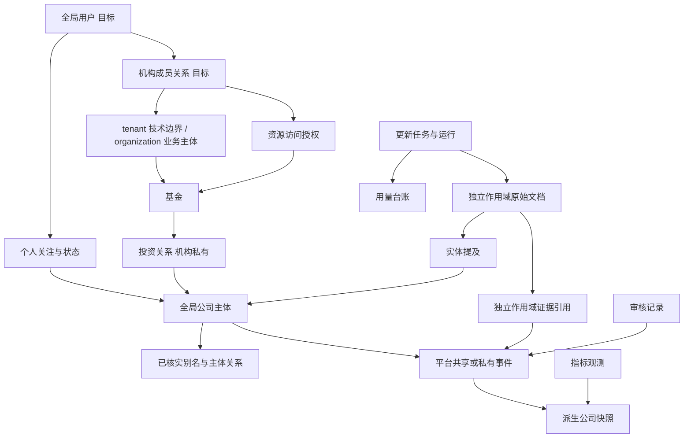

# 01 领域模型

## 1. 边界上下文

| 上下文 | 负责内容 | 明确不负责 |
| --- | --- | --- |
| 身份与权限 | 用户、tenant、organization 成员关系、角色、资源授权和有效权益 | 公司事实判定和套餐结算 |
| 个人空间 | 个人关注、备注、查看水位、个人资料和个人线索 | 授予平台共享公司读取权限 |
| 机构与投资 | 机构、基金、组合、投资关系和机构资料 | 把私密投资数据复制到共享事件 |
| 证据与事实 | 来源、原始文档、证据引用、实体提及、事件、指标 | 用摘要替代原始证据或继承关联对象的可见范围 |
| 更新编排 | 策略、任务、运行、预算、Provider | 同步用户查询时等待外部调用 |
| 审核发布 | 风险闸门、审核队列、纠错撤回、快照 | 严重负面完全自动发布 |
| 报告通知 | 模板、已生成报告、通知 | 每次访问重新调用模型生成 |

## 2. 领域关系图

## 3. 完整模型与 MVP 实现边界

完整领域模型在现有事实、基金和权限对象之外，按 ADR-0009 增加个人关注、organization 成员关系、商业订阅、权益和产品用量等目标对象。完整表职责、键和索引见[数据库设计](03-database-design.md)。

当前 `0007` Schema 仍是基金授权优先的最小垂直闭环，不表示目标双通道已经实现。后续先补数据作用域安全基线，再开放平台共享搜索和详情；个人关注、organization 完整模型、正式认证、商业订阅和支付继续分阶段实施，详见[实施计划](10-implementation-plan.md)。

## 4. 原始事实与派生数据

- 原始层：`raw_documents` 保存来源元数据、许可、哈希和可选存储引用；内容按许可最小化保存。`official_identity_verifications` 引用官方工商原文档并保留匹配结论和核验时间。
- 事实层：`events`、`event_evidence`、`metric_observations` 追加记录，纠错不原地抹除历史。
- 派生层：`company_snapshots`、`generated_reports` 可从已发布事实重建，带构建版本和基准时间。
- 审计层：`refresh_runs`、`review_queue`、`usage_ledger`、`audit_logs` 解释数据如何产生、花费多少、谁批准。

## 5. 公司身份解析

状态：`unresolved` → `candidate_matched` → `verified`；发现矛盾可退回 `unresolved`。初始只有简称时允许建档，但不能据此自动发布严重负面。

确定性优先顺序：

1. 统一社会信用代码精确匹配；冲突直接人工审核。
2. 工商全称或经验证的曾用名精确匹配。
3. 全称加注册地、法定代表人等组合匹配。
4. 官网域名、官方账号与工商主体的已验证映射。
5. 母子公司、品牌、产品与经营主体的有效期关系。
6. 简称、英文名、品牌名或产品名只生成候选；同名和跨主体歧义进入审核。
7. 模型仅对候选排序并给出依据，不得越过确定性冲突或直接发布。

`company_aliases` 保存名称类型、有效期、来源和验证状态；`company_relationships` 保存母子公司、集团成员、品牌运营、产品归属等带方向和有效期的关系。每次实体匹配保留候选集合、命中规则和置信度。官方记录冲突时不静默覆盖公司；人只选有关联的官方候选，事件重建与发布路由由程序完成。

## 6. 同一公司被多个基金投资

公司身份和许可允许复用的事件存于 `platform_shared` 事实层；各个人关注、机构、基金和组合引用同一 `company_id`。各基金通过独立 `investments` 行连接公司，投资金额、持股比例、内部估值、MOIC、TVPI 和协议条款带机构及基金作用域，不进入共享快照。公司页面先按有效权益加载共享事实，再按个人所有权和机构资源授权叠加私有视图；`fund_access_grants` 不决定共享基础层访问。

## 7. 财务与经营指标

`metric_definitions` 定义稳定编码、名称、数据类型、允许单位、统计周期和行业扩展命名空间；行业指标使用 `industry_code.metric_code`，无需为每个行业改表。

`metric_observations` 每次观测追加保存数值、单位、期间起止、`as_of_date`、来源性质、置信度和审核状态。同比、环比优先在查询或快照构建时按可比期间计算；若口径或单位不可比，返回空值并解释。来源性质固定为 `audited`、`regulatory_disclosure`、`company_reported`、`manager_reported`、`media_cited`、`third_party_estimate`、`unknown`。没有可靠值时界面显示“暂无可靠公开数据。”

## 8. 事件、导入和顾问对象

事件独立保存方向、重大性、风险、置信度和来源质量，详见[事件分类](04-event-taxonomy.md)。`research_imports` 是导入批次而非事实；其记录必须经过身份、去重、证据、重大性和风险闸门。专业顾问任务单属于未来能力，当前只定义访问和沉淀规则，不提前增加表或接口；进入实现前另建 ADR。

## 9. 双通道访问与数据作用域

- 平台共享、个人私有、机构私有和系统受限是记录作用域；登录与有效权益是访问资格，两者不得混为一谈。
- `platform_shared` 不表示匿名互联网公开。当前数据库值 `public` 仅作为兼容名称，未来物理表示由数据作用域 PR 决定。
- 平台共享记录没有个人或机构所有者；个人私有记录必须有个人所有者；机构私有记录必须有机构所有者。
- 事件事实、证据引用和原始文档分别授权。共享事件不会自动公开网页全文、付费来源或客户上传资料。
- 事件状态和发布路由不决定可见范围；未确认线索默认保持个人、机构或系统受限。
- 个人与机构访问、迁移边界和测试契约以 [ADR-0009](DECISIONS/ADR-0009-dual-channel-access-and-data-scope.md) 为准。
