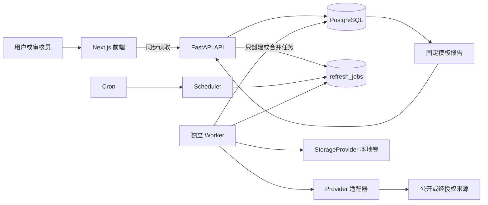
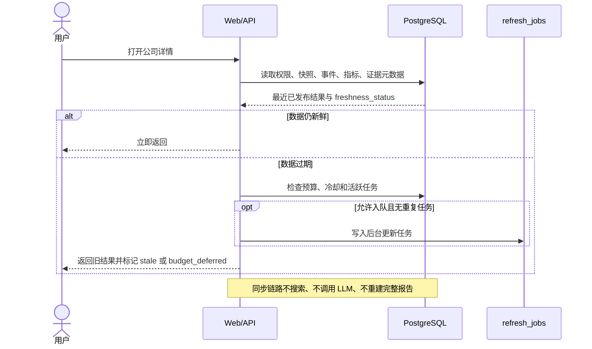
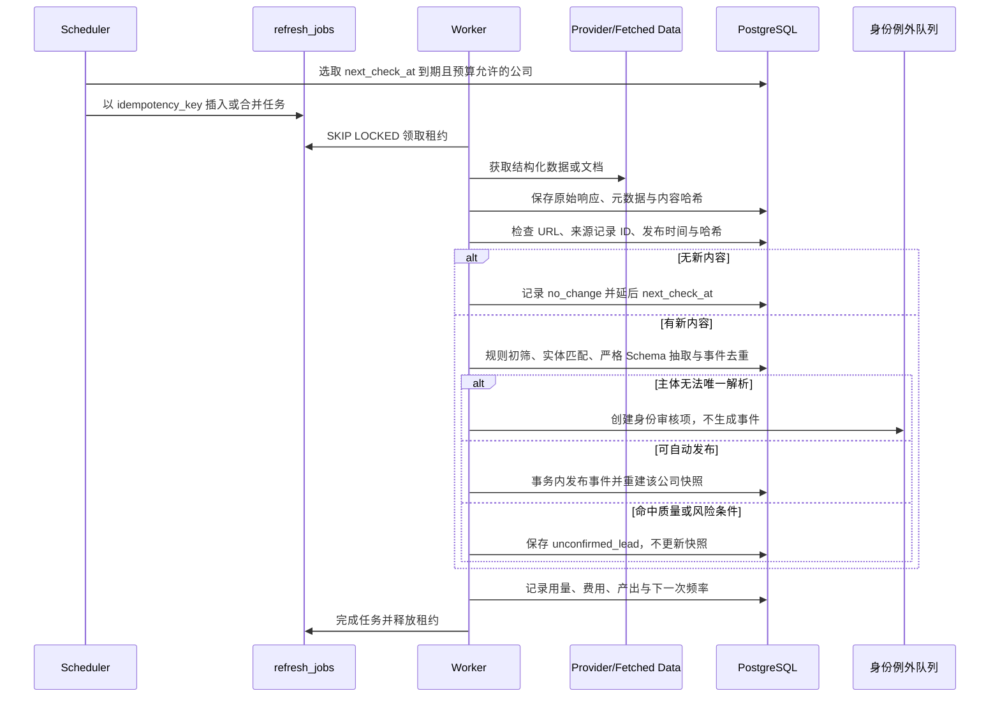

# 02 系统架构

## 1. 组件与同步边界

同步 API 只读数据库或写入轻量任务记录；搜索、抓取、模型和报告重建只能在 Worker 链路中发生，并受总开关、预算和许可控制。

## 2. 用户查询时序

## 3. 按需更新时序

## 4. 默认更新与缓存策略

所有间隔来自版本化 `refresh_policies`，不写死在业务逻辑。Demo 初始值如下：

| 条件或数据类别 | 初始策略 | 调整规则 |
| --- | --- | --- |
| 未查询、未关注的普通公司 | 不自动更新，或 30 天低频巡检 | 长期无变化可停止自动巡检 |
| 最近被查询的公司 | 已有结果缓存 14 天 | 首次查询若无快照，返回 `unknown` 并尝试后台入队 |
| 用户关注公司 | 7 天 | 取消关注后回到普通策略 |
| 最近 30 天有实质事件 | 2—3 天临时检查 | 连续无变化达到策略阈值后退回关注/普通频率 |
| 高风险公司 | 必要时 1 天 | 必须有风险依据和预算；稳定后自动降频 |
| 工商主体与基础身份 | 30 天 | 身份冲突立即转审核，不等待下一 TTL |
| 普通新闻和业务动态 | 14 天 | 内容哈希未变时不进入抽取 |
| 融资、重大合同、司法、退出 | 关注公司 7 天 | 实质事件可临时升频 |

`next_check_at` 由各数据类别最早到期时间、关注/风险覆盖和预算延迟共同决定。每次无变化增加 `consecutive_no_change_runs` 并按策略扩大间隔；发现实质事件则重置计数并设置临时升频窗口。手动更新的冷却时长也是配置项，在真实命中率验证前不固化数值。

同公司并发请求先查活动任务并合并；冷却未过或预算不足只返回状态。搜索缓存按 Provider、规范查询、身份版本和时间窗复用，文档缓存按来源记录 ID、URL、ETag/Last-Modified 与内容哈希复用。无新内容时不得调用 LLM或重建完整报告。

按需缓存 V1 先使用带版本号的环境配置：最近查询 TTL 默认 14 天，请求冷却默认 24 小时。公司列表只计算并展示新鲜度，不触发整页公司批量入队；公司详情在 `AUTO_REFRESH_ENABLED=true` 且状态为 `stale` 或 `unknown` 时创建或合并零成本后台任务。首次响应仍返回旧数据及原新鲜度，后续在活动任务存在时显示 `refreshing`。

Mock Worker V1 仅为虚构数据提供单任务命令入口：按租户使用 `FOR UPDATE SKIP LOCKED` 领取 `mock_refresh`，写入可配置的短租约与心跳，过期后允许重领，并用 `usage_ledger` 记录零次外部调用和零费用。有当前快照时只更新 `last_checked_at` 与新鲜度，保留 `data_as_of`；无快照时不生成事实，继续保持 `unknown`。完整 `refresh_policies` 表、通用 `next_check_at`、常驻 Worker 和公司级复杂升降频仍按后续阶段实施。

人工研究导入 V1 是独立的本机前置入口，不进入用户同步查询路径：机构管理员从 Git 忽略的私有目录导入公开来源 JSON，系统按文件、批次、来源记录和事件指纹去重。主体未解析时只形成实体提及审核项；主体已验证时检查证据 URL、来源等级、官方域名、可信度和风险。安全记录自动发布并重建快照，其他记录以 `unconfirmed_lead` 路由保存且不创建逐条审核任务。URL 外部检查受总开关和每批上限控制；关闭时安全降级为未确认线索。批次元数据由 `research_imports` 的租户 RLS 隔离。

官方工商身份流程通过 `OfficialIdentityProvider` 边界导入已核对的政府/GSXT 结构化记录，校验官方域名和统一社会信用代码校验位后，追加写入原始证据与 `official_identity_verifications`。工作台只向相关歧义项暴露有效期内候选；选定后于同一事务更新身份、解析提及、重建事件/证据并复用发布策略。页面决定本身不访问外部网站。

授权商业工商身份 V1 复用同一导入、候选和重路由服务，但以 `verification_basis=licensed_business_data` 与政府来源分开审计。天眼查适配器只由本机运维命令调用：名称候选查询后必须用信用代码唯一锚定，原始响应进入私有缓存，规范化最小字段进入租户私有身份记录；名称或地区冲突保持待人工处理。公司搜索、详情、来源监测和自动刷新链路均不调用该适配器，身份查询也不生成事件或改变发布规则。

受控来源监测使用独立 `source_check_runs` 队列和 Worker，不复用用户查询的 `refresh_jobs`。一次性 Scheduler 按每个来源的 `check_frequency_minutes`、`last_checked_at` 和连续失败退避计算应检查时间，只负责小批量、幂等入队。定时运行的 `trigger_type` 和 `scheduled_for` 随任务保存；真实网络、重试、过期租约恢复、候选去重和用量审计仍由现有 Worker 执行。标记值得研究的候选只能经另一个结构化管理员操作转成同 tenant 的私有底稿和候选事件；继续不自动晋升或发布。

## 5. 后台流水线

1. Scheduler 按 `next_check_at`、关注、近期事件、风险、预算选公司。
2. Entity Resolver 准备全称、别名、官网、官方账号和信用代码。
3. Provider 返回结构化记录、搜索结果或导入批次。
4. Fetcher 保存原始响应元数据及许可允许的最小内容。
5. Change Detector 用来源记录 ID、规范 URL、发布时间、ETag/Last-Modified 和内容哈希识别变化。
6. Rule Filter 低成本排除明显无关或旧内容。
7. Entity Matcher 确认目标主体；只有身份或组织关系歧义进入人工队列。
8. Event Extractor 只对新且相关内容调用低成本模型，输出严格版本化 JSON。
9. Event Deduplicator 用事件指纹合并同一事件的多来源证据。
10. Risk Gate 将严重负面、来源冲突、低置信度和异常金额单位保留为未确认线索；安全白名单事实才自动发布。
11. Snapshot Builder 仅对事实发生变化的公司重建派生快照。
12. Report Builder 仅对变化公司用固定模板生成增量内容。
13. Usage Ledger 按 Provider、任务、公司和租户记录用量、估价与有效产出。
14. Scheduler 根据变化结果调整 `next_check_at` 和连续无变化次数。

Provider 协议、Kimi 导入和 DeepSeek 边界见[数据源策略](05-data-source-strategy.md)。

## 6. 幂等、事务与恢复

- 任务：数据库唯一幂等键，加“同公司+任务类型仅一个活跃任务”的部分唯一索引。
- 文档：来源记录 ID、规范 URL 与内容哈希三级去重；重复文档不进入模型。
- 事件：版本化事件指纹唯一；新来源只增加 `event_evidence`。
- 事务：原始文档可先独立持久化；事件、证据、发布路由和快照切换在单事务完成；历史人工决定、纠错和撤回同样保持事务性。
- 租约：Worker 使用 `FOR UPDATE SKIP LOCKED` 原子领取，设置 `leased_until` 和 `heartbeat_at`。
- 崩溃恢复：租约过期后可重新领取；每一步根据持久化检查点安全重放，不重复调用已有响应的 Provider。
- 重试：确定性校验失败不重试；网络/限流按 Provider 策略最多有限次指数退避；LLM JSON 失败最多修复重试一次。
- 降级：单个 Provider 失败时尝试已授权且不更贵的配置化替代源；否则保留旧快照并记录 `provider_deferred`，不隐式升级费用。

## 7. 技术选择与升级阈值

Demo 采用 FastAPI、Pydantic、SQLAlchemy、Alembic、PostgreSQL、Next.js、数据库任务表、独立 Worker、Cron、本地持久化卷和 Docker Compose。数据库队列可复用事务、权限、备份和现有运维面，适合低并发及低预算。

只有出现经测量的瓶颈才升级：

- Redis/Celery：持续任务积压超过可接受时效、数据库锁竞争影响查询，或需要高吞吐延迟队列/复杂工作流；先记录指标并建 ADR。
- 对象存储：许可允许保存的文件量超出单机卷备份窗口，需要跨实例访问、生命周期策略或不可变版本。
- 向量检索：出现经过验证的跨大量授权文档语义检索需求，且关键词、元数据和 PostgreSQL 全文检索达不到召回验收值。

## 8. 可迁移部署

容器只依赖标准环境变量、PostgreSQL 和挂载卷；域名、TLS、备份目标和 Secret 由部署环境注入。可部署在任意合规云服务器或合作者服务器，不写入云厂商专属 SDK；不使用家庭 Ubuntu 服务器，不以 Tailscale 作为访问或运维前提。详细运行流程见[运维手册](12-operations-runbook.md)。
