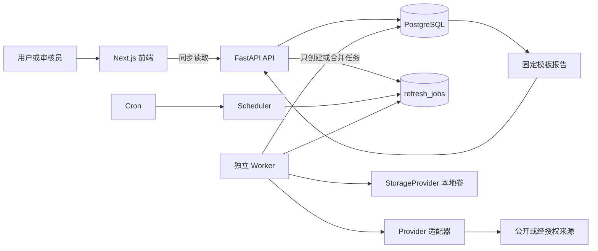
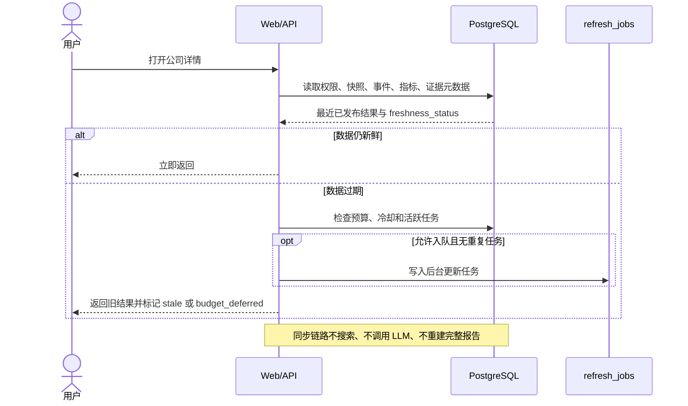
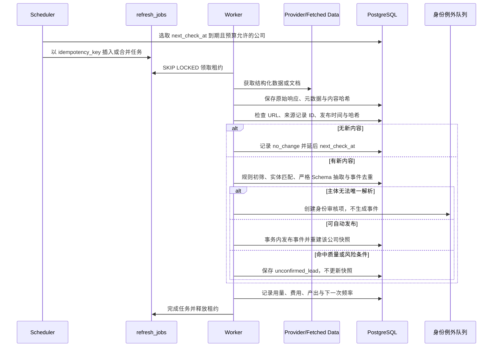

# 02 系统架构

> 当前演进决策为 [ADR-0021](DECISIONS/ADR-0021-incremental-event-delivery.md) 与 [ADR-0022](DECISIONS/ADR-0022-curated-baseline-and-incremental-research.md)，完整范围与代码基线见 [增量交付计划](15-incremental-event-delivery-plan.md)。下方完整调度、差分和多来源归并流程包含目标设计，不能整体视为已实现；执行状态只看 [实施看板](10-implementation-plan.md)。

## 1. 组件与同步边界

同步公司查询只读数据库或写入轻量任务记录；搜索、抓取和模型只在 Worker 链路发生，并受总开关、预算和许可控制。用户显式请求的固定报告沿用现有数据库生成路径，不能因普通页面访问重建报告或追加外部研究。

## 2. 用户查询时序

## 3. 按需更新时序

## 4. 默认更新与缓存策略

目标是以版本化策略管理间隔，不写死在业务逻辑。当前主要使用环境配置，完整 `refresh_policies` 表及公司类别升降频尚未全部实现。Demo 设计初始值如下，新增接线按 E3 验收，本文不授权开启：

E3 的实际接线为 `watchlist_monitoring.py` → 现有 `CompanyResearchJob` → `company_watch_schedules` → 本人关注页。仅覆盖经营、融资、合同/中标；默认关闭，首次检查、7 天周期、无新文档降频及失败退避见[固定切片](15-incremental-event-delivery-plan.md#e3-固定切片与停止边界)。关注聚合入口不开放私人清单；任务结束与计划状态同事务更新。下表中其他类别及风险升频仍是目标设计。

| 条件或数据类别 | 初始策略 | 调整规则 |
| --- | --- | --- |
| 未查询、未关注的普通公司 | 不自动更新，或 30 天低频巡检 | 长期无变化可停止自动巡检 |
| 最近被查询的公司 | 已有结果缓存 14 天 | 首次查询若无快照，返回 `unknown` 并尝试后台入队 |
| 用户关注公司 | 7 天 | 取消关注后回到普通策略 |
| 最近 30 天有实质事件 | 2—3 天临时检查 | 连续无变化达到策略阈值后退回关注/普通频率 |
| 高风险公司 | 必要时 1 天 | 必须有风险依据和预算；稳定后自动降频 |
| 工商主体与基础身份 | 30 天 | 身份冲突立即转审核，不等待下一 TTL |
| 普通新闻和业务动态 | 14 天 | 内容哈希未变时不进入抽取 |
| 融资、重大合同、司法、退出 | 关注公司 7 天 | 实质事件可临时升频 |

`next_check_at` 由各数据类别最早到期时间、关注/风险覆盖和预算延迟共同决定。每次无变化增加 `consecutive_no_change_runs` 并按策略扩大间隔；发现实质事件则重置计数并设置临时升频窗口。手动更新的冷却时长也是配置项，在真实命中率验证前不固化数值。

同公司并发请求先查活动任务并合并；冷却未过或预算不足只返回状态。搜索缓存按 Provider、规范查询、身份版本和时间窗复用，文档缓存按来源记录 ID、URL、ETag/Last-Modified 与内容哈希复用。无新内容时不得调用 LLM或重建完整报告。

按需缓存 V1 先使用带版本号的环境配置：最近查询 TTL 默认 14 天，请求冷却默认 24 小时。公司列表只计算并展示新鲜度，不触发整页公司批量入队；公司详情在 `AUTO_REFRESH_ENABLED=true` 且状态为 `stale` 或 `unknown` 时创建或合并零成本后台任务。首次响应仍返回旧数据及原新鲜度，后续在活动任务存在时显示 `refreshing`。

Mock Worker V1 仅为虚构数据提供单任务命令入口：按租户使用 `FOR UPDATE SKIP LOCKED` 领取 `mock_refresh`，写入可配置的短租约与心跳，过期后允许重领，并用 `usage_ledger` 记录零次外部调用和零费用。有当前快照时只更新 `last_checked_at` 与新鲜度，保留 `data_as_of`；无快照时不生成事实，继续保持 `unknown`。完整 `refresh_policies` 表、通用 `next_check_at`、常驻 Worker 和公司级复杂升降频仍按后续阶段实施。

人工研究导入 V1 是独立的本机前置入口，不进入用户同步查询路径：机构管理员从 Git 忽略的私有目录导入公开来源 JSON，系统按文件、批次、来源记录和事件指纹去重。主体未解析时只形成实体提及审核项；主体已验证时检查证据 URL、来源等级、官方域名、可信度和风险。安全记录自动发布并重建快照，其他记录以 `unconfirmed_lead` 路由保存且不创建逐条审核任务。URL 外部检查受总开关和每批上限控制；关闭时安全降级为未确认线索。批次元数据由 `research_imports` 的租户 RLS 隔离。

上述是当前 V1 行为；ADR-0022 的人工确认入口按下节目标改造，不能用 V1 的网页检查前置否定负责人已复核的初始资料。

官方工商身份流程通过 `OfficialIdentityProvider` 边界导入已核对的政府/GSXT 结构化记录，校验官方域名和统一社会信用代码校验位后，追加写入原始证据与 `official_identity_verifications`。工作台只向相关歧义项暴露有效期内候选；选定后于同一事务更新身份、解析提及、重建事件/证据并复用发布策略。页面决定本身不访问外部网站。

历史授权商业工商身份 V1 曾复用同一导入、候选和重路由服务，并以 `verification_basis=licensed_business_data` 与政府来源分开审计。R1 已移除活动适配器、专用 Worker、CLI、运行开关和缓存挂载；历史证据不能改称政府或公开网络证据。`0022` 向前迁移只停止展示没有独立来源支撑的身份和事实，保留原始记录及审计血缘；生产 Secret 与缓存须在合并部署、备份和回归通过后删除。

### 4.1 受限公开网络研究 V1（已合并部署）

R3 继续复用 PostgreSQL 的个人申请、全局公司任务、租约、取消、断线恢复、证据血缘、RLS 和用量台账，不引入第二套 Agent 状态存储。平台管理员只能把准确主体对应到已核验且允许进入共享目录的公司；Worker 依序执行：身份闸门 → 共享缓存/预算 → 固定九类投资研究覆盖 → 百度主源搜索 → 主源失败或主体结果不足时博查回退 → 安全抓取原网页 → 确定性主体匹配、分类和去重 → 证据及作用域校验 → 分级候选或待核实线索。搜索摘要只用于发现 URL，不能独立生成事件。

E4.3 定点修复在已启用的增量按需路径增加“该组正文全失败 → 原查询备用搜索 → 追加候选读取”，不另开事件词查询。查询文本及跨组 URL 归属保存在原任务 JSON，复用原缓存、幂等令牌、预算和 robots 规则；无需新表、Provider 接口或基础设施。具体停止与时限见[增量计划](15-incremental-event-delivery-plan.md#e43-单公司对照与可交付性验收)，真实结果以看板为准。

V1 每个任务最多 4 次搜索、12 个候选 URL、8 次抓取、3 份合格文档、2 MiB 总下载量和 180 秒 Worker 执行时间；缓存默认 14 天，并绑定公司身份指纹，身份变化后不会错误复用。候选原文只保存许可边界内的最小片段，属于 `system_restricted` 平台运营数据；可向个人展示的证据引用另行生成，且不会包含投资金额、持股比例、机构资料或客户上传文件。V1 不调用模型、不生成报告、不确认公司身份，也绝不自动发布；严重负面、证据不足和身份歧义继续保持未确认状态。同步公司页面仍只读数据库。详见 [ADR-0018](DECISIONS/ADR-0018-provider-neutral-bounded-web-research.md)。

R3.2 不改变上述架构、调用上限或权限边界，只修正“搜索已发现，但程序误拒绝”的确定性判定。主体比对使用 Unicode NFKC 归一化处理全角/半角标点；搜索缓存身份指纹保持不变，防止修复导致无效外部调用。变化信号只增加递表、通过聆讯、获备案、启动招股和正式上市等能证明状态转换的精确短语，不用泛化关键词放松静态页、日期、原页正文和证据闸门。

R3.3 把“搜索发现页面”和“取得可核验证据”明确分成两个步骤。百度或博查返回标题、摘要和 URL 只代表发现线索；目标站点仍由 `DocumentFetcher` 按自身 robots、许可和网络安全策略判断。系统不得冒充其他爬虫、忽略 `Disallow`、复用登录 Cookie、代理轮换或无头浏览器规避限制。通过搜索缓存合并和 URL 规范化复用已取得的主备结果；高价值线索缺少正文时，最多进行一次受预算约束的原始来源回溯，优先定位政府、监管、交易所、公司官网、正式 Feed 或官方 PDF。受阻页面只保留元数据和证据缺口，不生成事实。

R3.3 的官方 PDF 读取仍受 HTTPS、允许域名、DNS/SSRF、重定向、robots、MIME 与文件签名、字节、页数和解析超时限制；不执行脚本、附件或嵌入内容。R3.4 已在现有 PostgreSQL 血缘模型上补充原子事实及逐条支持状态，不新建 JSONL 状态库。R3.5 在固定研究计划后最多选择一个明确、重要且尚无合格证据的事件类别，用百度主源执行一次定向补查；原始来源回溯已发生时不再补查，博查只复用已有缓存而不新增调用。调用前先持久化尝试状态，Worker 中断恢复不得再次消耗这一额度。

受控来源监测使用独立 `source_check_runs` 队列和 Worker，不复用用户查询的 `refresh_jobs`。一次性 Scheduler 按每个来源的 `check_frequency_minutes`、`last_checked_at` 和连续失败退避计算应检查时间，只负责小批量、幂等入队。定时运行的 `trigger_type` 和 `scheduled_for` 随任务保存；真实网络、重试、过期租约恢复、候选去重和用量审计仍由现有 Worker 执行。标记值得研究的候选只能经另一个结构化管理员操作转成同 tenant 的私有底稿和候选事件；继续不自动晋升或发布。

### 4.2 人工初始资料与增量研究（E4.1 本地已验证）

复用两条输入入口及同一事件存储：表格适配器进入人工导入/确认路径；网络新材料进入现有研究任务/抓取/抽取路径。二者共享公司、别名、事件、证据、版本、快照和读取权限，不建立第二套事实库。人工已复核、来源性质与自动抓取状态分别记录，表格摘要不伪装成原网页摘录。

| 当前代码证据 | E4 局部改造 |
| --- | --- |
| `curated_workbook.py` 只读表格，`curated_import.py` 负责事务准入与导入；`curated_publication.py` 复用人工决定及观测版本 | E4.1 已实现 `curator_confirmed`，创建/关联公司并保存别名；原件在个人私有层，已确认普通资料通过明确平台管理员决定生成共享投影。迁移 `0032` 保留旧依据与历史，预览与导入不调用外部 Provider |
| `CompanyAlias` 已存在，`web_research_service.py` 搜索及正文匹配未读取其关系 | 使用适用、已确认且唯一归属的别名，保持查询/正文一致；未确认和私有别名不进入共享研究 |
| `source_fetcher.py` 主要为静态 HTTP/HTML，业务通用摘录默认截取前 1500 字符 | 在受限正文中定位相关事实段落，区分页面失败与公司无信息；受限渲染或其他合法来源仅在实际缺口成立时评估 |
| 通用融资候选以 URL/内容哈希指纹为主，事实主要是页面标题 | 补当前一类融资披露的必要字段、事项归并及修订；复用现有事件/证据/版本，避免转载重复及跨轮次误合并 |
| 已有申请、后台任务、缓存、冷却、取消及进度 | E4.1 已区分等待与执行、可绑定原待补证申请而不创建任务；按需业务更新接线留给 E4.2，预算、冷却和取消规则保留 |

独立业务发现使用仅含身份/适用别名的隔离输入；导入的业务答案不能进入该任务可读数据库、快照、搜索缓存或上下文。系统输出封存后才与人工基准比较；完整初始化和材料重放另验幂等/更新，不能计为独立召回。详细契约与切片见[完整计划 E4](15-incremental-event-delivery-plan.md#e4-负责人确认资料与按需增量研究)。

## 5. 后台流水线（目标与实现边界）

1. Scheduler 按 `next_check_at`、关注、近期事件、风险、预算选公司。
2. Entity Resolver 准备全称、别名、官网、官方账号和信用代码。
3. Provider 返回结构化记录、搜索结果或导入批次。
4. Fetcher 保存原始响应元数据及许可允许的最小内容。
5. Change Detector 用来源记录 ID、规范 URL、发布时间、ETag/Last-Modified 和内容哈希识别变化。
6. Rule Filter 低成本排除明显无关或旧内容。
7. Entity Matcher 确认目标主体；只有身份或组织关系歧义进入人工队列。
8. Event Extractor 只对新且相关内容调用低成本模型，输出严格版本化 JSON。
9. Event Deduplicator 用事件指纹合并同一事件的多来源证据。
10. Risk Gate 将严重负面、来源冲突、低置信度和异常金额单位保留为未确认线索；安全白名单事实才自动发布。
11. Snapshot Builder 仅对事实发生变化的公司重建派生快照。
12. Report Builder 在用户明确请求时从既有事件及证据生成固定报告，不默认全量重搜或重复生成。
13. Usage Ledger 按 Provider、任务、公司和租户记录用量、估价与有效产出。
14. Scheduler 根据变化结果调整 `next_check_at` 和连续无变化次数。

确定性变化事件、待核实候选与模型解读分层保存。2026-09-09 基线中，`change_detection.py` 保留快照差分能力，但当前公开研究入口未调用它；网络路径主要形成 `candidate + unconfirmed_lead`。E1 先将一类公告事实接入现有事件层；E2 在结构化来源具备可比较样本时接入差分。重要变化展示不再永久依赖旧生成路由，但仍须满足原发布及权限条件。

已有独立 Agent Worker 只处理达到重要性门槛的已发布确定性变化，或由本次已完成研究任务产生新证据、具有同公司已核验实体提及的候选。模型输入不含私有原始文档，只含最多五条允许展示的最小证据引用；输出经过各自版本化 JSON Schema、事件/证据绑定、数字、信用代码和投资建议禁语校验后另行保存，不能改变事件状态。`0025` 扩展现有解读表的 RLS，使普通有效用户只能读取已完成且 Schema 与事件路由匹配的候选解读，队列写入仍限平台管理员。公司详情始终读取已完成结果，不同步调用模型；证据被撤下时，依赖该证据的解读同步停止展示。

Provider 协议、Kimi 导入和 DeepSeek 边界见[数据源策略](05-data-source-strategy.md)。

## 6. 幂等、事务与恢复

- 任务：数据库唯一幂等键，加“同公司+任务类型仅一个活跃任务”的部分唯一索引。
- 来源覆盖：E2.1 的 `research_coverage.py` 复用两个现有搜索分组，在任务 JSON 记录类别路由与检查结果；API 只向本人输出有限历史覆盖和缺口。覆盖不依赖事件表，缓存不刷新来源检查时间；不连接新的来源或调度，见[来源策略](05-data-source-strategy.md)。
- 文档：来源记录 ID、规范 URL 与内容哈希三级去重；重复文档不进入模型。
- 事件：已有按作用域划分的指纹唯一约束；人工结构化导入能追加同事实证据，当前活动网络路径的 `web-v1` 指纹仍含 URL/内容哈希。E1.2 新增内部 `tender_storage.persist_tender_candidate`，复用事件/逐字段证据表并追加来源观测；仅支持 E1.1 单类候选，默认关闭。E1.3 已接到现有私有研究导入；活动公开网络 Worker 仍用原路径，不据此宣称全来源已接通。
- 中标存储边界：从数据库重查主体、原文、许可和当前权限并重新抽取，拒绝仅凭候选引用写入。个人、机构、共享资料分别归并，系统受限底稿不能经此入口变为共享事件；并发通过 PostgreSQL 事务锁与既有唯一约束防重。原文档先保存，事件/证据/观测在可回滚的同一事务内追加，调用方负责提交。观测中的 `supported` 仅表示字段有原文支撑，不代表事件已确认；更正候选不覆盖当前投影。E1.3 由平台管理员选择具体观测、复核逐字段证据后更新独立共享投影，私有观测不改写。
- 中标交付链：`TENDER_EVENTS_ENABLED=false` 默认关闭新导入和晋升；启用后只有人工研究记录 `event_subtype=tender_notice` 使用规则抽取，继续检查主体、原文、来源/批次许可和私有授权。人工晋升复用原角色、确认及审计流程；共享快照仅保存获准字段和共享证据 ID，不复制私有观测 ID、owner 或底稿。字段不足或冲突继续作为候选。
- 当前结果：详情以 `display_kind` 区分已核实变化、基础资料、未确认区；日期只到日时用 `occurred_on`，历史观测可展开。转载保留来源，不增加事项数或个人变化提醒；核实实质更正后，同一事项可再次提醒一次。
- 解读与报告：沿用异步队列、Provider 和预算，缓存键包含当前事实版本及有效证据输入；转载复用，更正后旧解读立即隐藏。最多五条模型证据引用，只选择能提供前后版本证据的字段，页面仍显示完整已核实字段；模型失败按原 Provider 有限重试，查询和轮询不无限重排失败任务。必要证据撤回/许可失效后，关联当前事实和解读退出已确认展示，新报告不纳入，历史只读报告不重写。

- 事务：原始文档可先独立持久化；事件、证据、发布路由和快照切换在单事务完成；历史人工决定、纠错和撤回同样保持事务性。
- 租约：Worker 使用 `FOR UPDATE SKIP LOCKED` 原子领取，设置 `leased_until` 和 `heartbeat_at`。
- 崩溃恢复：E2.2 的 `web_research_budget.py` 在业务公开研究/主体查证调用前持久化预占，再派发并按结果结算；过期租约的未决调用保留为不确定支出，暂停重发。管理员凭回执核对后保留不完整结果标记；预算锁不跨 HTTP。此控制尚未覆盖模型和机构可信来源，详见[成本说明](06-cost-control.md)。
- 重试：确定性校验失败不重试；网络/限流按 Provider 策略最多有限次指数退避；LLM JSON 失败最多修复重试一次。
- 降级：单个 Provider 失败时尝试已授权且不更贵的配置化替代源；否则保留旧快照并记录 `provider_deferred`，不隐式升级费用。

## 7. 技术选择与升级阈值

Demo 采用 FastAPI、Pydantic、SQLAlchemy、Alembic、PostgreSQL、Next.js、数据库任务表、独立 Worker、Cron、本地持久化卷和 Docker Compose。数据库队列可复用事务、权限、备份和现有运维面，适合低并发及低预算。

只有出现经测量的瓶颈才升级：

- Redis/Celery：持续任务积压超过可接受时效、数据库锁竞争影响查询，或需要高吞吐延迟队列/复杂工作流；先记录指标并建 ADR。
- 对象存储：许可允许保存的文件量超出单机卷备份窗口，需要跨实例访问、生命周期策略或不可变版本。
- 向量检索：出现经过验证的跨大量授权文档语义检索需求，且关键词、元数据和 PostgreSQL 全文检索达不到召回验收值。

## 8. 可迁移部署

容器只依赖标准环境变量、PostgreSQL 和挂载卷；域名、TLS、备份目标和 Secret 由部署环境注入。应用不写入云厂商专属 SDK；不使用家庭 Ubuntu 服务器。外部用户通过标准 HTTPS 访问，不依赖 Tailscale；管理员可以使用 Tailscale SSH。详细运行流程见[运维手册](12-operations-runbook.md)。

邀请测试的 M5B 采用独立 Compose 覆盖文件把 PostgreSQL 与应用放在同一腾讯云中国香港主机，数据库没有主机端口，通用生产 Compose 仍可切换外部托管数据库。备份工具只把 `pg_dump` 临时明文写入受限目录，随后用 `age` 公钥加密并删除临时明文；COS 上传在宿主机使用已单独配置的官方 COSCLI，只接受 `.dump.age` 及校验元数据。解密私钥不进入生产主机。该单机拓扑不提供高可用，完整边界见 [ADR-0014](DECISIONS/ADR-0014-hong-kong-invitation-deployment.md)。
