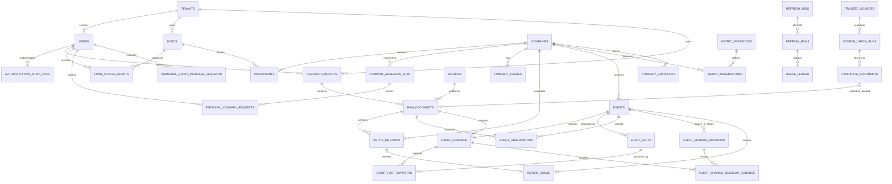
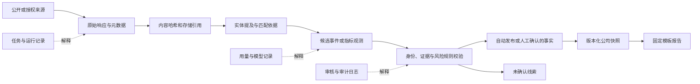

# 03 数据库设计

## 1. 设计原则

PostgreSQL 是事实主库。所有结构变化通过 Alembic 新迁移完成；不修改已应用迁移。UUID 主键、UTC `timestamptz`、显式外键和状态约束为默认。原始事实追加保存，派生快照可重建。个人、机构与基金私有行必须通过应用授权和 PostgreSQL 行级安全（RLS）双重限制。

本文件同时描述已实现 Schema 和 ADR-0009 的后续目标边界。E1.2/E1.3 新增兼容迁移 `0028`、`0029`，仅在隔离测试库验证，不能据此推断部署版本；实际交付状态见[实施看板](10-implementation-plan.md)。数据作用域安全基线、共享公司精确查询、受控共享事实晋升、受控可信来源监测、候选研究交接、CloudBase 身份映射、个人留存、受限公开网络研究、版本化变化检测、证据约束投资者解读队列和证据—事实逐条支持账本已经实现；标记为“目标”的 organization 和商业订阅权益仍未实现。当前 `tenant` 继续作为技术隔离边界，CloudBase 只提供外部身份，业务授权仍由本地用户、角色、基金授权和 RLS 决定。

## 2. 表目录：身份、投资与权限

| 表 | 职责与关键字段 | 约束与关键索引 |
| --- | --- | --- |
| `tenants` | 当前技术隔离和 RLS 上下文；短期承载机构作用域 | PK `id`；本阶段不物理改名，不为个人查询创建虚假基金 |
| `users` | tenant 绑定的本地业务账户；可选 `auth_provider/auth_subject` 关联 CloudBase 身份 | 唯一 `(tenant_id, email)` 与非空 `(auth_provider, auth_subject)`；首次按邮箱绑定要求全库唯一 active 候选，歧义失败关闭 |
| `organizations`（目标） | 机构客户和机构私有数据的业务所有者；短期由 tenant 承载 | 不在本阶段建表；未来与 tenant 的映射另行迁移 |
| `organization_memberships`（目标） | 用户加入机构的成员关系、角色、状态和有效期 | 唯一 `(organization_id, user_id)`；用户可加入多个机构 |
| `roles` | `id`, `code`, `permissions`, `scope_type` | 唯一 `code`; 检查 scope |
| `user_role_assignments` | `user_id`, `role_id`, `scope_id`, validity | 复合唯一；FK user/role；索引有效授权 |
| `funds` | `id`, `tenant_id`, `name`, `code`, `status`, `visibility_scope` | 唯一 `(tenant_id, code)`；索引 tenant/status |
| `fund_access_grants` | `user_id`, `fund_id`, `permission`, validity；只授权基金私有层 | 复合唯一；FK user/fund；不授予平台共享档案读取权限 |
| `companies` | 全局工商主体 ID、信用代码、工商全称、地区、官网、身份状态和目录资格 | 信用代码全局唯一；只有已核实且通过目录审核的主体进入共享搜索 |
| `company_aliases` | 公司、别名、类型、核验状态、来源、独立作用域及 owner | 共享别名全局唯一；个人和机构私有别名分别在 owner 范围内唯一；只有已核实共享别名进入搜索 |
| `company_relationships` | `from_company_id`, `to_company_id`, `relationship_type`, validity, evidence | 禁止自关联；版本化唯一；双向查询索引 |
| `investments` | `id`, `tenant_id`, `fund_id`, `company_id`, amount, currency, ownership, internal_valuation, `visibility_scope` | FK tenant/fund/company；同一轮次条件唯一；RLS；fund/company 索引 |
| `personal_watchlist_items` | 当前用户的单一默认关注清单 | 唯一 `(owner_user_id, company_id)`；只允许关注已核验共享公司，不产生公司读取权限 |
| `personal_company_requests` | 用户提交的新公司研究或已有公司更新请求；保存身份候选、确认、队列关联、调用量、取消、租约和错误状态 | owner 私有；同 owner/目标仅一个活动请求；确认前不得创建共享公司；旧人工请求仍兼容 |
| `personal_quota_increase_requests` | 用户申请临时增加日/月研究额度，管理员记录批准量、有效期和理由 | 每名用户只允许一个待处理申请；owner 自读，平台管理员跨租户只处理该运营记录 |
| `personal_usage_records` | 查询、申请和固定报告的测试权益消耗 | owner 私有；公司请求同时按上海自然日和自然月统计；取消前零外部调用只作废月额度，日提交次数不退；与外部成本 `usage_ledger` 分离 |
| `personal_company_view_states` | 用户首次和最近查看某共享公司的时间状态 | 唯一 `(owner_user_id, company_id)`；只允许 owner 读写 |
| `personal_event_view_receipts` | 用户确实看到过的平台共享事件回执 | 唯一 `(owner_user_id, event_id)`；事件外键可追溯公司；只追加；避免用时间截止点错过并发发布事件 |
| `plans`（目标） | 套餐能力和限额的版本化配置 | 唯一套餐版本；不保存资源授权 |
| `subscriptions`（目标） | 个人或机构获得 plan 的有效关系 | 个人和机构订阅主体二选一；不替代 access grant |
| `plan_entitlements`（目标） | 查询、关注、报告、刷新和席位等能力或额度 | 唯一 `(plan_version, entitlement_code)` |

## 3. 表目录：证据、事实与报告

| 表 | 职责与关键字段 | 约束与关键索引 |
| --- | --- | --- |
| `sources` | 来源主体、等级、类型、许可、保留策略、基础 URL | 唯一来源代码；等级/许可索引 |
| `source_connectors` | Provider 配置引用、能力、租户范围、启用状态；只存 Secret 引用 | 唯一 `(tenant_id, provider_code, connector_name)`；不存明文密钥 |
| `raw_documents` | source、可选导入批次和候选文档血缘、外部记录 ID、规范 URL、标题、时间、哈希、存储引用、许可、独立作用域和所有者 | 文档共享资格不继承事件；外部记录与去重键按作用域分别唯一；每个 `candidate_document_id` 最多交接一份同 tenant 的机构私有文档 |
| `entity_mentions` | 文档中的公司候选、命中依据、候选集合、置信度、解析状态 | 唯一 `(raw_document_id, mention_span_hash, candidate_company_id)`；待解析索引 |
| `events` | 公司、类型/子类、业务状态、发布路由、作用域、所有者、审核/证据状态、五项评价、事实、时间和事件指纹 | 共享事件全局去重；私有候选在所有者范围内去重；业务状态不推断权限 |
| `event_evidence` | 事件到文档或结构化记录的证据引用、最小片段、支撑类型、作用域和许可；共享展示引用保存许可允许的来源快照并关联原私有引用 | 私有引用必须关联原文档；共享展示引用不关联私有原文档，使用 `source_event_evidence_id` 保留血缘；不得因事件共享而暴露受限原文 |
| `event_facts` | 带稳定 `fact_key` 的原子字段，保留名称、值、单位、顺序和重复出现次数；中标观测可追加不同版本的字段，当前展示仍由 `events.facts` 限定 | 同事件同 `fact_key` 唯一；`(id, event_id)` 作为证据支持复合外键边界 |
| `event_fact_supports` | 一条原子事实与一条事件证据的确定性评估；保存支持状态、证据定位、检查项、理由、策略版本和评估时间 | 状态仅为 `supported/partial/conflicting/pending_review/unsupported`；复合外键禁止跨事件错接事实与证据；同事实/证据唯一 |
| `event_observations` | E1.2 单类来源观测：事件/原文档、契约和事实版本、观测性质、日期与精度、候选及逐字段证据关联、创建人和时间 | 唯一 `(event_id, raw_document_id, schema_version)`；按事件/原文档索引；RLS 同时要求父事件和同作用域原文档可读，写入沿用事件授权且创建人必须为当前用户；应用角色只能追加 |
| `metric_definitions` | 指标编码、类型、单位集合、周期和行业命名空间 | 唯一 `metric_code`; 行业索引 |
| `metric_observations` | 公司指标历史值、单位、期间、`as_of_date`、来源性质、审核状态 | 观测幂等键唯一；公司/指标/基准日降序索引 |
| `company_snapshots` | 派生状态、信息缺口、新鲜度、构建版本、可空的事实水位 | 唯一 `(company_id, snapshot_version)`；当前快照条件唯一；没有可靠事件/来源日期时 `data_as_of` 保持空 |
| `investor_change_analyses` | 对已核验共享变化的模型辅助解读；保存 prompt/Schema/输入哈希、证据 ID、结构化输出、Token、费用和队列状态 | 唯一 `(event_id, prompt_version, input_hash)`；只允许 `platform_shared`；普通活跃用户只读已完成解读，平台管理员处理队列 |
| `personal_company_reports` | 个人生成的确定性 Markdown 公司报告时点快照 | owner 私有且只追加；保存模板版本、事件 ID 快照、正文校验和幂等键；不含私有候选、文档或投资字段 |
| `report_templates` | 固定模板、版本、适用报告类型和可见范围 | 唯一 `(template_code, version, tenant_id)` |
| `generated_reports` | 模板版本、事实水位、`as_of_date`、存储引用、可见范围 | 唯一报告幂等键；tenant/fund/as-of 索引 |
| `notifications` | 已批准事件/报告的通知投递状态和幂等键 | 投递幂等键唯一；状态/计划时间索引 |

## 4. 表目录：编排、导入与审计

| 表 | 职责与关键字段 | 约束与关键索引 |
| --- | --- | --- |
| `refresh_policies` | TTL、升降频、冷却、预算和 Provider 规则的版本化配置 | 唯一 `(tenant_id, code, version)`；仅一个活动版本 |
| `refresh_jobs` | company、原因、优先级、状态、幂等键、租约、预计成本 | 幂等键唯一；同公司/类型活跃任务部分唯一；领取索引 |
| `refresh_runs` | 每次尝试、检查点、Provider 结果、错误、变化计数、起止时间 | FK job；job/attempt 唯一；状态/开始时间索引 |
| `company_research_jobs` | 全局公司级研究队列、九类投资研究覆盖状态、租约、取消和调用/缓存/Token 计数；旧任务的历史模块状态继续兼容读取 | 同一公司仅一个活动任务；多个个人或机构请求可关联同一任务；E2.1 在既有 `coverage` JSON 追加 `category_coverage_version/source_routes` 和逐次搜索/正文的分类、时间、缓存及失败元数据，无新迁移；历史缺少记录时保持未知，不从事件数反推 |
| `web_search_cache_entries` | Provider、规范查询、查询组、公司身份指纹、结果与响应哈希、取得/到期时间 | 全局公共搜索缓存；唯一 `(provider_code, query_hash, company_identity_fingerprint, policy_version)`；只允许平台管理员 Worker 通过 RLS 读写 |
| `research_imports` | tenant、导入人、批次、格式、工具、原始文件哈希、许可、自动发布/未确认/身份审核计数与状态 | `(tenant_id, batch_id)` 和 `(tenant_id, file_hash, parser_version, selection_key)` 唯一；旧入口选择键为空，负责人表格按用途/选样区分；普通人工导入保留原 RLS，`curated-xlsx-v1` 仅 active 平台管理员可读写；状态索引 |
| `official_identity_verifications` | tenant、公司候选、私有身份原文档、查询词、工商全称、信用代码、注册地、登记状态、`verification_basis`、核验结果/规则/时间 | 每份原文档唯一核验记录；当前入口为政府官方或 ADR-0019 交易所披露人工核验，旧商业依据仅留历史兼容；tenant/状态/时间及信用代码索引；原管理员写、审核员读 RLS 不扩张，交易所入口应用层额外要求平台管理员 |
| `trusted_sources` | tenant、公司、来源类型、允许域名、起始 URL、可选列表内容路径、许可依据、检查频率、保留策略和最近状态 | 同 tenant/company/URL 唯一；仅当前 tenant 平台管理员可读写；列表路径变更会清除起始页条件缓存 |
| `source_check_runs` | 来源检查队列、人工/定时触发与应检查时间、策略与资源上限快照、租约、请求/字节/变化/失败计数、robots 状态、请求审计和零费用字段 | 同来源仅一个活跃任务；定时幂等键包含 source 与 due time；tenant/company/source 复合血缘；RLS；运行记录不被后续配置静默改写 |
| `candidate_documents` | 新增或变化页面的 URL、标题、日期、哈希、最小摘录、许可、链接状态、发现运行、前版本、人工处理状态和研究交接定位 | 同来源/URL/哈希唯一；tenant/company/source/run 复合外键；默认 `organization_private`；只能通过显式结构化交接生成同 tenant 的私有候选，不直接生成共享事实 |
| `review_queue` | 事件或实体提及、触发规则、状态、分配人、决定和理由 | `event_id` 与 `entity_mention_id` 必须且只能存在一个；每个对象唯一；状态索引 |
| `event_sharing_decisions` | 平台管理员的晋升、拒绝和撤回决定；操作者、理由、私有来源事件、目标共享事件、共享表述和策略版本；中标及负责人表格决定另绑定 `source_observation_id` | 观测 ID 唯一，`(source_observation_id, source_event_id)` 复合外键防错接；旧空观测行仍按来源事件限制一次晋升/拒绝；幂等键唯一；只追加，不允许应用角色更新或删除 |
| `event_sharing_decision_evidence` | 每次共享决定采用的私有证据引用和当时展示快照 | 每个决定与来源证据唯一；只追加；不授予原文档共享权限 |
| `authentication_audit_logs` | CloudBase 身份绑定、会话开始、刷新和结束的追加式审计；只保存 subject 哈希 | user/tenant 外键；事件/结果检查；用户自读自写、同 tenant 平台管理员只读 RLS；应用角色不能更新或删除 |
| `usage_ledger` | task/run/company/tenant/provider、调用量、Token、估算/实际费用、有效产出 | 用量幂等键唯一；tenant/company/provider/日期索引 |
| `usage_records`（商业目标） | 未来订阅、机构赞助和席位等正式权益消耗 | 在当前个人用量记录验证后再抽象订阅主体；不影响 `usage_ledger` |
| `prompt_versions` | prompt code、版本、模板哈希、Schema 版本、状态 | 唯一 `(prompt_code, version)`；活动版本条件唯一 |
| `audit_logs` | actor、tenant、action、object、结果、敏感字段类别、时间 | 追加写；tenant/object/time 索引；不保存 Secret 或全文 |

## 5. 简化 ER 图

字段细节以表目录为准，图展示当前已实现的关键关系；多清单、organization 成员关系和商业权益仍是目标模型，关系图见 [ADR-0009](DECISIONS/ADR-0009-dual-channel-access-and-data-scope.md)。

## 6. 时间语义

- `occurred_at`：事件实际发生时间；未知可空，不得用抓取时间填充。
- `event_observations.occurred_on/date_precision`：中标材料只给日期时保存 `date + day`；不确定则为 `NULL + unknown`，原始时间措辞保留在候选与证据中，旧 `Event.occurred_at` 不补成午夜。
- `published_at`：来源首次发布时间；未知可空并保留原因。
- `published_on`：来源只提供日期而没有可靠时刻时使用；不得虚构为当天零点。
- `observed_at`：系统首次看到该来源或观测的时间，必填。
- `as_of_date`：指标、快照或报告覆盖到的业务基准日。
- `created_at`：数据库记录写入时间，不能替代以上业务时间。

所有展示应注明所用时间类型，排序默认先 `occurred_at`，为空时再用 `published_at`，但不得改变原字段。

## 7. 去重与幂等键

- 文档：`sha256(source_id + external_record_id)` 优先；无外部 ID 时用 `sha256(source_id + canonical_url + published_at + content_hash)`。相同 URL 内容变更保留新版本，并以 `supersedes_document_id` 关联。
- 事件：共享事实使用 `sha256(company_id + taxonomy_version + event_type + subtype + normalized_core_facts + occurred_date_bucket + counterparty + amount + currency)` 全局去重；私有候选必须把作用域和所有者加入去重边界。只有正式晋升后的共享事实才跨客户合并证据。
- 指标：`sha256(company_id + metric_code + period_start + period_end + as_of_date + source_id + source_record_id)`；来源修订新增观测并关联被替代行。
- 更新任务：`sha256(scope + company_id + job_type + policy_version + schedule_bucket + refresh_reason)`；同时限制一个公司/任务类型只有一个 `queued` 或 `running` 任务。
- 报告：模板版本、事实水位、受众范围和基准日组成幂等键；无事实变化不重建。

## 8. 发布、纠错和历史保留

E1.2 的 `tender-v1` 事项按主体、采购人、项目、标段、公告阶段及原公告编号在原权限作用域内归并；标识不足时仅按当前文档保存，不跨文档猜测归并。`event_observations` 区分 `initial/same_facts/correction_candidate/conflicting/incomplete`，每份材料保留独立候选和证据，不能由 URL 数量推出独立确认。更正只追加，不覆盖首次私有候选投影或自动发布；E1.3 经逐版本人工核实后才更新独立共享事件的当前字段。共享证据的 `display_detail_payload` 使用 `tender-shared-snapshot-v1` 保存获准字段、日期精度、事实版本、审核时间和共享引用 ID；共享查询不读取私有观测。日期、原始措辞及未知值也随观测保留，事实版本不替代证据历史。观测存在时 `0028` 拒绝降级，有观测审核记录时 `0029` 拒绝降级；回退应关闭新入口并保留数据。`0029` 还为已发布且人工核实的 `tender-v1` 事件补解读 RLS 策略：仍由当前有效平台管理员写入，普通活跃用户只能读取已完成的共享解读；旧策略及候选/私有边界不改变。

事件状态为 `candidate`、`in_review`、`published`、`rejected`、`retracted`、`corrected`；发布路径另存 `publication_route`、`publication_policy_version` 和 `publication_reasons`。`unconfirmed_lead` 当前是 `candidate` 的路由标签，不进入快照。受控晋升不会修改私有候选的作用域或所有者，而是创建独立 `platform_shared` 事件；共享指纹全局唯一，同一私有候选的决定键幂等，两个机构的相同事实可关联同一共享事件。驳回只追加决定记录并保留候选；撤回将共享事件标为 `retracted`，重建共享快照但不删除私有候选、原文档或审计记录。发布事件至少有一条允许展示的证据引用。当前四个外部和自动开关保持关闭，受控晋升只允许人工 `platform_admin` 路径。

## 9. 租户、基金与可见范围

`company_aliases`、`raw_documents`、`entity_mentions`、`events`、`event_evidence` 和 `company_snapshots` 已使用 `platform_shared`、`personal_private`、`organization_private` 和 `system_restricted`，并以数据库检查约束保证 owner 组合合法。`companies`、`funds` 和 `investments` 中原有的 `public`、`tenant`、`fund` 值暂时保留为兼容映射；公司 `public` 仍要求登录和应用授权，不表示匿名互联网公开。

全局目录公司由 `companies.tenant_id IS NULL AND visibility_scope = 'public'` 表示。显式身份确认造成法定名称变更时，原工商全称写入 `company_aliases`，类型为 `former_legal_name`、核验状态为 `verified`、作用域为 `platform_shared` 且两个 owner 均为空；租户级公司的相同记录仍为 `organization_private`。V1 复用现有索引和约束，不批量提升历史别名，也不把内部代号或品牌名自动加入共享索引。

平台共享记录不得有个人或机构访问所有者；个人私有记录必须有 `owner_user_id`；机构私有记录必须有 `owner_organization_id`，过渡期使用 `owner_tenant_id`；同一记录不能同时归个人和机构。来源用户、来源租户和导入批次属于数据血缘，不等同于访问 owner。事件、证据引用和原始文档分别判断作用域、许可和展示范围。访问条件同时校验登录状态、有效权益、记录作用域、owner、机构关系、资源授权和动作权限。详细规则见[安全合规](07-security-compliance.md)和 [ADR-0009](DECISIONS/ADR-0009-dual-channel-access-and-data-scope.md)。

## 10. 数据血缘图

### E3 公司关注计划（0031）

E3 另以 `0031` 增加 `company_watch_schedules`：每公司一个计划，保存策略版本、到期/冷却、尝试/成功时间、连续失败/无新文档次数和最近任务；`company_research_jobs.trigger_type` 默认为历史兼容的 `manual`，新增 `watchlist`。管理员通过固定搜索路径的 `public.watchlist_monitor_targets()` 只读聚合符合条件的公开公司，不取得关注者 ID；原个人关注 RLS 保留，计划仅管理员可写、本人关注后可读。成功/失败收尾与计划状态同事务提交，防止结束后重复排队。存在计划历史或巡检任务时拒绝降级，停用应关闭开关并保留历史。

### E2.2 公开研究账本（0030）

`usage_ledger` 新增 `usage_state`、`cost_status`、`quota_scope/task_key/subject_key`、调用/金额预占、报价版本及派发/结算时间；`external_calls` 和金额允许 `NULL`，金额精度提升至 `Numeric(18,6)`。历史行默认 `legacy/unknown`，不推断免费、不改变来源与累计用量。预占、派发分别先提交，结算与结果/进度一起提交。

平台研究费用跨执行 Worker 的租户归集：当前有效平台管理员可读取/核对平台研究账本及旧搜索费用，普通用户不能通过同租户策略读写新平台账本；机构和模型私有费用仍走原租户策略。新索引支持任务和公司窗口计量。迁移有数据降级保护、跨租户并发预算及非 owner RLS 由 `test_web_budget_delivery.py` 验证；状态和恢复操作见[成本说明](06-cost-control.md)。

### E4.1 最小结构变化（0032）

`Company.identity_verification_basis` 新增 `curator_confirmed`；确认依据由私有 `ResearchImport → RawDocument → EntityMention` 及零调用审计关联到公司，记录确认者、确认时间、文件哈希、工作表/行与选择范围，不伪造政府核验行。共享准入只由 active 平台管理员执行，旧核验依据不覆盖。

`ResearchImport.selection_key` 区分同一文件的主体与初始资料用途；记录幂等另用资料库标识、公司代码、工作表和记录 ID，实质修订追加 `EventObservation` 与人工决定。共享证据只复制许可允许的展示字段，不包含文件名、私有观测 ID 或确认人。

`CompanySnapshot.last_checked_at` 允许为空：初始导入沿用旧联网检查时间，没有历史检查时为 `NULL / unknown`；资料基准日取原资料口径。事件数值字段保留兼容占位，`curated_versions.assessment_status=not_assessed`，风险输出为 `unknown`，不参与已评分风险汇总；页面和模板报告显示未评价。带人工资料或未检查快照时禁止降级 `0032`。

### E4.2 融资观测访问策略（0033）

复用 `EventObservation` 与 `EventEvidence`，不新增表或改写历史迁移。融资候选使用 `financing-v1` 事项标识，观测使用 `financing-disclosure-v1`；原始正文留在 `system_restricted`。`0033` 只允许有效平台管理员为已绑定共享公司、来源为 `bounded_public_web` 且关联可展示证据的融资事件追加和读取观测；无更新/删除策略，不向普通用户开放受限原件。

共享展示仅使用证据中的 `financing_observation` 投影，限定字段与来源元数据，移除原件/操作者标识；证据撤回或许可不允许时隐藏其字段。补充来源和更正不改写已发布人工事件；同日多事项或品牌归属不明时不强行合并。已有融资观测时禁止降级 `0033`，回退关闭新路径并保留审计。

E4.5 使用 `financing-comparison-v1` 关联与逐字段比对，具体缺轮次/相邻日条件见[增量计划](15-incremental-event-delivery-plan.md#e45-融资自动比对与补充来源2026-09-15-已批准)。比较保存在观测载荷和证据展示投影的 `comparison` 中；详情 API 的该字段可选，历史数据为 `null`，不改表或历史行。既有观测类型保持，兼容材料使用 `same_facts`，明确差异和更正仍待核实。新建候选采用 `financing-v2`，指纹加入来源文档，防止被判为不同事项的同日同轮材料撞到唯一约束；事项去重依靠带事务锁的比较与同文档重试检查。旧 `financing-v1` 仍可读取和追加来源，不重算旧指纹；新旧版本均遵守撤回证据隐藏规则。 产生 v2 数据后，应用回退必须保留 v2 读取与撤证兼容，不能仅切回不识别 v2 的旧镜像；本次没有生产写入。
