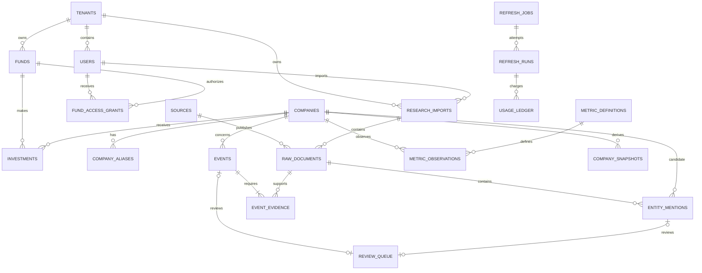
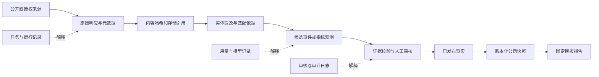

# 03 数据库设计

## 1. 设计原则

PostgreSQL 是事实主库。所有结构变化通过 Alembic 新迁移完成；不修改已应用迁移。UUID 主键、UTC `timestamptz`、显式外键和状态约束为默认。原始事实追加保存，派生快照可重建。租户与基金级行必须通过应用授权和 PostgreSQL 行级安全（RLS）双重限制。

## 2. 表目录：身份、投资与权限

| 表 | 职责与关键字段 | 约束与关键索引 |
| --- | --- | --- |
| `tenants` | `id`, `name`, `status`, `budget_policy_id`, timestamps | PK `id`; 唯一规范化名称；索引 `status` |
| `users` | `id`, `tenant_id`, `email`, `status`, `last_login_at` | FK tenant；唯一 `(tenant_id, lower(email))`; 索引 tenant/status |
| `roles` | `id`, `code`, `permissions`, `scope_type` | 唯一 `code`; 检查 scope |
| `user_role_assignments` | `user_id`, `role_id`, `scope_id`, validity | 复合唯一；FK user/role；索引有效授权 |
| `funds` | `id`, `tenant_id`, `name`, `code`, `status`, `visibility_scope` | 唯一 `(tenant_id, code)`；索引 tenant/status |
| `fund_access_grants` | `user_id`, `fund_id`, `permission`, validity | 复合唯一；FK user/fund；索引 fund/user |
| `companies` | `id`, `credit_code`, `legal_name`, `registered_region`, `identity_status`, `tenant_id?`, `visibility_scope` | 信用代码条件唯一；规范名称/地区索引；私有主体含 tenant |
| `company_aliases` | `id`, `company_id`, `alias`, `alias_type`, validity, `verification_status`, `source_id` | 唯一 `(company_id, normalized_alias, alias_type, valid_from)`；别名检索索引 |
| `company_relationships` | `from_company_id`, `to_company_id`, `relationship_type`, validity, evidence | 禁止自关联；版本化唯一；双向查询索引 |
| `investments` | `id`, `tenant_id`, `fund_id`, `company_id`, amount, currency, ownership, internal_valuation, `visibility_scope` | FK tenant/fund/company；同一轮次条件唯一；RLS；fund/company 索引 |
| `subscriptions` | 用户或基金关注公司、频率覆盖和通知偏好 | 唯一 `(tenant_id, owner_type, owner_id, company_id)`；`next_check_at` 索引 |

## 3. 表目录：证据、事实与报告

| 表 | 职责与关键字段 | 约束与关键索引 |
| --- | --- | --- |
| `sources` | 来源主体、等级、类型、许可、保留策略、基础 URL | 唯一来源代码；等级/许可索引 |
| `source_connectors` | Provider 配置引用、能力、租户范围、启用状态；只存 Secret 引用 | 唯一 `(tenant_id, provider_code, connector_name)`；不存明文密钥 |
| `raw_documents` | source、可选导入批次、外部记录 ID、规范 URL、标题、时间、哈希、存储引用、许可 | `document_dedupe_key` 唯一；内容哈希、导入批次和发布时间索引 |
| `entity_mentions` | 文档中的公司候选、命中依据、候选集合、置信度、解析状态 | 唯一 `(raw_document_id, mention_span_hash, candidate_company_id)`；待解析索引 |
| `events` | 公司、类型/子类、状态、五项评价、事实、不确定性、事件指纹、版本关系 | 唯一 `(company_id, fingerprint_version, event_fingerprint)`；公司/状态/发生时间索引 |
| `event_evidence` | 事件到文档或结构化记录的证据片段、位置、支撑类型 | 唯一 `(event_id, raw_document_id, span_hash)`；文档反查索引 |
| `metric_definitions` | 指标编码、类型、单位集合、周期和行业命名空间 | 唯一 `metric_code`; 行业索引 |
| `metric_observations` | 公司指标历史值、单位、期间、`as_of_date`、来源性质、审核状态 | 观测幂等键唯一；公司/指标/基准日降序索引 |
| `company_snapshots` | 派生状态、信息缺口、新鲜度、构建版本、事实水位 | 唯一 `(company_id, snapshot_version)`；当前快照条件唯一 |
| `report_templates` | 固定模板、版本、适用报告类型和可见范围 | 唯一 `(template_code, version, tenant_id)` |
| `generated_reports` | 模板版本、事实水位、`as_of_date`、存储引用、可见范围 | 唯一报告幂等键；tenant/fund/as-of 索引 |
| `notifications` | 已批准事件/报告的通知投递状态和幂等键 | 投递幂等键唯一；状态/计划时间索引 |

## 4. 表目录：编排、导入与审计

| 表 | 职责与关键字段 | 约束与关键索引 |
| --- | --- | --- |
| `refresh_policies` | TTL、升降频、冷却、预算和 Provider 规则的版本化配置 | 唯一 `(tenant_id, code, version)`；仅一个活动版本 |
| `refresh_jobs` | company、原因、优先级、状态、幂等键、租约、预计成本 | 幂等键唯一；同公司/类型活跃任务部分唯一；领取索引 |
| `refresh_runs` | 每次尝试、检查点、Provider 结果、错误、变化计数、起止时间 | FK job；job/attempt 唯一；状态/开始时间索引 |
| `research_imports` | tenant、导入人、批次、格式、工具、原始文件哈希、许可、解析计数与状态 | `(tenant_id, batch_id)` 和 `(tenant_id, file_hash, parser_version)` 唯一；机构管理员 RLS；状态索引 |
| `review_queue` | 事件或实体提及、触发规则、状态、分配人、决定和理由 | `event_id` 与 `entity_mention_id` 必须且只能存在一个；每个对象唯一；状态索引 |
| `usage_ledger` | task/run/company/tenant/provider、调用量、Token、估算/实际费用、有效产出 | 用量幂等键唯一；tenant/company/provider/日期索引 |
| `prompt_versions` | prompt code、版本、模板哈希、Schema 版本、状态 | 唯一 `(prompt_code, version)`；活动版本条件唯一 |
| `audit_logs` | actor、tenant、action、object、结果、敏感字段类别、时间 | 追加写；tenant/object/time 索引；不保存 Secret 或全文 |

## 5. 简化 ER 图

字段细节以表目录为准，图只展示关键关系。

## 6. 时间语义

- `occurred_at`：事件实际发生时间；未知可空，不得用抓取时间填充。
- `published_at`：来源首次发布时间；未知可空并保留原因。
- `observed_at`：系统首次看到该来源或观测的时间，必填。
- `as_of_date`：指标、快照或报告覆盖到的业务基准日。
- `created_at`：数据库记录写入时间，不能替代以上业务时间。

所有展示应注明所用时间类型，排序默认先 `occurred_at`，为空时再用 `published_at`，但不得改变原字段。

## 7. 去重与幂等键

- 文档：`sha256(source_id + external_record_id)` 优先；无外部 ID 时用 `sha256(source_id + canonical_url + published_at + content_hash)`。相同 URL 内容变更保留新版本，并以 `supersedes_document_id` 关联。
- 事件：`sha256(company_id + taxonomy_version + event_type + subtype + normalized_core_facts + occurred_date_bucket + counterparty + amount + currency)`；规范化规则版本进入 `fingerprint_version`。多来源命中同指纹时只增加证据。
- 指标：`sha256(company_id + metric_code + period_start + period_end + as_of_date + source_id + source_record_id)`；来源修订新增观测并关联被替代行。
- 更新任务：`sha256(scope + company_id + job_type + policy_version + schedule_bucket + refresh_reason)`；同时限制一个公司/任务类型只有一个 `queued` 或 `running` 任务。
- 报告：模板版本、事实水位、受众范围和基准日组成幂等键；无事实变化不重建。

## 8. 发布、纠错和历史保留

事件状态为 `candidate`、`in_review`、`published`、`rejected`、`retracted`、`corrected`。驳回保留候选与理由；撤回保留原记录并从当前快照排除；纠错创建新事件版本，以 `corrects_event_id` 指向旧版本，原事件标记 `corrected`。发布事件至少有一条证据。审核发布、事件版本切换和新快照指针在同一事务中完成。

## 9. 租户、基金与可见范围

`visibility_scope` 取 `public`、`tenant`、`fund`、`user`、`system`。这里的 `public` 表示可在私有平台的授权用户间复用，不表示对互联网匿名公开。访问条件同时校验 tenant、fund grant、角色权限和记录范围；`fund` 记录必须有 `fund_id`，`user` 记录必须有 owner。共享公开事件不含任何基金私密字段，投资表不被快照构建器复制到公共快照。详细规则见[安全合规](07-security-compliance.md)。

## 10. 数据血缘图

