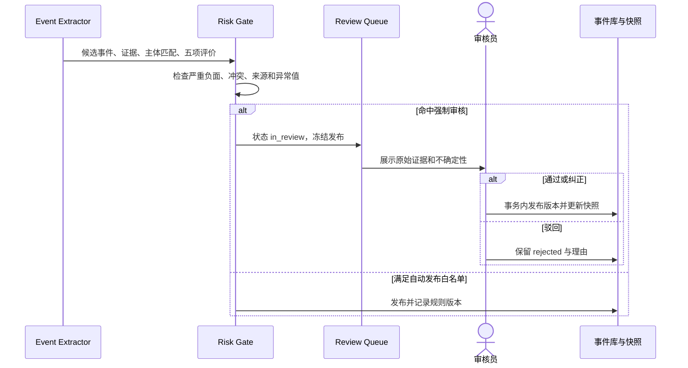

# 04 事件分类与评价

## 1. 分类表

一级类型与二级类型由版本化配置管理；下表是初始词表，改变语义需新增 ADR 和 taxonomy 版本。

| 一级类型 | 二级类型（`event_subtype`） |
| --- | --- |
| `financial_operation` | `revenue_profit`, `cash_burn`, `orders_sales`, `customer_supplier_change`, `wage_arrears`, `layoff`, `shutdown`, `capacity_utilization` |
| `financing_cap_table` | `financing_round`, `valuation_disclosed`, `registered_capital_change`, `shareholder_change`, `control_change`, `equity_pledge`, `equity_freeze_auction`, `secondary_transfer`, `repurchase_bet_trigger` |
| `contract_commercial` | `bid_award`, `major_contract`, `key_customer`, `overseas_order`, `first_order`, `first_mass_production`, `commercialization_milestone`, `contract_cancelled`, `material_breach` |
| `product_technology` | `product_launch`, `certification_license`, `clinical_regulatory`, `patent_ip`, `technology_milestone`, `technology_route_change`, `recall_quality`, `research_suspended` |
| `governance_people` | `legal_representative_change`, `board_change`, `executive_change`, `founder_departure`, `key_person_departure`, `reorganization`, `mass_layoff`, `executive_investigated_missing` |
| `legal_compliance` | `litigation`, `arbitration`, `enforcement`, `dishonest_debtor`, `consumption_restriction`, `administrative_penalty`, `tax_environment_safety`, `cyber_privacy`, `ip_dispute`, `bankruptcy_liquidation`, `abnormal_deregistered` |
| `capacity_assets` | `factory_line`, `project_started`, `commissioned`, `project_delayed`, `asset_mortgage_seizure`, `site_closed`, `permit_change`, `supply_chain_disruption` |
| `exit_liquidity` | `ipo_tutoring`, `ipo_filing`, `ipo_inquiry`, `ipo_suspended`, `ipo_withdrawn`, `neeq_listing`, `merger_acquisition`, `share_transfer`, `repurchase`, `liquidation_exit` |
| `information_quality` | `freshness_change`, `source_coverage_change`, `critical_data_gap`, `source_conflict`, `confidence_change`, `review_status_change` |

## 2. 五项独立评价

| 字段 | 取值 | 解释 |
| --- | --- | --- |
| `direction` | `positive`, `negative`, `neutral`, `mixed`, `unknown` | 事件可能影响方向；不是投资建议 |
| `materiality_score` | 整数 0—100 | 0—24 低、25—49 一般、50—74 重大、75—100 极重大 |
| `risk_severity` | `none`, `low`, `moderate`, `high`, `critical` | 只描述下行情景及处置紧迫度 |
| `confidence_score` | 小数 0—1 | 主体匹配、来源、证据完整性和独立印证的可解释组合 |
| `source_quality` | `A`, `B`, `C`, `D`, `E` | 来源本身的权威性、可定位性和编辑责任 |

不得把五项再合并成一个总分。每项旁边保存组成因素和规则版本。

### 2.1 重大性因素

`materiality_factors` 分别记录金额/规模、核心业务影响、控制权或治理影响、现金流/持续经营/退出影响、首次或里程碑属性、人工标记。缺失营收时不得杜撰比例；未知因素保持空值。分数是用于排序的规则输出，不替代原始事实。

重大合同采用混合标准，满足任一可进入重大候选：公开金额达到配置阈值；交易对手经审核属于关键客户；属于首单、首个量产或首个海外项目；明确构成核心产品商业化里程碑；管理员人工标记。若只有“重大”宣传措辞且无支撑，不能据此判定。

### 2.2 风险严重度

- `low`：局部、可逆、短期不影响核心经营。
- `moderate`：可能影响重要业务、现金或合规，需要跟踪。
- `high`：可能实质影响持续经营、控制权、估值或退出，必须人工审核。
- `critical`：破产清算、核心停产、重大刑事/欺诈指控、控制权丧失等，必须优先审核且绝不自动发布。

### 2.3 可信度与来源等级

建议保留四个 0—1 子项：主体匹配 35%、来源可靠性 30%、证据完整性 20%、独立印证 15%，另记录冲突惩罚。权重配置化；界面展示子项而非只展示结果。

- A：政府、法院、监管和正式公开系统的直接记录。
- B：公司官网、官方账号、正式公告或经许可的权威结构化数据。
- C：有编辑责任的主流财经或行业媒体，能回链原始依据。
- D：聚合转载、研究工具输出或单一自媒体，只能作线索或待核证据。
- E：匿名、无法定位原文或内容冲突；不得支撑发布。

`license_status` 单独记录获取、缓存、引用和再分发权限，不计入 `source_quality` 或 `confidence_score`。即使来源质量为 A，许可不允许保存或展示时也必须遵守许可；许可未知会阻塞相应保存/发布动作，但不能通过降低来源分数来掩盖。

## 3. 自动发布与强制审核

自动发布必须同时满足：Schema 校验通过；公司身份 `verified`；至少一条可定位证据；来源 A/B；`confidence_score >= configured_threshold`（Demo 建议 0.85）；无来源冲突；不属于高/极高风险；不命中强制审核子类；规则明确允许。

以下任一条件强制人工审核：身份歧义；来源冲突；只有 D/E 来源；高或极高风险；欺诈、刑事、失联、破产、停业、核心人员调查；可能实质影响估值、持续经营或退出；低于置信阈值；金额/单位异常；撤稿、纠错或后续裁判。非官方重大负面原则上还需两个独立来源。指控必须保留“被指控/尚未认定”等法律状态。

## 4. 状态与后续更新

`candidate` 经风险闸门后进入 `in_review` 或允许 `published`；审核可转为 `rejected`。已发布事件若原文撤回或事实失效，保留记录并标记 `retracted`；事实纠正时创建新版本，旧版本标记 `corrected` 并互相关联。新的裁判、融资进展或合同后续作为独立后续事件，通过 `related_event_id` 建立时间线，不能静默改写历史。

详细字段校验见[API 设计](08-api-design.md)，事务和版本关系见[数据库设计](03-database-design.md)。
