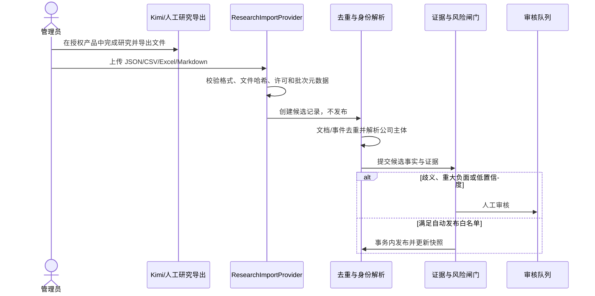

# 05 数据源与 Provider 策略

## 1. 来源优先级与保存边界

优先级依次为：官方政府/法院/监管系统；公司官网与正式公告；经许可商业 API；主流财经和行业媒体；Kimi 等联网研究工具；自媒体线索。不得绕过登录、验证码、付费墙、频率限制或反爬措施，也不得抓取受限商业数据库前端。

普通新闻默认只保存 URL、标题、来源、发布时间、观察时间、内容哈希、许可状态、最小必要证据片段和可选存储引用。关键官方证据可按配置保存快照。每个来源记录许可、允许用途、保留期、是否可缓存/再分发和删除要求；许可未知时只保存定位元数据并进入审核。

## 2. 统一 Provider 协议

业务层只依赖以下版本化协议，Provider 名称和价格来自配置与依赖注入。

| 接口 | 方法与输入 | 输出 | 职责边界 |
| --- | --- | --- | --- |
| `SearchProvider` | `search(SearchRequest)` | `SearchResultBatch` | 返回标题、URL、摘要、时间和来源记录 ID；不判定事实 |
| `StructuredDataProvider` | `fetch(StructuredDataRequest)` | `StructuredRecordBatch` | 返回有许可的工商、司法、监管等结构化记录 |
| `ResearchImportProvider` | `parse(ImportRequest)` | `ResearchImportBatch` | 解析 JSON/CSV/Excel/Markdown；只产生候选 |
| `DocumentFetcher` | `fetch(FetchRequest)` | `FetchedDocument` | 遵守访问许可获取内容，返回哈希、响应元数据和存储建议 |
| `LLMProvider` | `extract(EventExtractionRequest)` | `StrictEventCandidate` | 只做证据约束的结构化抽取，不直接发布 |
| `StorageProvider` | `put/get/delete(StorageObject)` | `StorageReference` | 保存许可允许的文件；业务库只存引用和哈希 |
| `NotificationProvider` | `send(NotificationRequest)` | `DeliveryReceipt` | 只发送已批准内容，使用投递幂等键 |
| `JobQueueProvider` | `enqueue/lease/ack/fail(Job)` | `JobReceipt` | Demo 映射 PostgreSQL 任务表，隔离未来队列实现 |

所有请求携带 `request_id`、`tenant_id` 或公共范围、预算上下文、许可用途、超时、Provider 配置版本；所有响应携带 Provider、外部记录 ID、观察时间、缓存状态和估算用量。

## 3. 错误、重试和降级

统一错误：`ProviderDisabled`、`BudgetExceeded`、`RateLimited`、`TransientFailure`、`PermanentFailure`、`PermissionDenied`、`SchemaMismatch`。权限、预算、永久错误和确定性 Schema 错误不重试；网络或限流按 `retry_after` 或有上限退避，默认最多两次。LLM 解析/校验失败最多修复重试一次，仍失败则保留失败记录且不发布。

降级顺序由配置明确给出：缓存 → 已有结构化数据 → 许可允许且不更贵的替代 Provider → 保留旧快照并延迟。禁止静默切换到更昂贵模型、未授权来源或消费端接口。

## 4. 预留实现及启用条件

| 实现 | 当前状态 | 启用前提 |
| --- | --- | --- |
| `MockSearchProvider` | 第 2 阶段建议实现 | 只读虚构 fixture，无网络 |
| `ManualResearchImportProvider` | 第 2/3 阶段 | 文件授权和格式校验通过 |
| `KimiAgentImportProvider` | 预留 | 用户人工导出、许可明确，不调用未公开接口 |
| `KimiScheduledResearchImportProvider` | 预留 | Kimi Work/Claw 等官方导出能力、授权和稳定格式已确认 |
| `KimiOpenPlatformProvider` | 预留 | 正式 API 文档、账号授权、价格和数据条款确认 |
| `LicensedBusinessDataProvider` | 预留 | 单独合同允许 API 调用、缓存和目标用途 |
| `OfficialPublicDataProvider` | 预留 | 官方接口或合法下载路径、频率和保留边界确认 |
| `DeepSeekLLMProvider` | 第 3 阶段候选 | API 能力、模型名、Schema 支持、价格和预算确认 |

## 5. Kimi 能力边界

Kimi 消费端会员/Agent、Kimi Work 或 Kimi Claw、Kimi Code、开放平台 API、以及商业数据库授权是彼此独立的授权面：

- 消费端会员额度不视为网站 API 额度；不得抓取账户页、Cookie 或未公开接口。
- Agent/Work/Claw 的结果只能通过官方导出或人工导入进入候选层，保存和再分发取决于来源许可。
- Kimi Code 是开发辅助能力，不自动赋予生产数据访问、模型 API 或商业数据库权利。
- 开放平台只有在正式文档、密钥、价格、速率和条款确认后才能作为 Provider。
- 天眼查、iFind 等数据必须有单独授权；Kimi 结果不能替代工商、司法或监管原始来源。

系统在完全没有 Kimi 时仍须通过 Mock 和人工导入完成闭环。

## 6. 统一 ResearchImport 格式

批次元数据：`schema_version`、`batch_id`、`queried_at`、`research_tool`、`agent_name`、`original_query`、`target_company_hint`、`file_hash`、`parser_version`、`license_status`、`imported_by`。

每条记录至少包含：

- `target_company` 与 `company_identity_evidence`（全称、信用代码、地区、官网等可为空但须解释）；
- `source_url`、`source_title`、`source_published_at`、`evidence_excerpt`；
- `candidate_event_type`、`candidate_event_subtype`、`amount`、`currency`；
- `uncertainties`、`requires_human_review`、`license_status`；
- `queried_at`、`research_tool`、`original_query`、`batch_id` 和原始文件哈希。

金额和币种必须分列，未知保持空；证据片段是最小必要引用。JSON 使用版本化对象数组；CSV/Excel 使用固定英文列名；Markdown 使用 YAML 元数据加逐条记录段落。解析器先生成同一规范对象，再校验。缺少来源定位、许可或身份依据时不得自动发布。

## 7. DeepSeek 低成本抽取

`DeepSeekLLMProvider` 默认关闭。只有文档哈希为新、规则判定相关、主体候选已准备、预算通过时才调用；输入仅含必要身份、标题、证据片段和 Schema，采用低温度、受限输出和非推理/低成本配置（具体能力确认后再定）。响应必须通过[严格事件 Schema](08-api-design.md)，记录 provider、model、prompt/schema 版本、参数、Token、延迟和估算费用。不得补全缺失金额、营收、利润、现金、估值或持股。

## 8. 缓存与变化检测

搜索请求以 Provider、规范查询、身份版本和时间窗为缓存键；文档按外部记录 ID、规范 URL、ETag/Last-Modified 和内容哈希判断变化。缓存未过期或内容哈希未变时直接复用结果，不调用 LLM、不重建报告。缓存命中、无变化运行和有效事件均写入用量台账，支持成本归因。
