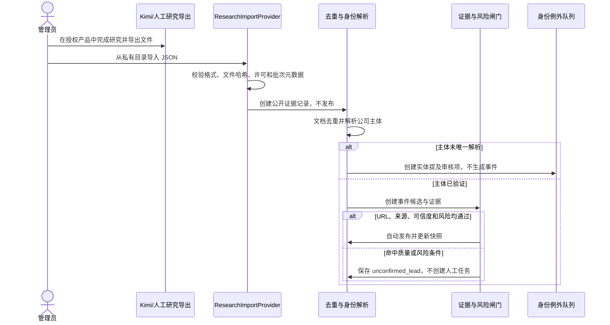

# 05 数据源与 Provider 策略

> 当前增量范围见 [ADR-0021](DECISIONS/ADR-0021-incremental-event-delivery.md)、[ADR-0022](DECISIONS/ADR-0022-curated-baseline-and-incremental-research.md) 和 [完整计划](15-incremental-event-delivery-plan.md)：负责人确认的初始资料与系统网络新发现是两条入口，复用同一事件与证据链。下列协议/预留来源不等于全部已接通，九类检索标签不等于九类均有可靠数据。未配置、读取失败、受限、成功无记录与取得证据必须分别表达。

## 1. 来源优先级与保存边界

优先级依次为：官方政府/法院/监管系统；公司官网与正式公告；经许可商业 API；主流财经和行业媒体；Kimi 等联网研究工具；自媒体线索。不得绕过登录、验证码、付费墙、频率限制或反爬措施，也不得抓取受限商业数据库前端。

上述排序用于选择和解释来源，不是逐家公司必须经过的核验步骤。负责人复核的表格可独立建立初始资料，默认不额外访问政府、官网或商业数据库；实际身份/事实冲突定点处理。记录原来源性质、人工确认及系统本轮读取状态，网页暂不可读不否定已确认的整理记录。

普通新闻默认只保存 URL、标题、来源、发布时间、观察时间、内容哈希、许可状态、最小必要证据片段和可选存储引用。关键官方证据可按配置保存快照。每个来源记录许可、允许用途、保留期、是否可缓存/再分发和删除要求；许可未知时只保存定位元数据并进入审核。

## 2. 统一 Provider 协议

### E2.1 已有公开网络路由的覆盖记录

`research_coverage.py` 沿用现有两个组合检索：`business_capital` 覆盖财务/融资/合同主题，`technology_risk_exit` 覆盖技术/治理/司法/产能/退出主题。任务创建时在 `CompanyResearchJob.coverage` 中记录 `category-source-checks-v1` 及当时的分组和主备 Provider 配置。多个类别共用原有调用，未增加查询、供应商、费用上限或频率；这不代表接通了各类官方全库或专业数据库。信息质量由检查记录汇总，不配置独立外部检索。

类别结果依据搜索响应和实际正文检查，不查询事件数量。区分 `not_configured/not_checked/blocked/failed/no_records/candidates_only/evidence_obtained/unknown`；`no_records` 仅表示已完成的组合检索未检出合格线索，任一来源失败时不能把部分空结果当作成功无记录。正文沿用既有主体同段与分类规则，分类未确定的资料继续保留覆盖缺口；搜索标题/摘要不能充当正文。取得相关正文同时允许记录其他来源受阻/失败，不能升级成事实确认或公司经营判断。

分别保存尝试时间、成功搜索的缓存基准时间、正文成功检查时间及缓存复用标记。缓存重新处理不刷新原检查时间，不借任务结束时间或事件发生时间补造。无版本化记录的历史任务保持“记录不足”，不回填、不从旧 `modules=completed/no_data` 反推。该视图是本人已结束查询的历史记录，不作为当前完整来源清单或自动刷新信号；机构私有可信来源监测仍保留原独立权限，不能混入共享公司的覆盖记录。费用状态、预占/结算与恢复属于 E2.2。

业务层只依赖以下版本化协议，Provider 名称和价格来自配置与依赖注入。

| 接口 | 方法与输入 | 输出 | 职责边界 |
| --- | --- | --- | --- |
| `SearchProvider` | `search(SearchRequest)` | `SearchResultBatch` | 返回标题、URL、摘要、时间和来源记录 ID；不判定事实 |
| `StructuredDataProvider` | `fetch(StructuredDataRequest)` | `StructuredRecordBatch` | 返回有许可的工商、司法、监管等结构化记录 |
| `ResearchImportProvider` | `parse(ImportRequest)` | `ResearchImportBatch` | 解析 JSON/CSV/Excel/Markdown；只产生候选 |
| `DocumentFetcher` | `fetch(FetchRequest)` | `FetchedDocument` | 遵守访问许可获取内容，返回哈希、响应元数据和存储建议 |
| `LLMProvider` | `extract(EventExtractionRequest)` | `StrictEventCandidate` | 只做证据约束的结构化抽取，不直接发布 |
| `StorageProvider` | `put/get/delete(StorageObject)` | `StorageReference` | 保存许可允许的文件；业务库只存引用和哈希 |
| `NotificationProvider` | `send(NotificationRequest)` | `DeliveryReceipt` | 只发送已批准内容，使用投递幂等键 |
| `JobQueueProvider` | `enqueue/lease/ack/fail(Job)` | `JobReceipt` | Demo 映射 PostgreSQL 任务表，隔离未来队列实现 |

所有请求携带 `request_id`、`tenant_id` 或公共范围、预算上下文、许可用途、超时、Provider 配置版本；所有响应携带 Provider、外部记录 ID、观察时间、缓存状态和估算用量。

## 3. 错误、重试和降级

统一错误：`ProviderDisabled`、`BudgetExceeded`、`RateLimited`、`TransientFailure`、`PermanentFailure`、`PermissionDenied`、`SchemaMismatch`。权限、预算、永久错误和确定性 Schema 错误不重试；网络或限流按 `retry_after` 或有上限退避，默认最多两次。LLM 解析/校验失败最多修复重试一次，仍失败则保留失败记录且不发布。

降级顺序由配置明确给出：缓存 → 已有结构化数据 → 许可允许且不更贵的替代 Provider → 保留旧快照并延迟。禁止静默切换到更昂贵模型、未授权来源或消费端接口。

## 4. 预留实现及启用条件

| 实现 | 当前状态 | 启用前提 |
| --- | --- | --- |
| `MockSearchProvider` | 已实现 | 只读虚构 fixture，无网络；CI 和默认开发环境唯一启用的搜索实现 |
| `BaiduSearchProvider` | R3 已实现，默认关闭 | R2 选定主源；只允许后台 Worker、显式开关、预算和 Secret 齐备时调用 |
| `BochaSearchProvider` | R3 已实现，默认关闭 | R2 选定条件回退源；仅在百度失败或准确主体结果不足时调用，不做并行双查 |
| `ManualResearchImportProvider` | 已实现 V1 | 仅本机 JSON、公开来源元数据和机构管理员；身份例外审核，其余由确定性策略自动路由 |
| `KimiAgentImportProvider` | 预留 | 用户人工导出、许可明确，不调用未公开接口 |
| `KimiScheduledResearchImportProvider` | 预留 | Kimi Work/Claw 等官方导出能力、授权和稳定格式已确认 |
| `KimiOpenPlatformProvider` | 预留 | 正式 API 文档、账号授权、价格和数据条款确认 |
| `LicensedBusinessDataProvider` | 当前无活动实现 | 历史审计不改写；新能力不得依赖已退役供应商的 SDK、字段、配额或缓存 |
| `OfficialIdentityProvider` | 已实现政府 JSON 与历史授权商业数据双依据 | 政府来源和历史授权商业来源使用不同 `verification_basis`，不得混称官方 |
| `OfficialPublicDataProvider` | 预留 | 非工商身份的官方接口或合法下载路径、频率和保留边界确认 |
| `DeepSeekLLMProvider` | 已实现证据约束变化解读，默认关闭 | 只处理新且相关的最小证据片段；严格 Schema、证据和预算校验 |

## 受控可信来源监测 V1

V1 不是通用爬虫或搜索引擎。平台管理员先把已核验公司的官网、政府页、RSS/Atom、Sitemap、列表页或单页登记为 `trusted_sources`，后台 Worker 才能访问；同步搜索和详情请求永不联网。列表页可明确设置内容路径前缀，以排除同域导航和无关栏目。

检查结果先进入 tenant 私有的 `candidate_documents`。许可不明时只保存 URL、标题、日期、哈希和定位元数据，不默认保存全文；`public_access` 仅表示无需登录可访问，可用于同 tenant 的私有研究，不代表允许商业再分发；只有 `permission_confirmed` 的展示引用才具备后续共享晋升资格。`unclear` 或 `restricted` 来源在授权依据更新前不能交接研究。

候选先由管理员标记是否值得研究；只有另行确认谨慎表述、最小证据摘录、事件分类和评分后，才通过既有导入服务生成同 tenant 的私有底稿和候选事件。原候选、来源、导入批次、文档、事件和证据以 `candidate_document_id` 保留血缘，重复交接幂等。监测和交接都不调用 LLM、不自动晋升或发布。

低频调度只根据管理员登记的检查频率选取到期来源；默认 dry-run，每次最多 10 个来源，连续失败按 2/4/8 倍间隔退避。调度器只入队，网络访问仍在独立 Worker 中执行，不进入公司搜索或详情请求。

## 5. 供应商中立受限研究 V1

R2 已完成搜索源准入决策：百度作为主源，博查只在主源错误，或没有主体准确、非资料聚合页且未明确过期的结果时回退。两者不得默认并行调用。搜索缓存按 Provider、规范查询和公司身份指纹保存 14 天，跨用户、跨质量策略版本复用同一平台共享搜索结果；质量策略升级时重新执行正文与近期性闸门，不重新消耗搜索额度。价格和额度不写死为商业承诺，真实运行仍受当前部署配置、调用台账和每日/月度系统闸门约束。

R3 使用 `SearchProvider` 发现候选 URL，再使用现有安全抓取边界读取原网页。R3.1 在百度适配器使用其正式支持的“最近一年”检索条件，并继续用本地可配置近期窗作最终判断；先按政府网站、证券监管和交易所正式披露站点、已核验公司官网、经人工维护的小型媒体域名清单、其他可定位原文排序。已核验官网入口作为零搜索调用的确定性候选加入同一有限队列，仍须经过安全抓取和正文证据闸门。该排序只决定有限抓取额度先看谁，不等于来源背书。明确过旧、未来日期、商业资料库档案页和已知聚合资料页在抓取前剔除；搜索结果日期不可靠或缺失时仍可抓取原页，由原页元数据作最终判断。

百度或博查返回的摘要、排名和答案不能作为事实证据；只有原网页通过 HTTPS、SSRF、重定向、robots、MIME、大小、主体匹配和许可检查后，才保存最小必要证据片段。来源发布时间位于可配置近期窗（Demo 默认 365 天）、正文同一片段包含准确主体和显式重要变化时，才生成待核实候选；`occurred_at` 只有独立证据时才填写，`published_at` 和 `observed_at` 不得代替事件实际发生时间。严重负面、身份冲突和证据不足内容只能进入待核实线索。V1 的分类和结构化表述使用确定性规则，不调用 `LLMProvider`，因此缓存命中和新研究都产生 0 模型 Token；未来只有真实质量数据证明必要时才单独引入模型抽取。

R3.1 完成时的 V1 安全抓取只解析 HTML、XHTML、RSS/Atom 和 XML。R3.3 在真实缓存回放确认正式证据落在 PDF 后，只为政府、监管/交易所和已核验公司官网增加受限 PDF 通路。PDF 必须继续通过 HTTPS、域名、DNS/SSRF、重定向、robots、MIME 和字节上限，再在隔离子进程中检查文件签名、加密状态、页数、文本量和解析超时；不执行脚本、附件或嵌入内容，不长期保存 PDF 二进制全文。非权威域名 PDF、扫描件、加密文件或无可提取文本的文件只记录证据缺口，不自动生成事实。

R3.3 把搜索 API 发现、目标页面访问权和已获取证据分开记录。有效期内的百度/博查缓存可在不新增 Provider 调用的前提下合并去重；高价值页面被 robots 阻断时，摘要仍不能成为事实，只允许一次受搜索上限、缓存、取消和断线恢复控制的原始来源回溯。找不到可合法读取的替代原文时，保留内部线索、访问状态和需授权人工导入的证据缺口，不绕过限制。

R3.5 不增加搜索组、Provider 或四次任务上限。固定查询与抓取结束后，只有现有候选元数据能指出一个明确且重要的证据缺口时，才按退出、融资、合同、合规、产品、产能、治理和经营的固定顺序补查一次；原始来源回溯已经使用过这一额度时直接跳过。新取得正文仍须经过安全抓取、主体、近期性和内容质量闸门。缓存复用、无变化、旧候选、取消任务和没有新文档的事件均不进入模型队列；模型只生成与事件和可展示证据绑定的待核实派生解读，不把搜索摘要变成事实，也不改变候选状态。

V1 继续使用 PostgreSQL 任务状态机，不引入通用自主 Agent 或第二套持久状态。Provider 密钥只注入专用 Worker；API 与前端容器不获得密钥。默认、CI 和 dry-run 均为零网络；真实搜索必须在一次性受控窗口显式开启四重调用闸门。

主源失败只记录有限诊断字段：Provider、检索组、错误类别、HTTP 状态和调用数。认证失败、权限拒绝、安全策略拒绝、限流、配额不可用、请求无效、上游超时和上游不可用分别归类；不得记录 API Key、查询正文、供应商错误消息或原始错误响应。诊断用于判断配置、额度还是供应商稳定性问题，不向个人用户暴露。

## 6. Kimi 能力边界

Kimi 消费端会员/Agent、Kimi Work 或 Kimi Claw、Kimi Code、开放平台 API、以及商业数据库授权是彼此独立的授权面：

- 消费端会员额度不视为网站 API 额度；不得抓取账户页、Cookie 或未公开接口。
- Agent/Work/Claw 的结果只能通过官方导出或人工导入进入候选层，保存和再分发取决于来源许可。
- Kimi Code 是开发辅助能力，不自动赋予生产数据访问、模型 API 或商业数据库权利。
- 开放平台只有在正式文档、密钥、价格、速率和条款确认后才能作为 Provider。
- 历史商业数据授权不再构成未来技术路线；活动集成已按 ADR-0018 和 R1 退役。Kimi 结果不能替代工商、司法或监管原始来源。

系统在完全没有 Kimi 时仍须通过 Mock 和人工导入完成闭环。

## 7. 统一 ResearchImport 格式

以下 V1 描述当前代码；负责人确认的表格入口按本节末 ADR-0022 补充目标实现，不能把 V1 限制作为新方向的拒绝理由。

人工研究导入 V1 只接受 `data/private/research_imports/` 下的 JSON。批次输入包含 `schema_version`、`batch_id`、`queried_at`、`research_tool`、`agent_name`、`original_query`、`target_company_hint`、`license_status` 和 `records`；系统另行生成 `file_hash`、`parser_version` 与 `imported_by`。`license_status` 当前只能为 `public`，文件上限 1 MiB，每批最多 500 条。

每条记录包含：

- `external_record_id` 和 `company_identity_evidence`（工商全称必填，信用代码、地区、官网可选）；
- `source_code`、`source_name`、`canonical_url`、可空的 `source_published_at` 或日期精度 `source_published_on`、可空且独立的 `occurred_at`、`title` 与最小必要 `evidence_excerpt`；
- `event_type`、`event_subtype`、`direction`、重要性、风险、置信度和来源质量；
- 结构化 `facts`、`uncertainties`；旧文件中的 `requires_human_review` 仅作为兼容字段接受，不覆盖当前发布策略。

目标公司必须预先存在。信用代码优先，其次使用工商全称、地区和已核验官网；未唯一解析或官网冲突时保留原始文档与实体提及并创建身份审核项，不生成事件。解析成功后检查 URL 可用性、来源 A/B、官方域名一致性、可信度和风险：全部满足时自动发布并更新快照；否则以 `unconfirmed_lead` 保存且不创建逐条事件审核任务。同一候选事件的新独立来源会追加证据；已发布事件的新安全证据可直接附加，其他证据保持未确认且不改变既有事实。相同租户内的文件哈希/解析器版本和批次编号分别幂等；同一外部记录内容冲突时整批回滚。

来源发布日期与事件实际发生时间必须分开；仅知道日期时使用 `source_published_on`，不得虚构时刻。未知保持 `null`，不得用查询时间或观察时间替代来源/事件时间。所有非空时间戳必须带时区。

V1 不复制保存原始文件字节，只保存受 RLS 保护的批次元数据、文件哈希，以及许可允许的公开来源定位、最小证据片段和结构化记录。CSV、Excel、Markdown、网页上传、内部财务和投资协议等敏感材料均未实现，启用前需另行设计格式、恶意内容隔离、正式认证与存储许可。实体提及不能由通用事件审核接口批准；只能在专用流程中选择有效关联的官方候选，由程序重跑解析、事件生成和发布路由。

工商身份导入另使用 `data/private/identity_imports/`。政府/GSXT JSON 使用 `verification_basis=official_government`、`license_status=public`；历史授权商业记录使用 `verification_basis=licensed_business_data`、`license_status=permission_confirmed`，且不得改称政府或公开网络证据。记录要求 HTTPS 白名单域名、带时区核验时间和通过校验位的统一社会信用代码。同一代码的全称变化记为 `conflict`；同一代码且全称相同时，地区格式差异保留审计但不覆盖主档。无现有公司记为 `unmatched`，不得自动创建公司。

旧 V1 的名称候选、信用代码精确查询和私有缓存属于历史实现。R1 已移除其活动代码、专用开关、CLI 和部署挂载，不再存在可发起真实调用的产品入口；生产 Secret 和缓存只按运维手册在合并部署、备份及验证后清理。历史决策见 ADR-0010，当前有效方向见 ADR-0018。

URL 验证是受控外部读取：`EXTERNAL_CALLS_ENABLED=false` 时不发请求并将记录降级为未确认；开启后仍受 `SOURCE_URL_MAX_CHECKS_PER_IMPORT` 限制，且拒绝私网、回环和非 HTTP(S) 目标。该步骤不调用模型或付费 API，请求数写入 `usage_ledger`。

### 7.1 负责人确认表格（E4.1 本地已验证）

- 本地只读解析现有表格，默认预览；公司/适用别名用 `curator_confirmed` 准入，普通已复核事实通过可追溯的人工决定进入初始事件。程序解析不直接决定发布，也不把文件中的指令当执行授权。
- 表格记录 ID、原文件哈希、工作表/行、整理工具、资料基准日、确认人/时间和作用域关联到已有导入/证据链；原文件仅在 Git 忽略的私有范围内处理。原报道、人工整理摘要和实际抓取摘录保留各自性质，不伪造原文或哈希。
- 来源不可读只更新本轮读取状态；已确认初始事实继续可读。表内待核线索、日期未知、媒体报道和品牌/集团归属保持原样，实质冲突不覆盖旧事实。普通用户上传不会自动得到平台确认权限。
- 消费端 ChatGPT/Gemini 研究结果通过负责人导出并复核后导入；网站后台仍用现有正式搜索 API 与合规读取，不调用未公开消费端接口。静态读取失败时可补充人工导出来源，不用重复核验整家公司。
- 首批只覆盖当前文件结构与已选公司闭环，表格列映射、幂等、权限及单公司对照见[完整计划 E4](15-incremental-event-delivery-plan.md#e4-负责人确认资料与按需增量研究)。CSV/Markdown 全格式支持、客户私有文件平台及批量联网仍不由此自动启动。

## 8. DeepSeek 低成本抽取

`DeepSeekLLMProvider` 默认关闭。只有文档哈希为新、规则判定相关、主体候选已准备、预算通过时才调用；输入仅含必要身份、标题、证据片段和 Schema，采用低温度、受限输出和非推理/低成本配置（具体能力确认后再定）。响应必须通过[严格事件 Schema](08-api-design.md)，记录 provider、model、prompt/schema 版本、参数、Token、延迟和估算费用。不得补全缺失金额、营收、利润、现金、估值或持股。

## 9. 缓存与变化检测

搜索请求以 Provider、规范查询、身份版本和时间窗为缓存键；文档按外部记录 ID、规范 URL、ETag/Last-Modified 和内容哈希判断变化。缓存未过期或内容哈希未变时直接复用结果，不调用 LLM、不重建报告。缓存命中、无变化运行和有效事件均写入用量台账，支持成本归因。
