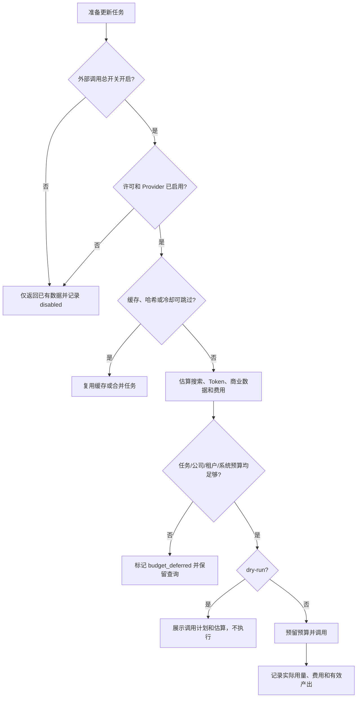

# 06 成本控制

## 1. 变量与公式

所有参数进入版本化 `refresh_policies` 或价格配置，不写死在业务代码。

- `N`：公司数；`h/a/w/b`：高风险、近期活跃、关注、普通公司的互斥比例。
- `q`：经 TTL、冷却和任务合并后每月独立按需任务数。
- `f_h/f_a/f_w/f_b`：各组月检查频次；`k`：每任务计划搜索数。
- `c`：搜索缓存命中率；`d`：新文档命中率；`r_f`：规则过滤率。
- `t_in/t_out`：单次 LLM 平均输入/输出 Token；`r_review`：候选进入人工审核比例。
- `p_s/p_in/p_out/p_b`：搜索、百万输入/输出 Token、商业数据单价。
- `B`：商业数据调用数；`m`：单次审核分钟；`p_h`：人工小时成本。
- `C_compute/C_db/C_file`：计算、数据库、文件存储月成本。

公式：

```text
T_daily  = 30N
T_tiered = N(h*f_h + a*f_a + w*f_w + b*f_b)
T_demand = N(h*f_h + a*f_a + w*f_w) + q
S        = T * k * (1-c)
L        = S * d * (1-r_f)
TokenIn  = L * t_in; TokenOut = L * t_out
C_external = S*p_s + TokenIn/1e6*p_in + TokenOut/1e6*p_out + B*p_b
C_review   = L*r_review*m/60*p_h
C_total    = C_external + C_review + C_compute + C_db + C_file
C_company  = C_total/N
C_event    = (C_external + C_review)/reliable_published_events
```

`C_event` 在策略比较中使用可变成本，基础设施单独列示，避免固定成本掩盖更新策略效率；经营决策仍看 `C_total`。

## 2. 三种策略

| 策略 | 优点 | 主要代价 | 结论 |
| --- | --- | --- | --- |
| 每日全量 | 延迟最低、覆盖最宽 | 大量无变化任务、缓存失效与人工噪声；成本随 `30N` 增长 | Demo 不采用 |
| 分级定时 | 比全量节省，规则可解释 | 即使无人关注，普通公司仍固定扫描；命中率受周期限制 | 可作基线 |
| 按需+低频巡检 | 查询价值、风险和变化驱动；缓存/合并效果最好 | 需准确维护新鲜度与调度状态，低关注公司发现延迟更长 | 当前选择 |

选择第三种不是只看调用总数：目标函数是最低的可靠有效事件综合成本，同时满足关注公司时效。数据过期先返回旧快照；请求只在预算、TTL、冷却和去重后入队。高风险可临时升频，长期无变化自动降频。

## 3. 可重复的规划示例

下表是说明公式的规划样例，不是供应商报价或预算承诺。假设 `h/a/w/b=1%/4%/15%/80%`：每日全量 `T=30N`；分级频次为 30/10/4/1 次/月，所以 `T=2.1N`；按需策略的高风险/活跃/关注频次为 15/10/4 次/月，普通公司不固定扫描，合并后的用户任务 `q=0.05N`，所以 `T=1.2N`。每任务计划 2 次搜索；每日/分级缓存命中 35%，按需 55%；新文档命中分别 0.5%/5%/15%；规则过滤 60%；每次模型 1600/300 Token；20% 候选审核、55% 模型候选最终成为可靠已发布事件；每次审核 6 分钟、人工规划价 ¥200/小时；搜索 ¥0.03/次、模型输入/输出 ¥1/¥2 每百万 Token；商业数据调用为 0。300/1000 家共享计算、数据库和文件存储规划值合计为 ¥300/¥800，10/50 家使用已有资源记 0。

| 公司 | 策略 | 月任务 | 搜索 | LLM | 输入/输出 Token | 外部费 ¥ | 审核数 | 基础设施 ¥ | 月均/公司 ¥ | 有效事件可变成本 ¥ |
| ---: | --- | ---: | ---: | ---: | ---: | ---: | ---: | ---: | ---: | ---: |
| 10 | 每日 | 300 | 390 | 0.78 | 1,248/234 | 11.70 | 0.16 | 0 | 1.48 | 34.55 |
| 10 | 分级 | 21 | 27.3 | 0.55 | 874/164 | 0.82 | 0.11 | 0 | 0.30 | 10.00 |
| 10 | 按需 | 12 | 10.8 | 0.65 | 1,037/194 | 0.33 | 0.13 | 0 | 0.29 | 8.19 |
| 50 | 每日 | 1,500 | 1,950 | 3.90 | 6,240/1,170 | 58.51 | 0.78 | 0 | 1.48 | 34.55 |
| 50 | 分级 | 105 | 136.5 | 2.73 | 4,368/819 | 4.10 | 0.55 | 0 | 0.30 | 10.00 |
| 50 | 按需 | 60 | 54 | 3.24 | 5,184/972 | 1.63 | 0.65 | 0 | 0.29 | 8.19 |
| 300 | 每日 | 9,000 | 11,700 | 23.40 | 37,440/7,020 | 351.05 | 4.68 | 300 | 2.48 | 34.55 |
| 300 | 分级 | 630 | 819 | 16.38 | 26,208/4,914 | 24.61 | 3.28 | 300 | 1.30 | 10.00 |
| 300 | 按需 | 360 | 324 | 19.44 | 31,104/5,832 | 9.76 | 3.89 | 300 | 1.29 | 8.19 |
| 1000 | 每日 | 30,000 | 39,000 | 78.00 | 124,800/23,400 | 1,170.17 | 15.60 | 800 | 2.28 | 34.55 |
| 1000 | 分级 | 2,100 | 2,730 | 54.60 | 87,360/16,380 | 82.02 | 10.92 | 800 | 1.10 | 10.00 |
| 1000 | 按需 | 1,200 | 1,080 | 64.80 | 103,680/19,440 | 32.54 | 12.96 | 800 | 1.09 | 8.19 |

按需策略的 LLM 数可能高于分级定时，因为命中新内容更多；这不是成本异常，而是更高的有效产出。它仍以更少搜索、更低月总可变成本和更低每条有效事件成本完成目标。真实试验后必须用实际命中率、价格和审核时间替换示例值。

## 4. 预算层级与闸门

预算按任务、公司日/周、租户周/月、系统周/月逐层校验，同时检查搜索数、输入/输出 Token、冷却期、查询缓存、内容哈希、Provider 开关和许可。费用未知时按配置上界预留；完成后结算实际或估算值。



## 5. R3 受限公开研究预算

R3 默认采用百度主源、博查条件回退，不并行双查。固定九类投资研究覆盖被压缩为两组高密度查询；每个任务最多 4 次搜索，其中回退调用也计入同一上限。主源只有在失败，或没有主体准确、非资料页且未明确过期的结果时才回退；单纯排名靠后不触发双查。系统默认搜索上限为 50 次/日、1500 次/月，每次最多取 10 个结果，再经过 12 个候选 URL、8 次抓取、3 份合格文档、2 MiB 下载量和 180 秒执行时间的逐层限制。真实额度或价格变化只调整部署配置，不改业务代码。

搜索缓存默认 14 天，键包含 Provider、规范查询和公司身份指纹。同一公司被不同用户查询时复用平台共享缓存；公司身份变化或缓存过期后重新查询，质量/近期策略升级则复用搜索与文档缓存并重新过闸门，因此不为规则调整重复消耗搜索额度。页面刷新、断线重连、重复申请、取消后再次打开以及缓存命中均不增加搜索调用。取消时已取得且通过主体匹配的公共缓存继续保留，避免下一位用户重复付费，但用户当日防滥用次数不退。

V1 不调用模型、不生成报告，因此模型 Token 和模型费用恒为 0。搜索 API 即使当前免费，也视为“有额度或可能计费”的外部资源：专用 Worker 必须同时开启 `WEB_RESEARCH_ENABLED`、`EXTERNAL_CALLS_ENABLED`、`WEB_RESEARCH_CALLS_ENABLED` 和 `PAID_API_CALLS_ENABLED`；API/前端继续保持关闭。这样可以避免免费额度变化后在无人知情时继续消耗。

R3.5 仍不提高每任务四次搜索上限：原始来源回溯和证据缺口补查共享一个额外尝试名额，补查只调用百度主源，博查最多融合已有缓存。尝试状态在联网前写入 PostgreSQL，进程中断恢复不会重复消耗。候选模型解读与既有重要变化解读共用月 Token 上限；只有本次新建、主体已核验且证据允许展示的候选才排队。缓存重放、无变化、取消、低重要性、证据撤下、打开页面和未请求报告均为零模型调用。

## 6. 敏感参数与观测

最敏感的参数通常是新文档命中率、缓存命中率、每任务搜索数、规则过滤率、人工审核比例/时长和关注/高风险公司比例。`usage_ledger` 必须同时记录无变化任务、候选数、发布数、误报、缓存命中和影子价格；已有订阅边际费用可设为 0，但仍应记录影子成本，便于未来迁移。

投资者变化解读使用独立月 Token 上限和逐次用量台账。无新变化、低于重要性门槛、重复输入、用户打开页面或用户未请求完整报告时均为零模型调用；真实 Worker 只有在专用开关、外部调用开关和可能计费开关同时开启，且已经填写当前输入/输出 Token 单价后才能运行。价格缺失或预算不足时关闭失败，不自动改用更贵模型。

Demo 新增支出目标为 0：默认开关关闭、预算为 0、使用 Mock 和既有本地资源。只有用户明确授权并填写价格配置后，外部调用预算才可大于 0。
