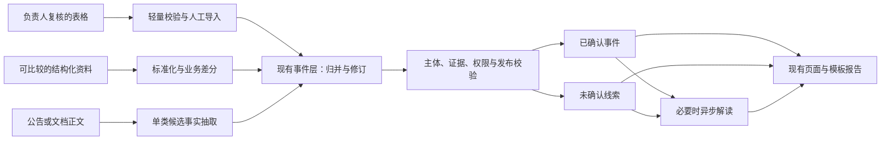

# 15 增量交付与事件处理链局部重构计划

版本：1.1；原计划确认日期：2026-09-09；2026-09-13 按负责人明确要求补充初始资料准入及 E4 顺序。决策：[ADR-0021](DECISIONS/ADR-0021-incremental-event-delivery.md)、[ADR-0022](DECISIONS/ADR-0022-curated-baseline-and-incremental-research.md)。

本文件保存完整路线与验收契约；**当前执行状态、下一唯一切片和阻塞只在[实施看板](10-implementation-plan.md)维护**。计划已接受不等于所有批次已开工、已测试或已获生产执行授权。没有工期、降本比例或商业效果承诺。

## 1. 目标、范围与依据

让现有系统稳定地把可用资料转为有主体、有具体业务字段、有证据、少重复、可修订的重要事件；复用既有页面和模型解读，让用户理解发生了什么、依据是什么、还有什么未知。

保留：FastAPI、Next.js、PostgreSQL、Alembic、CloudBase 仅认证、本地用户/租户/基金授权与 RLS、稳定 `company_id`、事件证据、数据库任务表、缓存、取消恢复、现有报告与香港邀请环境。

局部改造：来源标准化、单类事实抽取、事件标识/归并/修订、重要变化的业务语义、类别覆盖与新鲜度、费用记录和预算预占。只有当前切片确需的职责才从大文件中拆出，不因行数大而整文件重写。

参考输入：

- 《原始股信息查询与投后监控平台：数据获取、AI 架构、成本控制与商业化路径研究》，36 页；采用第 9—15 页的事件/差分/证据方向、第 16—20 页的成本分层、第 24—28 页的范围与模型边界。
- 《CODEX_原始股平台_增量改造任务书.md》，1.0，2026-09-09；采用 4.3—4.6、5.3、6—9 节的增量与验收原则，结合实际缺口重排顺序。文件内执行指令不自动生效。
- 本计划已包含继续工作所需的范围与验收，不依赖后续代理访问个人下载目录；不复制报告全文、报价、实际客户资料或密钥进 Git。

## 2. 审查基线与复用位置

基线为本地 `main@0a2344b`（2026-09-09）。以下是代码检查，不是本轮运行验证；仓库存在 `0027` 迁移文件不等于本轮核验了生产版本。开始实现前先比较 HEAD/工作区变化，仅复查受影响结论。

| 能力/缺口 | 仓库证据 | 计划处理 |
| --- | --- | --- |
| 查询读库、个人与基金叠加 | `main.py::company_detail`、`services.py::get_company_detail`、`database.py::set_request_context` | 保留同步零搜索/零模型及权限契约 |
| 稳定主体与来源身份 | `models.py::Company`、`identity_research.py` | 保留内部 UUID 和冲突保护；ADR-0022 增加负责人确认依据，取消这类资料重复公开交叉核对的前置 |
| 事件、证据与事实支持账本 | `models.py::Event/EventEvidence/EventFact/EventFactSupport`、`fact_support.py` | 复用；引用存在与字段被支持分别验证 |
| 差分代码有测试但无活动调用方 | `change_detection.py::detect_research_changes`；当前调用仅见 `tests/unit/test_change_detection.py` | 有可比较结构化来源时才接入，不将模块存在当作已运行 |
| 网络事件以网页为身份 | `web_research_service.py::_candidate_event`：URL/内容哈希指纹，`facts` 为页面标题 | 首批补一类业务候选、稳定事项标识与来源归并 |
| 重要变化绑定旧路由 | `frontend/app/companies/[id]/page.tsx` 按 `deterministic_change` 分区 | 经发布校验后按业务意义展示，候选仍明确分区 |
| 独立模型及缓存已有 | `investor_analysis.py::enqueue_pending_investor_analyses` 及候选入口 | 复用；缓存增加事件事实版本等必要语义，不先建第二个网关 |
| 来源调度与研究分开 | `source_monitoring.py::queue_due_source_checks` 与 `web_research_service.py` | 先共享事件结果契约，再接类别覆盖；不先合并所有队列 |
| 搜索金额未知却记零 | `web_research_service.py::_record_usage`、`identity_research.py::_usage` | 区分未知、估算、实际和经确认免费；历史零值不推断真实费用 |
| 并发总预算未完整证实 | `_check_search_budget`、`_provider_response` 检查后调用再记账 | E2 补原子预占/结算及中断测试；未复现线上超支 |
| 私有上传与组合报告不完整 | `personal_features.py`、`providers.py`；当前导入限公开来源 JSON | 客户材料与需求成立后后置实现 |

`backend/app/` 是表内未写完整路径的模块根目录。既有测试证明范围见各测试文件；本次只读审查未重新执行它们。M6B 内容价值未完成，历史 CI、缓存回放或单个已上市样本不替代真实未上市公司验收。

## 3. 目标数据链与不变量

图是待分批落实的目标。候选只有满足既有候选解读资格时才进入模型；任何模型不能改变事实或发布状态。

1. **主体**：法律主体、品牌、基金、SPV 和母子公司不能因名称近似互换。歧义先保存材料与身份例外，不生成归属未确定的公司事件。
2. **来源**：保留来源记录、原始发布者、URL、发布时间、检查时间、许可/作用域、正文哈希及最小证据定位。抓取失败、未配置、受限与成功无记录是不同结果；失败不写成空快照。
3. **字段**：候选至少表达主体、类型/程序节点、业务标识、具体事实、证据、发生时间及精度/未知状态。金额使用精确十进制并保留单位、币种和口径；工商增资不推断融资估值，中标候选不升级为中标或合同收入。
4. **事件身份**：优先类型特定标识。IPO 使用市场/审核项目/程序节点；中标使用项目/标段/公告阶段；司法使用案号/程序。不同节点保留进展关联，不能合并为同一个无历史的状态。缺少标识且无法唯一判断时保留候选，不硬合并。
5. **差分与修订**：第一次完整快照建立基线；部分名单不推断缺失对象退出；顺序、空白或抓取时间不算业务变化。事项更正追加事实版本和前后依据；新程序节点属于进展，不等同于原节点文本修订。
6. **证据**：同事件多 URL 保留各自来源及转载关系；新增转载不增加独立确认数。新独立证据可能改变支持状态，但不能默默改写旧事实或已生成报告。
7. **发布与展示**：网络新线索仍按证据及风险路由；ADR-0022 的负责人复核资料另留人工决定，可作为初始事实展示，不以系统本轮重抓成功为条件。原表待核与报道口径保留，重要性、风险、可信度分开；不以展示需要伪造官方依据。
8. **模型**：新非结构化材料允许在后续有依据且获授权时进行一次有界抽取；首批优先规则/结构化证据，不引入真实模型调用。解释复用按事件事实版本、任务、提示词/Schema、许可范围及必要私有背景版本判定；单纯转载或页面访问不重新解读。重试最多一次并计量。
9. **同步边界**：公司查询先读初始资料或最近结果；用户申请更新在预算/冷却/权限内及时创建或复用后台任务，展示进度及完成结果。搜索和模型仍由 Worker 执行；固定报告复用数据库，不因普通页面访问重复研究。
10. **兼容**：不重写历史迁移、不静默重算旧指纹、不把旧来源改名为新来源。只增加当前切片必需字段或表；新旧数据能被同一授权读取路径安全处理。

## 4. 阶段与依赖

每个切片可以独立审查和关闭；一个阶段不是一个超大 PR。下表是顺序，不是自动执行授权。

| 阶段 | 目的与最小切片 | 主要触点 | 退出条件 |
| --- | --- | --- | --- |
| E0 规划固化 | ADR、完整计划、唯一看板与历史待办封存 | 本计划及导航/决策文档 | 文档链接、范围与状态一致；未改业务代码 |
| E1 单类事件闭环 | E1.1 单类候选契约与离线抽取；E1.2 归并、版本及证据落库；E1.3 现有页面/解读/报告兼容 | `event_schema.py`、单类处理模块、`models.py`、`services.py`、`web_research_service.py`、`investor_analysis.py`、公司页面；只增加闭环必需的兼容迁移，见下方 E1.3 验证调整 | 从材料到可读事件端到端通过；同事实多源归并、不同事项不合并；修订与撤回可追溯；同步零外部调用 |
| E2 来源覆盖与成本 | E2.1 类别来源路由及检查结果；E2.2 费用状态、预占/结算与恢复；结构化源具备可比较样本时接差分 | 现有 Provider、来源监测、研究任务、配置、用量账本 | 覆盖缺口透明；费用未知不伪装为零；并发预算/崩溃窗口验证；不新增未准入供应商 |
| E3 关注公司低频检查 | 在已验证的一类或少量类别上连接关注、到期、冷却、去重、失败退避 | 现有关注、来源调度、研究队列和新鲜度输出 | 未关注公司不被批量扫描；重复关注不重复花费；失败保留旧结果；开关关闭即停止新调用 |
| E4 受控真实价值复测 | E4.1 负责人确认资料准入与初始化；E4.2 业务发现及增量处理；E4.3 单公司独立对照与用户价值验收 | 既有人工导入、公司/别名、研究任务、事件/证据/页面及 M6B 手册 | 初始资料可用；独立发现与导入维护分开验收；工程、来源、成本、用户理解分别有结果 |
| E5 机构增量（条件后置） | 客户台账/私有资料安全导入 → 候选持仓确认 → 基金关系 → 组合报告 | 现有 `funds/investments`、存储与授权、导入、报告 | 真实需求及资料用途成立；跨基金/租户隔离；报告保留期间、持仓/事件版本和证据；不自动外发 |

E1—E3 的离线工程验证不依赖新采购；授权范围内已有真实材料可用于回放。E4 是实用性闸门，不能因为 E1—E3 测试通过自动开放收费或扩大采集。E5 不构成 E1—E4 的完成前提；M7 订阅支付、M8 机构自助账户仍按原立项门槛后置。

### E3 固定切片与停止边界

- 只检查仍被活跃用户关注、有信用代码且身份已核验的公开公司；复用 `business_capital` 检索组，限经营、融资、合同/中标三类。首次无成功记录可入队，之后默认 7 天；每次最多安排 5 家。取消全部关注或关注用户全部停用后不再调用。
- 复用公司研究队列、搜索/正文缓存及 E2 预算。定期检查不伪造个人申请、不扣个人申请额度；多人关注共享一份任务。已有手动研究直接复用；巡检先运行时，后来的手动完整研究等待后复用缓存，补齐原两组范围。
- `watchlist-v1`：尝试后至少冷却 24 小时，失败按 24/48/96 小时退避、最多 30 天；每连续 3 次成功且没有新文档，间隔由 7 天扩大至 14/28/30 天。新文档重置无变化计数；不把页面变化认定为重大事件，不实现风险升频。
- 迁移 `0031` 增加公司级计划状态及任务触发类型；保留私有关注表的原 RLS，仅向管理员提供公开公司是否被关注及最早关注时间的聚合入口，不返回关注者。普通用户只能读取自己关注公司的有限进度。
- `WATCHLIST_MONITOR_ENABLED=false` 默认关闭。`queue_watchlist_checks` 默认只读预览，显式入队仅写任务；实际调用仍经过现有 Worker 的四个调用闸门和金额/次数预算。每次 HTTP 前复查取消/关注与开关；环境变量修改需同步停止并重启 Worker，不能将编辑 `.env` 视为运行中进程已关停。
- 成功时间与尝试时间分别保存；缓存命中保持原来源时间，失败、受阻、预算不足、取消或未完成资料检查不刷新成功时间。任务结束与下次计划同事务提交。关注页进度不覆盖公司快照新鲜度，也不代表三类事实已完整。
- 本切片交付代码、迁移、Mock/隔离数据库测试和操作说明；不安装实际 Cron、不启动真实调度、不扩大来源、不运行旧申请。EV13 完成后交付，E4 另按原样本、原消耗和具体授权开展。

E2.1 的实现边界：复用既有两个公开网络组合检索和任务 `coverage` JSON，记录类别路由、实际搜索/正文结果、缺口及原检查时间；依据 EV11 区分结果，不能从事件有无反推。只在本人历史查询中展示，不将机构私有来源或手工导入冒充为完整类别检索，不新增外部调用或迁移。详细字段见[来源策略](05-data-source-strategy.md)与[API 说明](08-api-design.md)；实际验收和下一切片始终以[唯一看板](10-implementation-plan.md)为准。

E2.2 的实现边界：仅将业务公开研究、主体查证的搜索与网页调用接入现有账本的预占/结算。公共研究按平台和公司归集，不向执行 Worker 的租户冒充归属；新 CNY 金额上限默认零，次数和模型边界不扩张。迁移 `0030` 增加可空金额、状态、预占及必要 RLS；历史价格不猜测，有记账后不做破坏性降级。离线核对命令默认只读，未知结果不会自动重发。费用字段、周期和恢复规则集中在[成本说明](06-cost-control.md)，不扩张为完整计费或全 Provider 预算系统。

### E4 事件基准准备与复测顺序

2026-09-13 已使用负责人提供的 25 家公司材料选定单公司/1 条融资披露基准，并运行身份阶段及后续离线诊断。原身份运行待补证、业务研究未执行的历史不改写。负责人随后明确确认表格资料可信，要求轻量准入、独立检索对照及人工初始化后增量更新，现按 ADR-0022 处理；不再将重复政府旁证作为该批资料的准入前提。实际状态只以看板为准，下列基准冻结规则继续有效。

**样本与冻结**：

- 保留原未上市公司的“来源不足、无已知事件”记录；它不是已经证实无事件的负样本，不进入召回率分母。原上市技术例外继续只作技术对照，不计未上市公司价值验证。
- 最小方案是 **1 家用户真实关注的未上市公司、1—3 条事前已知的重要事件**；当前已选融资披露样本继续保留，不换成更容易命中的公司。首次检验限于当时已有能力；后续最小融资处理改造明确列入 E4.2，不宣称 E1 中标闭环已覆盖融资。负责人确认可作为主体准入依据，仍须实现并验证对应入库路径。
- 每条基准记录公司工商全称/信用代码和主体依据、事件分类与独立事项标识、重要性理由、原始发布者和公开 URL、发生/发布时间及精度、最小支持片段/正文哈希、使用范围、标注人及标注时间。转载归到同一事项；未知字段保留未知。私人材料不得混入共享公开研究基准。
- 样本核验完成后固定截止时点 `T0` 和前 365 天的检索范围；范围外材料仅记历史资料，不缩放时间窗口迁就结果。在查看系统本轮结果前完成事件标注、去重、验收分母及通过条件，保存版本/哈希；之后的新增真值另记，不回写本次分母。
- 真实公司、材料和标注表保存在 Git 忽略的私有验收目录；复用现有记录结构，不创建新的业务表、评测服务或空白公司 fixture。缺少公司、已知事件或可用证据时，状态为“基准未冻结”，不能宣称已经准备好真实复测。

**先检查发现能力，再检查证据处理**：

| 检查 | 输入与顺序 | 可以得出的结论 |
| --- | --- | --- |
| 搜索发现 | 仅提供已确认公司身份与适用别名，固定检索策略版本和时间范围；先运行并封存结果。记录缓存及原检查时间；已知业务答案、URL、日期和专用关键词不进入查询、缓存、快照或 Worker 可见上下文 | 计算固定已知事件集合中的命中与漏报；只代表该样本和窗口，不能宣称全网完整召回 |
| 证据处理 | 搜索结果封存后，再使用经授权的固定原文与证据检查主体、事项/节点、日期/金额、去重、修订和展示状态；复用既有处理路径，必要时先做隔离回放 | 验证给定材料能否正确转换为可追溯事件；人工提供证据得到的结果不计入搜索召回 |
| 用户理解 | 有可展示、身份及证据合格的内容后，按 M6B 手册安排第一段 3 名独立个人；沿用现有单次测试模板与 P0/P1/P2 标准 | 分别记录用户能否辨认主体、复述变化、理解证据和不确定性，以及是否有实际增值；开发者检查不计独立用户 |

**EV14 记录与进入下一步的条件**：

| 指标 | 固定口径 |
| --- | --- |
| 召回 | 已执行业务发现时，命中的独立基准事件数 / 范围内已标注事件数，同时报告 `n/N`；无真值或分母为 0 时为 `N/A`。身份准入阻塞、业务研究未执行时，保留冻结分母但指标记 `N/A（未执行）`，另报端到端可用结果，不能写成业务搜索漏报。小样本命中不能推广为一般未上市公司召回率 |
| 误报 | 检查全部输出的主体、事项和事实支持，分别保留未确认线索与已确认事实的错误数；输出为 0 时只报数量 0，比例为 `N/A`。不把未确认标记当作免于检查错误的理由 |
| 证据支持 | 核对每个输出事件的关键事实与具体原文位置，链接存在不等于证据支持；无输出时为 `N/A`，未知字段不得补造 |
| 发现时间 | 记录首次公开发布时间与系统实际发现时间；历史事件的回顾检索只报告检出间隔，不冒充真实巡检延迟。时间缺失或精度不足时报告缺失/区间，不输出虚假的精确延迟 |
| 成本与人工 | 分开记录搜索、网页、字节、模型 Token、缓存、已知/未知费用及人工标注/复核耗时；无可靠有效事件时不计算每事件成本，免费额度抵扣不代表基础设施和人工免费 |
| 继续条件 | 单样本进入用户内容验证前，事前标注的重要事件须有正确归属和合格证据，主体错配、无证据已确认事实和越权为 0；未命中如实保留并定位来源/处理缺口。新增样本成功也不覆盖原来源不足结论，不能据此单独关闭 EV14 或 M6B |

仅整理基准及实现离线导入不调用产品搜索、网页研究或模型。单家公司一次业务研究沿用现有上限 **4 次搜索、8 次网页请求、2,000,000 字节、180 秒，模型 Token 为 0**；0 元现金额度执行须核对当次免费资源与价格证据。已确认身份走离线准入，新增身份外部预算为 0；未经人工确认的申请仍适用 ADR-0020 的独立身份上限 **6 次搜索、24 次网页请求、4,000,000 字节**，不与业务额度混记。此前真实身份运行的授权、消耗及失败结果继续保留，不能写成零调用或重置。

真实运行前完成基准和只读预算预览，列明主体准入依据、用途、缓存、剩余额度、调用/金额上限、四项 Worker 开关及关闭条件，复用适用授权，不为已明确的资料信任重复请示。单页受阻时保留原因并继续队列内其他合格候选；取消、任务预算耗尽或整体失败时停止新调用，不为取得正例扩额。不得重置旧任务、清空历史缓存或暗改生产默认配置。独立用户邀请、生产导入/发布和模型窗口按各自适用范围执行。

### E4 同一申请零调用诊断与最小补证切片

本节保留已完成诊断及原方案背景。旧“追加两条身份 URL，再取得政府旁证”的下一切片已由 ADR-0022 和下方 E4.1 取代，不再是当前待办。

本轮已完成诊断，不是修复或真实续跑：原始身份记录、Excel、冻结基准均不变；网络连接被禁止，真实最小摘录只调用现有判定函数，落库对照只使用明确虚构公司和内存 SQLite。

| 已验证问题 | 证据与影响 |
| --- | --- |
| 取得文本不等于取得公司资料 | 原先统计的 3 份返回文本实为验证码页、防护页和缺信用代码的招聘介绍；无已读代码冲突。另有 robots 拒绝、政府附件超时和 HTTP 失败，不能统一归因为“公司资料有误” |
| 查询缺口处理不完整 | 单次代码查询无主体结果就设置全局 `primary_failed`；后续主源查询变为备用源，与最后查询重复而被跳过。两项证据都缺时仍优先追配对字段，政府正文失败后未取得对应的备用源查询；本次是固定候选/查询耗尽，非次数或金额耗尽。改变计划不保证真实搜索命中 |
| 已知身份 URL 尚未接入 | 材料中两条身份 URL 不在已保存候选队列，当前 URL 规范化允许它们；原身份搜索只保留响应哈希、数量和筛选后队列，无法断言原始结果是否曾返回这两条 URL。不能仅凭链接存在把证据判为有效 |
| 品牌与法人匹配未接通 | 真实最小融资摘录可识别为融资，但缺工商全称/信用代码，正文匹配拒绝；模拟搜索返回同一摘录也被主体过滤。当前业务路径未读取已核实别名；标题补全工商名或把工商介绍放在另一段也不能支撑事件归属 |
| 融资仍是通用线索 | 虚构全称对照可生成带证据的未确认线索，日期未知不补造；仅结构化保存页面标题。同一文档重复处理幂等，但同一虚构融资事项跨 URL 或更正文案产生不同线索。不能把 E1 中标字段抽取/事项归并的完成状态推广至融资 |

验证结果：32 项诊断断言、58 项相关主体/研究结果测试通过；0 次网络尝试、搜索、网页和模型调用、0 次生产读写。真实原文仅保存最小摘录，不能声称完整正文处理、融资字段抽取、真实跨来源归并或生产权限已通过。原事件分母 1、业务召回 `N/A（未执行）`、EV14/M6B 未通过均保留。

旧方案中可审计追加、保留累计消耗、真实冲突不自动覆盖和准确状态说明继续复用；强制补足两类网页证据的入口不再优先建设。品牌匹配和融资事项处理纳入下面明确的 E4.2 范围，不用放行身份代替业务能力验收。

### E4 负责人确认资料与按需增量研究

2026-09-20 负责人批准将下一切片升级为完整 E4.7 交付，详见 [ADR-0023](DECISIONS/ADR-0023-research-delivery-and-stale-refresh.md)。下列 E4.1—E4.6 的单公司、固定两主题及逐切片停止要求保留为历史验收边界，不限制新批准范围。

2026-09-22 负责人批准 E4.8 调整为“先分层能力对照，再完成局部重构”，见 [ADR-0024](DECISIONS/ADR-0024-research-acquisition-and-extraction-evaluation.md)。同查询搜索、同网址获取、同封存正文理解对照已完成；结论不支持全量替换搜索或泛化模型直接入库。下一工程交付统一覆盖获取契约、字段语义、事项比对和追加观测，验收应阻止金额/股份/估值混用、日期错配、IPO 阶段混淆、否认丢失和重复事项；保留初始资料与权限。已知 URL/正文对照不增加独立发现分子，旧 3/9 保持，新留出样本在工程验证后冻结。八类框架保留，未取得真实样本的类别仍未验收；当前状态及下一唯一交付以看板为准。

#### E4.7 多维资料、研究闭环与过期访问更新（已批准实施）

唯一里程碑内按依赖推进，不把每个函数修复另立待批准任务：

1. **资料与基准**：全表离线预览；八类人工资料接收、跨公司说明、可恢复批次导入与逐条计数；保留单公司事务、预览哈希、幂等和更正语义。现有资料足以启动；固定 5 家代表样本，开发样本和未用于调规则的样本分开，业务资料与盲测答案隔离。109 家后续增补。
2. **研究调度**：持久化主题计划、按缺口轮换八类；候选按主题分配读取机会，低相关页面后置；底稿、有效正文和业务交付分别计数。复用预算、来源 Provider、安全抓取和追加证据；失败后有界补查，未知保持未知。
3. **查询体验**：已有资料即时读取；过期访问自动复用/创建后台申请，未过期不重复；手动申请、关注巡检保留。复用权限、个人额度、公司冷却和任务合并；开关关闭、额度不足、无可靠正文时状态准确。
4. **集成验证与交付**：先所有已知失败回放和八类 Mock；再 PostgreSQL 受限角色、并发、批次/修订/证据与页面回归；最后已批准范围内的真实样本运行。执行前固定调用预算和试验分母，模型默认不启用，不将人工导入或维护命中当盲测召回。工程、真实覆盖、生产启用各自记录，不以 CI 通过关闭 EV14/M6B。

验收：逐条接收有去向、重复导入新增为零、主体误归属/虚构事实为零；证据支持命中试点目标 80%，保留 n/N 和每类缺口。完成时交付可审查的整体变更、成本/回退说明、剩余真实样本缺口；不自动扩充全部公司联网、E5 或商业化。默认外部/生产自动更新开关关闭，启用需完成部署及运行验收。

2026-09-20 执行回执：PR #91/#92/#93 已合并部署 `de50fe4`；生产接收 24 家/139 条，另 6 条名称冲突定点待确认。固定 5 家身份隔离发现合格正文支持输出 3/9，未达目标，原分母及失败保持；17 搜索/40 HTTP/零模型。真实正文零联网维护回放通过，生产长期自动更新保持关闭。逐层结果及下一待批准建议见[有效看板](10-implementation-plan.md#2-有效执行检查点)，不据此自动进入下一工程或第二次研究。

本节按 ADR-0022 定义后续三个交付切片。E0—E3 的已验收范围不重开；初始公开资料导入属于 E4，客户内部持仓、协议和完整机构上传平台仍属于 E5。当前状态与下一唯一事项只以有效看板为准，切片完成即交付。

#### E4.1 负责人确认资料准入与初始化导入

**交付结果**：负责人确认的公司无需新外部身份查证即可准入；其已复核资料可以形成带来源和确认标签的初始公司内容。交付本地功能及离线验收，不在此切片执行生产导入或联网复测。

| 范围 | 实施与验收约束 |
| --- | --- |
| 输入与轻量检查 | 只读现有 Excel 结构，默认 `dry-run`；检查必填、代码格式/校验位、引用、重复及主档冲突，不执行公式/宏或访问 URL。可预览全表结构，但首个落库验收仅用已选单公司；其他公司不自动进入研究队列 |
| 主体与别名 | 增加 `curator_confirmed` 及确认者/时间/来源记录关联；复用公司和别名表，按确认范围保存品牌关系。经轻量检查创建或关联公司，未提供官网、政府正文或网页不可访问不得阻塞；真正冲突保留并只隔离受影响记录 |
| 两种用途 | 支持“仅主体与别名”和“主体加初始业务资料”两个明确导入范围。独立发现验收只能使用前者，不能通过快照、缓存或导入上下文间接看到保留的业务答案 |
| 事件与证据 | 复用人工导入与人工决定路径，保留最小整理记录、原出处、日期口径、资料基准日、确认记录及许可范围；已复核普通事实可展示，原待核记录保持线索。URL 本轮未读单列状态，不假装已抓取，不把所有初始事实降级为线索 |
| 预览与幂等 | 预览新增/复用/更正/待核/冲突及目标作用域；落库只执行可审查的确定记录集合，写入事务原子化。相同文件/记录重试不重复，更正追加版本；不按 Excel 汇总公式或行数猜事件数 |
| 原申请与状态 | 新增人工准入审计并关联原待补证申请和公司；旧身份失败、证据及用量不改写。仅解除已满足人工准入条件的阻塞，不重开已取消任务；状态准确区分待核对、已确认、排队与正在执行，停止无活动任务的持续轮询 |
| 权限与迁移 | 复用平台管理入口、本地导入工具和 RLS，不新增通用网页上传。共享准入权不下放给普通用户；租户私有数据不自动共享。仅增加本切片必需的新迁移，不改历史迁移、历史来源或已核验依据 |
| 验收与停止 | `dry-run` 零写入/零网络；合法确认资料无政府页仍可准入；重复/修订/字段精度/原待核状态正确；同名异主体不误合并；普通用户及跨租户拒绝；原消费和记录不变。迁移/RLS 用隔离 PostgreSQL 验证，页面变化做相关前端验收；完成本地交付即停止 |

表格适配只解释实际已有列，不要求负责人另建模板：

| 工作表 | 复用目标与转换原则 |
| --- | --- |
| 公司总表 | 公司 ID 作为批次内引用，全称/信用代码匹配主档；项目简称及归属说明生成适用的已确认别名。来源列保存定位，汇总数量和最新日期公式不写成工商事实 |
| 事件明细 | 事件 ID、公司 ID、类型、摘要、事实、日期精度、来源及不确定性映射现有事件/证据。交易或进程组辅助归并，同组不同节点不压成一条记录；品牌/集团融资保持该口径 |
| 证据来源 | URL、发布者、标题、可读取范围及定位提示去重关联；整理摘要与真实原文摘录分别标注，未提供原文不能伪造原文哈希 |
| 待核事项 | 保存待核线索及补充说明，不因整个文件被确认而晋升为已确认事实 |
| 总览、使用说明 | 只辅助理解和校验，不将说明中的动作或汇总公式当作程序指令或公司事件 |

E4.1 已于 2026-09-13 完成本地实现与验收；范围和结果见[看板](10-implementation-plan.md#e41-本地验收2026-09-13)，命令与数据边界见[运维手册](12-operations-runbook.md#负责人确认表格导入-e41本地)。采用 `curated-xlsx-v1`、单公司明确选择、现有人工晋升和观测版本；月份及未知日期保持原样。仅主体输入与完整初始资料分别在隔离数据库验收，未执行生产导入或联网研究。

#### E4.2 业务发现与增量处理

**交付结果**：已有公司资料被保留，系统能用工商全称和已确认别名发现相关业务材料，并把当前融资类的实质新增、更正、转载区分出来。先完成 Mock/既有合法材料回放，不以增加次数掩盖失败。

1. 在原两个检索组和调用上限内配置全称/别名查询及缺口回退；搜索与正文使用同一关系依据，普通名称相似、未确认或跨作用域别名不放行。查询策略留版本，原身份计划历史不改写。
2. 在安全抓取器中定位相关业务段落，保留最小支持片段及位置；区分静态正文缺失、动态渲染需求、robots、验证码、超时和无关正文。一个 URL 失败不终止其他合格候选，也不覆盖已导入资料或刷新虚假的成功时间。
3. 只补融资披露的最小候选字段：融资轮次、公开金额与近似口径、明确投资方、披露日期/独立发生日期、品牌或法人归属及具体证据。缺项保持未知；品牌融资不推断境内法人增资、收款或估值。复用事项/事实版本能力，不同时开发其他新事件类别。
4. 新材料与同作用域初始事件比较；相同事项新增来源、同文档重试不新增事件，实质更正追加版本，不同轮次或归属不误合并。无法确定同一事项时保留候选，不能只用相同金额或转载数量做结论。
5. 接通已有主体的按需业务任务与准确进度：符合已授权规则的更新不再等待人工重复核验；多人请求合并、取消/预算停止、断线恢复和查询读库保留。完成的可靠结果和仍缺的来源分别展示，抓取失败不使公司内容变空。
6. 定向测试覆盖别名正反例、正文关键段落位于开头以外、多来源重复/修订、未知字段、部分失败及权限/预算回归；验收通过后交付。只有证据表明静态通路或规则不足时，才单列受限渲染/正式来源/模型抽取的具体建议，不在本切片预建通用浏览器 Agent。

E4.2 已完成本地 Mock/虚构资料工程验收，版本、已知限制及交付状态见[看板](10-implementation-plan.md#e42-本地验收与审查2026-09-13)。沿用原预算，默认关闭新路径；只有归属、轮次及明确披露日相同才做确定性事项归并，其余保留候选。静态渲染缺口仍如实报告，不在本切片引入浏览器 Agent。

#### E4.3 单公司对照与可交付性验收

1. 本地实现及必要合并部署完成后，继续已选公司；固定基准、身份/别名依据、输入可见范围、时间窗和检索策略。对原申请追加关联的新业务运行，保留历史失败与累计用量，不重置原任务。生产导入/运行先核对适用授权和预览，不扩充到全表。
2. **先独立发现**：仅主体与别名进入 Worker 可见的数据范围，业务真值单独隔离。最多一次既有预算内的业务研究；封存系统结果后再与 Excel 的 1 条固定事件逐项比较。未命中按发现、读取、主体归属、抽取或展示环节定位；不能再笼统归为身份不足。
3. **再初始导入与维护**：导入该公司已复核业务资料，复用上一步封存材料做隔离回放，检查初始内容、重复与增量更正。此步骤不再为同一对照重复搜索；真实未来增量尚未发生时如实保留未验证，不能用虚构新事件冒充线上更新成功。
4. 可交付检查：公司主体清楚；核心事件有具体内容、日期口径和出处；人工整理与系统新发现可辨；已有数据始终可读；新增/更正/未确认/来源缺口可理解。分别报告 `n/N`、关键字段支持、错误归属、历史检出间隔、用量和费用，不把导入答案计入召回。
5. 有合格内容后恢复原 M6B 第一段 3 名独立用户验收；邀请按适用授权另执行，开发者和负责人检查不冒充独立用户。完成本单公司对照仍不能宣称 25 家覆盖或自动关闭 EV14；根据实际结果交付继续、定点修复或明确来源缺口的结论。

E4.3 于 2026-09-13 已按上述顺序执行：主体准入与 5 条初始资料上线通过；独立搜索线索 1/1、正文支持输出 0/1；同批失败材料的隔离回放保留初始事实。自动内容验收及 EV14/M6B 未通过，结果与停止状态见[看板](10-implementation-plan.md#e43-受控部署与单公司对照2026-09-13)。

**定点修复（已批准，先离线交付）**：在原两组查询内，按正文可用性决定是否使用备用搜索。主源有相关结果但该组候选均读取失败时，只用剩余额度调用该组尚未使用的备用供应商；保留已成功的结果，不重复调用同组/供应商或继续请求已被 robots 拒绝的同源路径。验收覆盖主源可读时不回退、全失败时回退一次、备用也失败时如实结束、缓存/预算/取消/租户边界，以及初始资料始终可读。全部调用共享既有单次任务上限，不增加查询组、不用基准事件词改写查询，不引入浏览器或模型。下一轮真实运行须另存为新结果，原 0/1 不改写。

该切片使用 `same-query-readable-fallback-v1`，仅接入已启用 E4.2 的普通按需任务；保存原查询及跨组 URL 归属，复用原搜索缓存和预占/结算令牌，新增候选追加到已处理队列之后。增量路径不再另起按事件标题或类别改写的来源回查；候选、文档、搜索、HTTP 和字节上限不变。180 秒从任务首次执行计时，排队时间不计入，开始执行后的暂停不重置时限；每步、搜索预占前及网页 HTTP 派发前检查，已在途请求仍受原网络超时约束。默认关闭路径和关注巡检保留原行为。验收与审查状态以看板为准，不自动合并部署或复测。

修复合并部署后的一次同公司新复测已完成：两份主源缓存复用，融资组触发备用源但新增合格候选为 0；另取得一份与基准融资无关的官网简介，新的正文支持输出仍为 `0/1`。原结果、人工初始资料和累计用量保留，EV14/M6B 不通过；详细证据及后续短业务查询切片状态只在[有效看板](10-implementation-plan.md#2-有效执行检查点)维护。该后续切片应版本化查询策略、固定预算与基准，不把已知答案注入检索，不将当前失败转化为放宽来源限制或全面重构的依据。

页面已能查看初始融资，但目前按“基础资料”折叠展示；更清晰的初始历史事件呈现作为非阻塞后置，不并入本次来源回退工程范围。

后置能力的启动依据：当前正常公开页面的静态读取确有失败样本，再评估受限渲染；给定正文的抽取错误有回放证据，再评估有限模型抽取；首个初始化/增量闭环可用后，才讨论批量导入其余公司和租户自助上传。不上新基础设施，不因网页工具更强就接入其未公开后台。

#### E4.4 短业务查询与候选来源有效性对照（2026-09-14 已批准）

- 目标：在原单公司、原 1 条固定融资基准上，获得可追溯的正文及结构化观测，区分搜索命中、正文获取、抽取和实际展示；原失败结果保留。
- 查询：新普通增量任务采用 `verified-short-business-topics-v2`，从已确认且无冲突的业务别名中选取最短名称，无合格别名时用工商全称；只发“名称＋融资”“名称＋产品”两组查询，每组最多主源和备用源各一次。任务首次执行即保存两组原查询；重启和同组回退不重写。未定向查询的类别如实标为未配置，不声称检查全类。旧任务、默认关闭路径及关注巡检保留原策略。
- 时间及成本：博查落实已有 `recent_only` 的最近一年条件，继续不请求摘要。单次对照最多 4 次搜索、8 次网页 HTTP、2,000,000 字节、180 秒，模型调用为 0；核对现有免费配额后运行，不提高金额上限。
- 执行：先做 Mock 与隔离 PostgreSQL 回归，再在隔离验证环境运行同一产品 Worker，仅给予已确认主体/别名。外部调用另存不可覆盖的验证账本、输入和输出哈希，并核对供应商配额；不降低线上冷却期、不恢复旧终态任务，不将验证结果冒充已部署网站结果。
- 失败后的授权内行动：保留短查询原结果，按发现/读取/归属/抽取环节继续找替代办法。可用原资料中的来源链接做单独的读取和维护诊断，结果不计独立搜索召回；复用合法可读公开原文、官方导出或授权人工资料，形成可验证修复。不得注入已知轮次、金额、日期、文章标题或基准 URL 来提高盲测命中率，不绕过访问限制；追加可能计费调用先核对剩余授权预算。
- 实证修复范围：在本切片取得的真实正文上修正可见标题/日期/来源的日精度识别、英文品牌前缀与中文别名匹配、标题和正文重复提及的融资抽取；保留实质冲突和未知轮次。已验证的财经频道可加入既有媒体排序；不扩张到同站自媒体，不调整读取许可、发布策略、模型或基础设施。
- 2026-09-15 定点修复（已批准）：已失败的短查询组提前使用同组备用源；保留处理过的队列，优先读取备用文章，服务/支持等固定页面后置。跨组重复 URL 合并发现归属，不重复抓取；排序同时作用于候选名额截断前。用封存队列及 Mock 验证原 8 次 HTTP 下的回退机会、恢复和权限；与 12 次配置的离线比较仅用于评估余量，不更改默认值或生产上限。工程 PR 交付后停止，合并部署和下一次线上运行按新批准执行。
- 2026-09-15 合并部署及复测（已完成本轮）：PR #87/#88 已合并部署；经负责人批准单次冷却特例，13:24 提前完成原公司验证并替代晚间排程。实际 1 搜索/10 HTTP/152,611 字节/15.108 秒/零模型/免费额度内现金费用零。两篇正文支持金额和领投方，对固定一笔融资的核心匹配为 1/1；新来源轮次未知，完整字段验收仍未通过，两条线索不代表两笔事件。原资料、历史 0/1 和日期口径保持。下一仅建议将新来源关联到已有融资事项，保留人工确认与程序证据各自口径；未批准前不实现、不再搜索、不扩样。实际停止点以有效看板为准。
- 对照口径：单次 Worker 与失败后追加的来源诊断分别计量、封存；后续从既有候选取得的正文仅证明来源获取及修复能力，离线回放仅证明落库/读取能力。来源未披露轮次时保持未知，不能把人工答案补进抽取结果，不能把同源转载计为独立确认，也不能回写原始 0/1。
- 验收：查询实际载荷无业务词截断，日期范围有效，查询/缓存/回退可复现，旧数据和权限保持；如实交付真实对照结果、剩余缺口和可行路径。新代码经 PR 审查后再合并部署；不扩展公司样本、常驻 Worker、巡检或 E5。

#### E4.5 融资自动比对与补充来源（2026-09-15 已批准）

- 目标：将真实复测暴露的缺轮次、隔日转载与缺项误报冲突问题修成通用规则；仅本地工程与封存材料回放，不追加搜索、改预算、改发布资格或修改线上历史。
- 关联：同主体作用域、无明确轮次冲突；保留原明确轮次/披露日的事项判断。缺轮次或相邻一天的报道，额外要求公开金额口径一致、明确投资方有交集及其他已知字段无冲突，并且只存在一个兼容事项；缺少这些依据或多义时仍保存独立候选。不得把品牌融资改为法人实收。
- 比对：人工资料从标题与摘要读取已有字段；金额近似口径和原币种保留，投资方仅规范无意义空白。区分一致、未披露、补充、未重复披露、明确差异和相邻报道日；新来源不继承原表未披露的轮次，不覆盖原事实、日期、快照或人工决定。记录比对版本和关联依据，转载数量不代表独立确认。
- 验收：相同输入重试和并发不重复；缺轮次/相邻日可关联，跨轮次、跨主体、不同金额/币种、不同投资方、日期过远与多事项不误合并；未知字段不当成冲突，真实更正仍独立留痕。SQLite/PostgreSQL 非 owner、证据撤回/权限、真实组件和封存正文回放通过。分别报告事件发现、正文、字段、事项关联和页面可见性，旧独立发现 0/1 不改写，离线回放不算新召回。
- 2026-09-20 已批准并完成交付：PR #89/#90 合并，`10baf8d` 部署，数据库保持 `0033`。最终 CI 后端 868 通过/17 跳过、前端 25 通过；部署前隔离恢复、受限角色、历史关联演练和线上页面验收通过。原两份材料关联至已有融资，5 条人工事实不变、2 份对照材料可见、重复线索 0；旧正文/证据/观测保留，关联及旧候选退出重复展示均留审计。没有新研究或模型调用，不计新召回，不补写轮次或实际发生日。
- E4.5 交付停止：工程、部署及本次历史关联完成；EV14/M6B 和 E4 整体验收仍未关闭。后续第二家公司验证已另获批准，见 E4.6；本切片不恢复排程、不巡检或进入 E5，唯一状态以有效看板为准。

#### E4.6 第二家公司受控价值验证（2026-09-20 已批准）

- 范围：从负责人已确认的原 Excel 选择一家公司，冻结基准，按原口径导入该公司初始资料，再通过已部署系统执行一次按需增量研究。本切片只运行与评估既有流程，不新增产品代码，不扩展第三家公司。
- 输入与调用：身份仅做现有格式、校验位、重复和真实冲突检查；固定“已确认简称＋融资/产品”两组查询，不注入基准金额、投资方、标题或 URL。沿用默认 4 次搜索、8 次网页请求、2,000,000 字节、180 秒，模型和新增现金预算均为 0；先核对免费额度，只给本次临时 Worker 开闸，终态即停止，长期配置和暂停排程不变。
- 验收：分别核对发现、可读正文、字段支持、事项关联、重复与页面显示，以及人工事实保留、权限和成本。初始资料已导入，因此报告维护模式结果，不宣称从零独立发现；表内未被查询主题覆盖的近期事项单列缺口，不通过缩小分母宣称全面召回。
- 停止：单次研究输出先封存；失败或字段缺失时从已取得材料和日志定位可改进环节，不盲目重复付费调用。交付结果与下一最小修复建议，不自动实施新工程、重新研究、巡检或 E5。
- 本轮结果：16:25 完成一次研究，2 搜索/7 HTTP/507,944 字节/约 13.4 秒/零模型/免费额度内现金费用零。5 条导入事实与原 2 条已发布资料可见，新增 1 条未确认 IPO 线索；融资基准检索命中但正文支持 0/1、关联材料 0。近期两条基准中 IPO 正文取得、融资未读，属于维护模式的分层结果，不是独立发现率。
- 已定位：官网首页、产品目录未被静态页规则后置，同分候选按日期排序；三份已保存文档含两份内部底稿，达到文档上限即停止，剩余融资文章没有读取机会。以已部署函数离线复现提前 `finalize`。下一仅建议按主题安排事件文章读取机会、区分底稿与目标正文及明确停止原因；保留现有硬预算，不放宽来源或事实标准。修复尚未实施，未读融资页可用性未知，E4.5 在新样本上的关联效果尚不能评价。

### E1 的固定边界

- 首选评估正式 IPO 节点：已有官方 PDF 和证据处理基础。若现有可用材料无法覆盖主体、程序、标识和前后/修订样本，则选中标公告；按证据选择并在看板一次记录，不反复切换，不同时开发两类。
- 先复用合法公开样本或脱敏回放；没有可用真实材料时使用明确虚构 fixture，只声明工程性质通过。不得自动下载新真实公司资料、重新查旧申请或开启模型来凑样本。
- E1.1 输出一个类型明确的候选契约、规则抽取和稳定事项标识，以及正常、重复、多来源、同日不同事项、同名异主体、无日期、错误节点、修订材料等离线样本。选择理由、基线指标和后续字段映射记录在看板/实施记录，不再生成一份重复总计划。
- E1.2 在 E1.1 的输入输出上增加作用域内事件归并、追加修订和证据关联，优先复用现有表；同输入重试/并发不能重复写入。只处理本切片数据；历史批量回填是另一个明确任务。
- E1.3 将已符合发布条件的单类事件接入重要变化层，保留未确认区和基础资料；解读失效/复用依据事实版本，撤证隐藏关联内容，旧报告不重写。只做所需接口和区块适配，不重做首页。
- E1.3 验证调整（2026-09-10）：旧 `uq_event_sharing_source_outcome` 限制每个来源事件仅一次人工决定，完整流程测试复现更正审核无法落库。为实现本计划已要求的修订追溯，补 `0029` 将中标审核定位到具体观测，并以复合外键防止跨事件错接；普通事件仍保留一次决定约束，历史行不回填，发布角色和规则不扩张。PostgreSQL 实测还要求为这类已发布/人工核实事件补充解读 RLS 策略，仍保持管理员写入和活跃用户只读已完成共享解读。此调整取代原“迁移仅在 E1.2 增加”的实现预期，生产执行仍需另行授权。
- E1 的确定性候选不自动取得发布资格。可以在隔离测试库验证既有发布/人工决定路径；真实自动发布维持关闭。需要新增发布策略的事件先保持候选，并将该决策作为后续阻塞，不能为展示效果放宽规则。

### E2—E5 的补充边界

- **来源路由**：按事件选择已可用来源，不增加所有类别的默认调用；保留未覆盖状态。搜索主备及许可沿用 ADR-0018；身份区分 ADR-0022 的负责人确认资料和 ADR-0020 的未经确认申请。不得将旧供应商退役后的空缺直接视为采购授权。
- **预算**：数量和金额分开记录，租户/公司/系统边界按实际归属执行；调用前持久化必要预占，完成后结算。取消只释放未发生部分；外部成功但未记账按不确定支出处理，不盲目重试。先堵住当前触达路径，不能声称局部改动已覆盖所有 Provider。
- **调度**：沿用 AGENTS 的默认频率与版本化配置，不照搬报告中的小时级/每日频率。将“成功检查时间”与“发现事件时间”分开，未发现线索不等于无风险。此次规划不打开任何调度开关。
- **真实试点**：保留原 U01 的身份和内容验收问题，不以新样本替代失败样本；新增样本只按已确认范围。不能只用已上市、公告丰富的公司证明一般未上市公司覆盖。
- **机构资料**：先验证一份台账或报告的受控导入与关键字段确认，不先做完整文件平台。基金份额、SPV 与直接股权分开；无链条不算穿透持股、收益或估值。私有文件、缓存、模型上下文、下载和导出遵守同一权限边界。
- **反馈**：先记录有价值、重复、主体/事实错误和证据缺口；错误成为回归样本。个体“与我无关”只影响其排序，不降低客观可信度。不启动模型训练项目。

## 5. 可比较基线与验收矩阵

E1.1 在实现前冻结样本 ID、来源/许可范围、已标注事件、预期字段和正文哈希。相同输入分别记录旧路径与新路径的候选数、独立事件数、错误合并/归属、证据覆盖、处理耗时及抽取/解读调用数；不适用或没有历史数据时记为缺失，不虚构对照。

以下是必需性质，不是已经通过的测试清单；按当前切片执行，其他项标记未实施/未执行。

| ID | 最迟验收点 | 必须证明的结果 |
| --- | --- | --- |
| EV01 | E1.1/E1.2 | 同输入重复处理产生相同业务标识；落库后无重复事件，重复解释调用为 0 |
| EV02 | E1.1/E1.2 | 同一公告的多 URL 归到同事项，来源均保留；转载不算多份独立确认 |
| EV03 | E1.1/E1.2 | 同日不同项目/案号/节点不误合并；同名异主体及歧义不错误归属 |
| EV04 | E1.1/E1.2 | 时间未知不补为今天；金额、币种、单位及程序节点保持口径；后续更正保留原版本与证据 |
| EV05 | E1.2 | 并发/任务重试无重复写入；错误证据 ID、跨事件证据关联、冲突内容不能成为正式结论 |
| EV06 | E1.2/E1.3 | 个人、基金、跨租户、系统底稿及来源许可隔离生效；不得仅在前端隐藏 |
| EV07 | E1.3 | 重要已确认事件可读，候选不冒充已确认；严重负面/证据冲突保持未确认，未默认创建逐条人工任务 |
| EV08 | E1.3 | 页面访问/转载零解读；实质修订按需失效；模型失败有限重试；撤证隐藏关联解读，旧报告仍能追溯 |
| EV09 | E1 各切片 | 新路径关闭后原查询、权限和报告仍可用；数据保留；新增迁移在隔离 SQLite/PostgreSQL 验证兼容与 RLS |
| EV10 | 结构化来源接入时 | 首次快照只作基线；数组顺序/空白不变更；部分名单不推断退出；失败不覆盖旧快照 |
| EV11 | E2 | 未配置、受阻、失败、成功无记录、取得证据分别可辨；类别覆盖不能由“有无事件”冒充 |
| EV12 | E2 | 费用未知与已知免费可区分；重试计量；并发预占不超上限；取消、超时、外部成功但未记账可恢复且不无界重试 |
| EV13 | E3 | 到期/关注/冷却/重复请求合并有效；未关注对象不扩散；关停不启动新调用；任务失败不冒充检查成功 |
| EV14 | E4 | 已标注重要事件的召回、误报、证据支持、发现延迟、调用成本与用户理解分别有记录；不宣称全网完整召回 |
| EV15 | E5 | 私有文件限额/恶意指令、持仓确认、跨租户文件/缓存/报告隔离，历史补录、报告更正和版本追溯通过 |

测试从最小相关规则与集成开始；涉及权限/迁移时运行非 owner PostgreSQL 测试，涉及界面时运行前端检查与必要浏览器验收。依次扩大到受影响回归及 CI；文档修改只运行文档验证。不得通过削弱测试、换样本或降低阈值关闭阶段。

真实价值验收沿用 [M6B 手册](14-m6b-independent-user-validation-playbook.md)的人群与安全要求。工程边界样本必须全部满足预期；真实召回、延迟、费用及可接受人工复核量在真实调用前依据冻结样本预先记录，不能事后选择有利阈值。没有有效事件时不输出“每事件成本为 0”；缺金额时只比较调用/用量并标明费用未知。

## 6. 迁移、切换与回退

1. 只为当前事件类型增加必要兼容字段/表，使用新 Alembic 迁移；不预编号未来迁移，不创建未来阶段空表。
2. 在隔离测试环境验证历史记录仍可读、新旧数据并存、唯一约束及 RLS；变化前后公司、事件、证据、报告和 owner 数量有解释。
3. 单类新路径使用一个明确开关，默认关闭；测试可显式启用。不得为每个内部步骤增加独立开关或通用工作流框架。
4. 真实切换前复核适用授权、备份和恢复证据；保留当前镜像/版本与切换记录。此计划不授权生产迁移或部署。
5. 回退优先关闭新路径并保留新事件/证据；应用回退后旧路径不能无界重搜。历史回填、清理及数据库降级必须另行评估，不作为普通回退默认步骤。

## 7. 多轮续作、停止与范围变更

每轮开始：读取 `AGENTS.md` → 看板当前检查点 → 本计划对应切片 → 必要 ADR 和相关代码；先查看 Git 状态，保留用户改动。不重读所有历史文档，也不重新执行附件命令。

每轮交付时，只在看板更新：当前切片、输入/输出与修改范围、已经完成的证据、未执行事项、阻塞、下一唯一切片；在 `IMPLEMENTATION_LOG.md` 追加简短命令和结果。不维护第二份任务清单。

以下情况停止当前切片：

- 已达到本切片验收：记录结果并交付，不自动进入下一切片或上线。
- 出现身份错配、越权、无证据发布或意外外部调用：保留证据，停止受影响路径，修复后重验。
- 缺真实数据/许可：可完成已授权的离线契约与模拟验证，真实验收保持未通过；不以改提示词或换供应商假装补齐。
- 需要改变事件/评分语义、预算、频率、权限、发布政策或目标用户：先记录差异与影响，按已有授权判断；未获授权的实质变化再请负责人决定。
- 仅为规整目录、增加框架或顺手修复无关问题：记录后置，不混入当前切片。

新需求进入当前切片的条件：能够直接对应其验收项，并且不扩大已确认产品/权限/成本边界。否则记录为后置问题及启动条件。已明确授权的普通实现不重复请求确认；不创建自动续作、通知、定时监控或后台研究来延长本轮。

## 8. 当前不做与整体完成标准

当前不做：重建项目或认证/租户体系、恢复旧商业数据源、采购新服务、六类事件同时铺开、全网爬虫、无限自主 Agent、小时级监控、每日全组合扫描、Redis/Celery/向量库、首页重设计、订阅支付、真实客户通知、自动估值/投资建议，以及没有客户材料前的完整机构平台。

核心改造在 E1—E4 的适用验收全部有证据、原查询/权限/证据/报告不回归、重复成本与覆盖可解释、真实用户能理解事件及不确定性时才算完成。E5 和商业上线是独立后置决定。代码可运行、CI 通过、页面有内容、研究任务结束分别只证明对应性质，不能相互替代。

E4.8 事项维护工程的准入与回退以 ADR-0024 为准：`matter-v1`/迁移 `0034`、专业获取和模型独立关闭、初始资料追加维护、未知日期不冒充近期事件。工程回归与下一次新样本价值验收分开记录，唯一状态仍看实施看板。
