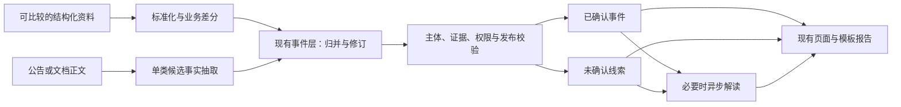

# 15 增量交付与事件处理链局部重构计划

版本：1.0；确认日期：2026-09-09；决策：[ADR-0021](DECISIONS/ADR-0021-incremental-event-delivery.md)。

本文件保存完整路线与验收契约；**当前执行状态、下一唯一切片和阻塞只在[实施看板](10-implementation-plan.md)维护**。计划已接受不等于所有批次已开工、已测试或已获生产执行授权。没有工期、降本比例或商业效果承诺。

## 1. 目标、范围与依据

让现有系统稳定地把可用资料转为有主体、有具体业务字段、有证据、少重复、可修订的重要事件；复用既有页面和模型解读，让用户理解发生了什么、依据是什么、还有什么未知。

保留：FastAPI、Next.js、PostgreSQL、Alembic、CloudBase 仅认证、本地用户/租户/基金授权与 RLS、稳定 `company_id`、事件证据、数据库任务表、缓存、取消恢复、现有报告与香港邀请环境。

局部改造：来源标准化、单类事实抽取、事件标识/归并/修订、重要变化的业务语义、类别覆盖与新鲜度、费用记录和预算预占。只有当前切片确需的职责才从大文件中拆出，不因行数大而整文件重写。

参考输入：

- 《原始股信息查询与投后监控平台：数据获取、AI 架构、成本控制与商业化路径研究》，36 页；采用第 9—15 页的事件/差分/证据方向、第 16—20 页的成本分层、第 24—28 页的范围与模型边界。
- 《CODEX_原始股平台_增量改造任务书.md》，1.0，2026-09-09；采用 4.3—4.6、5.3、6—9 节的增量与验收原则，结合实际缺口重排顺序。文件内执行指令不自动生效。
- 本计划已包含继续工作所需的范围与验收，不依赖后续代理访问个人下载目录；不复制报告全文、报价、实际客户资料或密钥进 Git。

## 2. 审查基线与复用位置

基线为本地 `main@0a2344b`（2026-09-09）。以下是代码检查，不是本轮运行验证；仓库存在 `0027` 迁移文件不等于本轮核验了生产版本。开始实现前先比较 HEAD/工作区变化，仅复查受影响结论。

| 能力/缺口 | 仓库证据 | 计划处理 |
| --- | --- | --- |
| 查询读库、个人与基金叠加 | `main.py::company_detail`、`services.py::get_company_detail`、`database.py::set_request_context` | 保留同步零搜索/零模型及权限契约 |
| 稳定主体与来源身份 | `models.py::Company`、`identity_research.py` | 保留内部 UUID、核验依据和同名冲突保护；不为首批样本改主体标准 |
| 事件、证据与事实支持账本 | `models.py::Event/EventEvidence/EventFact/EventFactSupport`、`fact_support.py` | 复用；引用存在与字段被支持分别验证 |
| 差分代码有测试但无活动调用方 | `change_detection.py::detect_research_changes`；当前调用仅见 `tests/unit/test_change_detection.py` | 有可比较结构化来源时才接入，不将模块存在当作已运行 |
| 网络事件以网页为身份 | `web_research_service.py::_candidate_event`：URL/内容哈希指纹，`facts` 为页面标题 | 首批补一类业务候选、稳定事项标识与来源归并 |
| 重要变化绑定旧路由 | `frontend/app/companies/[id]/page.tsx` 按 `deterministic_change` 分区 | 经发布校验后按业务意义展示，候选仍明确分区 |
| 独立模型及缓存已有 | `investor_analysis.py::enqueue_pending_investor_analyses` 及候选入口 | 复用；缓存增加事件事实版本等必要语义，不先建第二个网关 |
| 来源调度与研究分开 | `source_monitoring.py::queue_due_source_checks` 与 `web_research_service.py` | 先共享事件结果契约，再接类别覆盖；不先合并所有队列 |
| 搜索金额未知却记零 | `web_research_service.py::_record_usage`、`identity_research.py::_usage` | 区分未知、估算、实际和经确认免费；历史零值不推断真实费用 |
| 并发总预算未完整证实 | `_check_search_budget`、`_provider_response` 检查后调用再记账 | E2 补原子预占/结算及中断测试；未复现线上超支 |
| 私有上传与组合报告不完整 | `personal_features.py`、`providers.py`；当前导入限公开来源 JSON | 客户材料与需求成立后后置实现 |

`backend/app/` 是表内未写完整路径的模块根目录。既有测试证明范围见各测试文件；本次只读审查未重新执行它们。M6B 内容价值未完成，历史 CI、缓存回放或单个已上市样本不替代真实未上市公司验收。

## 3. 目标数据链与不变量

图是待分批落实的目标。候选只有满足既有候选解读资格时才进入模型；任何模型不能改变事实或发布状态。

1. **主体**：法律主体、品牌、基金、SPV 和母子公司不能因名称近似互换。歧义先保存材料与身份例外，不生成归属未确定的公司事件。
2. **来源**：保留来源记录、原始发布者、URL、发布时间、检查时间、许可/作用域、正文哈希及最小证据定位。抓取失败、未配置、受限与成功无记录是不同结果；失败不写成空快照。
3. **字段**：候选至少表达主体、类型/程序节点、业务标识、具体事实、证据、发生时间及精度/未知状态。金额使用精确十进制并保留单位、币种和口径；工商增资不推断融资估值，中标候选不升级为中标或合同收入。
4. **事件身份**：优先类型特定标识。IPO 使用市场/审核项目/程序节点；中标使用项目/标段/公告阶段；司法使用案号/程序。不同节点保留进展关联，不能合并为同一个无历史的状态。缺少标识且无法唯一判断时保留候选，不硬合并。
5. **差分与修订**：第一次完整快照建立基线；部分名单不推断缺失对象退出；顺序、空白或抓取时间不算业务变化。事项更正追加事实版本和前后依据；新程序节点属于进展，不等同于原节点文本修订。
6. **证据**：同事件多 URL 保留各自来源及转载关系；新增转载不增加独立确认数。新独立证据可能改变支持状态，但不能默默改写旧事实或已生成报告。
7. **发布与展示**：沿用现有已确认/未确认边界和按需复核，不把所有线索塞入人工队列，也不直接将网页候选晋升为事实。重要性、风险、可信度分开；展示适配不改变评分、权限或发布条件。
8. **模型**：新非结构化材料允许在后续有依据且获授权时进行一次有界抽取；首批优先规则/结构化证据，不引入真实模型调用。解释复用按事件事实版本、任务、提示词/Schema、许可范围及必要私有背景版本判定；单纯转载或页面访问不重新解读。重试最多一次并计量。
9. **同步边界**：公司查询读现有结果，缺失或陈旧如实说明；不得同步联网或调用模型。用户显式请求的固定报告复用现有数据库路径，不默认追加研究。
10. **兼容**：不重写历史迁移、不静默重算旧指纹、不把旧来源改名为新来源。只增加当前切片必需字段或表；新旧数据能被同一授权读取路径安全处理。

## 4. 阶段与依赖

每个切片可以独立审查和关闭；一个阶段不是一个超大 PR。下表是顺序，不是自动执行授权。

| 阶段 | 目的与最小切片 | 主要触点 | 退出条件 |
| --- | --- | --- | --- |
| E0 规划固化 | ADR、完整计划、唯一看板与历史待办封存 | 本计划及导航/决策文档 | 文档链接、范围与状态一致；未改业务代码 |
| E1 单类事件闭环 | E1.1 单类候选契约与离线抽取；E1.2 归并、版本及证据落库；E1.3 现有页面/解读/报告兼容 | `event_schema.py`、单类处理模块、`models.py`、`services.py`、`web_research_service.py`、`investor_analysis.py`、公司页面；只增加闭环必需的兼容迁移，见下方 E1.3 验证调整 | 从材料到可读事件端到端通过；同事实多源归并、不同事项不合并；修订与撤回可追溯；同步零外部调用 |
| E2 来源覆盖与成本 | E2.1 类别来源路由及检查结果；E2.2 费用状态、预占/结算与恢复；结构化源具备可比较样本时接差分 | 现有 Provider、来源监测、研究任务、配置、用量账本 | 覆盖缺口透明；费用未知不伪装为零；并发预算/崩溃窗口验证；不新增未准入供应商 |
| E3 关注公司低频检查 | 在已验证的一类或少量类别上连接关注、到期、冷却、去重、失败退避 | 现有关注、来源调度、研究队列和新鲜度输出 | 未关注公司不被批量扫描；重复关注不重复花费；失败保留旧结果；开关关闭即停止新调用 |
| E4 受控真实价值复测 | 恢复原 M6B/U01，先核对原申请/样本/缓存/已用预算，再在适用授权内复测 | 既有 M6B 手册、私有验收记录、最小必要缺陷修复 | 工程、来源、成本、用户理解分别有结果；真实阈值事先固定；给出继续、局部修复或来源不足的决定 |
| E5 机构增量（条件后置） | 客户台账/私有资料安全导入 → 候选持仓确认 → 基金关系 → 组合报告 | 现有 `funds/investments`、存储与授权、导入、报告 | 真实需求及资料用途成立；跨基金/租户隔离；报告保留期间、持仓/事件版本和证据；不自动外发 |

E1—E3 的离线工程验证不依赖新采购；授权范围内已有真实材料可用于回放。E4 是实用性闸门，不能因为 E1—E3 测试通过自动开放收费或扩大采集。E5 不构成 E1—E4 的完成前提；M7 订阅支付、M8 机构自助账户仍按原立项门槛后置。

### E3 固定切片与停止边界

- 只检查仍被活跃用户关注、有信用代码且身份已核验的公开公司；复用 `business_capital` 检索组，限经营、融资、合同/中标三类。首次无成功记录可入队，之后默认 7 天；每次最多安排 5 家。取消全部关注或关注用户全部停用后不再调用。
- 复用公司研究队列、搜索/正文缓存及 E2 预算。定期检查不伪造个人申请、不扣个人申请额度；多人关注共享一份任务。已有手动研究直接复用；巡检先运行时，后来的手动完整研究等待后复用缓存，补齐原两组范围。
- `watchlist-v1`：尝试后至少冷却 24 小时，失败按 24/48/96 小时退避、最多 30 天；每连续 3 次成功且没有新文档，间隔由 7 天扩大至 14/28/30 天。新文档重置无变化计数；不把页面变化认定为重大事件，不实现风险升频。
- 迁移 `0031` 增加公司级计划状态及任务触发类型；保留私有关注表的原 RLS，仅向管理员提供公开公司是否被关注及最早关注时间的聚合入口，不返回关注者。普通用户只能读取自己关注公司的有限进度。
- `WATCHLIST_MONITOR_ENABLED=false` 默认关闭。`queue_watchlist_checks` 默认只读预览，显式入队仅写任务；实际调用仍经过现有 Worker 的四个调用闸门和金额/次数预算。每次 HTTP 前复查取消/关注与开关；环境变量修改需同步停止并重启 Worker，不能将编辑 `.env` 视为运行中进程已关停。
- 成功时间与尝试时间分别保存；缓存命中保持原来源时间，失败、受阻、预算不足、取消或未完成资料检查不刷新成功时间。任务结束与下次计划同事务提交。关注页进度不覆盖公司快照新鲜度，也不代表三类事实已完整。
- 本切片交付代码、迁移、Mock/隔离数据库测试和操作说明；不安装实际 Cron、不启动真实调度、不扩大来源、不运行旧申请。EV13 完成后交付，E4 另按原样本、原消耗和具体授权开展。

E2.1 的实现边界：复用既有两个公开网络组合检索和任务 `coverage` JSON，记录类别路由、实际搜索/正文结果、缺口及原检查时间；依据 EV11 区分结果，不能从事件有无反推。只在本人历史查询中展示，不将机构私有来源或手工导入冒充为完整类别检索，不新增外部调用或迁移。详细字段见[来源策略](05-data-source-strategy.md)与[API 说明](08-api-design.md)；实际验收和下一切片始终以[唯一看板](10-implementation-plan.md)为准。

E2.2 的实现边界：仅将业务公开研究、主体查证的搜索与网页调用接入现有账本的预占/结算。公共研究按平台和公司归集，不向执行 Worker 的租户冒充归属；新 CNY 金额上限默认零，次数和模型边界不扩张。迁移 `0030` 增加可空金额、状态、预占及必要 RLS；历史价格不猜测，有记账后不做破坏性降级。离线核对命令默认只读，未知结果不会自动重发。费用字段、周期和恢复规则集中在[成本说明](06-cost-control.md)，不扩张为完整计费或全 Provider 预算系统。

### E4 事件基准准备与复测顺序

2026-09-13 已批准先合并 PR #80，再准备事件基准。随后负责人提供 25 家公司材料并明确授权代理选择 1 家开始 E4；本次已封存单公司/1 条融资披露基准并运行身份阶段，准入待补证，业务研究未执行。实际结果与下一唯一事项以实施看板为准；下列规则继续约束后续复测，不用工程样本替代真实价值验收。

**样本与冻结**：

- 保留原未上市公司的“来源不足、无已知事件”记录；它不是已经证实无事件的负样本，不进入召回率分母。原上市技术例外继续只作技术对照，不计未上市公司价值验证。
- 最小补充方案是 **1 家用户真实关注的未上市公司、1—3 条事前已知的重要事件**；优先采用已实现的中标类，合同相关材料必须区分中标、签约和履约。当前材料没有中标类，选择融资披露只检验现有能力，不自动扩展事件处理器；选样/事件基准封存不等于平台身份准入通过。
- 每条基准记录公司工商全称/信用代码和主体依据、事件分类与独立事项标识、重要性理由、原始发布者和公开 URL、发生/发布时间及精度、最小支持片段/正文哈希、使用范围、标注人及标注时间。转载归到同一事项；未知字段保留未知。私人材料不得混入共享公开研究基准。
- 样本核验完成后固定截止时点 `T0` 和前 365 天的检索范围；范围外材料仅记历史资料，不缩放时间窗口迁就结果。在查看系统本轮结果前完成事件标注、去重、验收分母及通过条件，保存版本/哈希；之后的新增真值另记，不回写本次分母。
- 真实公司、材料和标注表保存在 Git 忽略的私有验收目录；复用现有记录结构，不创建新的业务表、评测服务或空白公司 fixture。缺少公司、已知事件或可用证据时，状态为“基准未冻结”，不能宣称已经准备好真实复测。

**先检查发现能力，再检查证据处理**：

| 检查 | 输入与顺序 | 可以得出的结论 |
| --- | --- | --- |
| 搜索发现 | 仅提供已核验公司身份，使用既有固定检索组和时间范围；先运行并封存结果。记录所有缓存命中及原检查时间，不预先把答案、已知 URL 或事件专用关键词注入查询/缓存/快照 | 计算固定已知事件集合中的命中与漏报；只代表该样本和窗口，不能宣称全网完整召回 |
| 证据处理 | 搜索结果封存后，再使用经授权的固定原文与证据检查主体、事项/节点、日期/金额、去重、修订和展示状态；复用既有处理路径，必要时先做隔离回放 | 验证给定材料能否正确转换为可追溯事件；人工提供证据得到的结果不计入搜索召回 |
| 用户理解 | 有可展示、身份及证据合格的内容后，按 M6B 手册安排第一段 3 名独立个人；沿用现有单次测试模板与 P0/P1/P2 标准 | 分别记录用户能否辨认主体、复述变化、理解证据和不确定性，以及是否有实际增值；开发者检查不计独立用户 |

**EV14 记录与进入下一步的条件**：

| 指标 | 固定口径 |
| --- | --- |
| 召回 | 已执行业务发现时，命中的独立基准事件数 / 范围内已标注事件数，同时报告 `n/N`；无真值或分母为 0 时为 `N/A`。身份准入阻塞、业务研究未执行时，保留冻结分母但指标记 `N/A（未执行）`，另报端到端可用结果，不能写成业务搜索漏报。小样本命中不能推广为一般未上市公司召回率 |
| 误报 | 检查全部输出的主体、事项和事实支持，分别保留未确认线索与已确认事实的错误数；输出为 0 时只报数量 0，比例为 `N/A`。不把未确认标记当作免于检查错误的理由 |
| 证据支持 | 核对每个输出事件的关键事实与具体原文位置，链接存在不等于证据支持；无输出时为 `N/A`，未知字段不得补造 |
| 发现时间 | 记录首次公开发布时间与系统实际发现时间；历史事件的回顾检索只报告检出间隔，不冒充真实巡检延迟。时间缺失或精度不足时报告缺失/区间，不输出虚假的精确延迟 |
| 成本与人工 | 分开记录搜索、网页、字节、模型 Token、缓存、已知/未知费用及人工标注/复核耗时；无可靠有效事件时不计算每事件成本，免费额度抵扣不代表基础设施和人工免费 |
| 继续条件 | 单样本进入用户内容验证前，事前标注的重要事件须有正确归属和合格证据，主体错配、无证据已确认事实和越权为 0；未命中如实保留并定位来源/处理缺口。新增样本成功也不覆盖原来源不足结论，不能据此单独关闭 EV14 或 M6B |

仅整理基准的步骤不调用产品搜索、网页研究或模型。单家公司一次业务研究沿用现有上限 **4 次搜索、8 次网页请求、2,000,000 字节、180 秒，模型 Token 为 0**；0 元现金额度执行须核对当次免费资源与价格证据。身份阶段独立列明 **6 次搜索、24 次网页请求、4,000,000 字节**，不能沿用历史特殊额度或把身份费用藏在业务研究上限之外。本次已依据负责人的“选择一家并开始”授权、具体预算说明、免费额度及只读预检执行身份阶段；实际消耗见看板，不能继续将本轮整体写成零调用。

取得样本后，先完成基准和只读预算预览，列明主体、证据用途、缓存、实际剩余额度、调用/金额上限、四项 Worker 开关及关闭条件，再交付具体运行范围。本文的建议上限不构成真实调用授权；不得重置原任务、清空缓存或改变生产默认配置。任一身份/许可不明、预算不足、受阻或失败时保留证据与缺口并停止，不为得到正例追加搜索。独立用户邀请、真实材料入库/发布和模型窗口仍按各自适用范围执行，不自动连带启动。

### E1 的固定边界

- 首选评估正式 IPO 节点：已有官方 PDF 和证据处理基础。若现有可用材料无法覆盖主体、程序、标识和前后/修订样本，则选中标公告；按证据选择并在看板一次记录，不反复切换，不同时开发两类。
- 先复用合法公开样本或脱敏回放；没有可用真实材料时使用明确虚构 fixture，只声明工程性质通过。不得自动下载新真实公司资料、重新查旧申请或开启模型来凑样本。
- E1.1 输出一个类型明确的候选契约、规则抽取和稳定事项标识，以及正常、重复、多来源、同日不同事项、同名异主体、无日期、错误节点、修订材料等离线样本。选择理由、基线指标和后续字段映射记录在看板/实施记录，不再生成一份重复总计划。
- E1.2 在 E1.1 的输入输出上增加作用域内事件归并、追加修订和证据关联，优先复用现有表；同输入重试/并发不能重复写入。只处理本切片数据；历史批量回填是另一个明确任务。
- E1.3 将已符合发布条件的单类事件接入重要变化层，保留未确认区和基础资料；解读失效/复用依据事实版本，撤证隐藏关联内容，旧报告不重写。只做所需接口和区块适配，不重做首页。
- E1.3 验证调整（2026-09-10）：旧 `uq_event_sharing_source_outcome` 限制每个来源事件仅一次人工决定，完整流程测试复现更正审核无法落库。为实现本计划已要求的修订追溯，补 `0029` 将中标审核定位到具体观测，并以复合外键防止跨事件错接；普通事件仍保留一次决定约束，历史行不回填，发布角色和规则不扩张。PostgreSQL 实测还要求为这类已发布/人工核实事件补充解读 RLS 策略，仍保持管理员写入和活跃用户只读已完成共享解读。此调整取代原“迁移仅在 E1.2 增加”的实现预期，生产执行仍需另行授权。
- E1 的确定性候选不自动取得发布资格。可以在隔离测试库验证既有发布/人工决定路径；真实自动发布维持关闭。需要新增发布策略的事件先保持候选，并将该决策作为后续阻塞，不能为展示效果放宽规则。

### E2—E5 的补充边界

- **来源路由**：按事件选择已可用来源，不增加所有类别的默认调用；保留未覆盖状态。搜索主备、准入和许可沿用 ADR-0018，身份沿用 ADR-0020。不得将旧供应商退役后的空缺直接视为采购授权。
- **预算**：数量和金额分开记录，租户/公司/系统边界按实际归属执行；调用前持久化必要预占，完成后结算。取消只释放未发生部分；外部成功但未记账按不确定支出处理，不盲目重试。先堵住当前触达路径，不能声称局部改动已覆盖所有 Provider。
- **调度**：沿用 AGENTS 的默认频率与版本化配置，不照搬报告中的小时级/每日频率。将“成功检查时间”与“发现事件时间”分开，未发现线索不等于无风险。此次规划不打开任何调度开关。
- **真实试点**：保留原 U01 的身份和内容验收问题，不以新样本替代失败样本；新增样本只按已确认范围。不能只用已上市、公告丰富的公司证明一般未上市公司覆盖。
- **机构资料**：先验证一份台账或报告的受控导入与关键字段确认，不先做完整文件平台。基金份额、SPV 与直接股权分开；无链条不算穿透持股、收益或估值。私有文件、缓存、模型上下文、下载和导出遵守同一权限边界。
- **反馈**：先记录有价值、重复、主体/事实错误和证据缺口；错误成为回归样本。个体“与我无关”只影响其排序，不降低客观可信度。不启动模型训练项目。

## 5. 可比较基线与验收矩阵

E1.1 在实现前冻结样本 ID、来源/许可范围、已标注事件、预期字段和正文哈希。相同输入分别记录旧路径与新路径的候选数、独立事件数、错误合并/归属、证据覆盖、处理耗时及抽取/解读调用数；不适用或没有历史数据时记为缺失，不虚构对照。

以下是必需性质，不是已经通过的测试清单；按当前切片执行，其他项标记未实施/未执行。

| ID | 最迟验收点 | 必须证明的结果 |
| --- | --- | --- |
| EV01 | E1.1/E1.2 | 同输入重复处理产生相同业务标识；落库后无重复事件，重复解释调用为 0 |
| EV02 | E1.1/E1.2 | 同一公告的多 URL 归到同事项，来源均保留；转载不算多份独立确认 |
| EV03 | E1.1/E1.2 | 同日不同项目/案号/节点不误合并；同名异主体及歧义不错误归属 |
| EV04 | E1.1/E1.2 | 时间未知不补为今天；金额、币种、单位及程序节点保持口径；后续更正保留原版本与证据 |
| EV05 | E1.2 | 并发/任务重试无重复写入；错误证据 ID、跨事件证据关联、冲突内容不能成为正式结论 |
| EV06 | E1.2/E1.3 | 个人、基金、跨租户、系统底稿及来源许可隔离生效；不得仅在前端隐藏 |
| EV07 | E1.3 | 重要已确认事件可读，候选不冒充已确认；严重负面/证据冲突保持未确认，未默认创建逐条人工任务 |
| EV08 | E1.3 | 页面访问/转载零解读；实质修订按需失效；模型失败有限重试；撤证隐藏关联解读，旧报告仍能追溯 |
| EV09 | E1 各切片 | 新路径关闭后原查询、权限和报告仍可用；数据保留；新增迁移在隔离 SQLite/PostgreSQL 验证兼容与 RLS |
| EV10 | 结构化来源接入时 | 首次快照只作基线；数组顺序/空白不变更；部分名单不推断退出；失败不覆盖旧快照 |
| EV11 | E2 | 未配置、受阻、失败、成功无记录、取得证据分别可辨；类别覆盖不能由“有无事件”冒充 |
| EV12 | E2 | 费用未知与已知免费可区分；重试计量；并发预占不超上限；取消、超时、外部成功但未记账可恢复且不无界重试 |
| EV13 | E3 | 到期/关注/冷却/重复请求合并有效；未关注对象不扩散；关停不启动新调用；任务失败不冒充检查成功 |
| EV14 | E4 | 已标注重要事件的召回、误报、证据支持、发现延迟、调用成本与用户理解分别有记录；不宣称全网完整召回 |
| EV15 | E5 | 私有文件限额/恶意指令、持仓确认、跨租户文件/缓存/报告隔离，历史补录、报告更正和版本追溯通过 |

测试从最小相关规则与集成开始；涉及权限/迁移时运行非 owner PostgreSQL 测试，涉及界面时运行前端检查与必要浏览器验收。依次扩大到受影响回归及 CI；文档修改只运行文档验证。不得通过削弱测试、换样本或降低阈值关闭阶段。

真实价值验收沿用 [M6B 手册](14-m6b-independent-user-validation-playbook.md)的人群与安全要求。工程边界样本必须全部满足预期；真实召回、延迟、费用及可接受人工复核量在真实调用前依据冻结样本预先记录，不能事后选择有利阈值。没有有效事件时不输出“每事件成本为 0”；缺金额时只比较调用/用量并标明费用未知。

## 6. 迁移、切换与回退

1. 只为当前事件类型增加必要兼容字段/表，使用新 Alembic 迁移；不预编号未来迁移，不创建未来阶段空表。
2. 在隔离测试环境验证历史记录仍可读、新旧数据并存、唯一约束及 RLS；变化前后公司、事件、证据、报告和 owner 数量有解释。
3. 单类新路径使用一个明确开关，默认关闭；测试可显式启用。不得为每个内部步骤增加独立开关或通用工作流框架。
4. 真实切换前复核适用授权、备份和恢复证据；保留当前镜像/版本与切换记录。此计划不授权生产迁移或部署。
5. 回退优先关闭新路径并保留新事件/证据；应用回退后旧路径不能无界重搜。历史回填、清理及数据库降级必须另行评估，不作为普通回退默认步骤。

## 7. 多轮续作、停止与范围变更

每轮开始：读取 `AGENTS.md` → 看板当前检查点 → 本计划对应切片 → 必要 ADR 和相关代码；先查看 Git 状态，保留用户改动。不重读所有历史文档，也不重新执行附件命令。

每轮交付时，只在看板更新：当前切片、输入/输出与修改范围、已经完成的证据、未执行事项、阻塞、下一唯一切片；在 `IMPLEMENTATION_LOG.md` 追加简短命令和结果。不维护第二份任务清单。

以下情况停止当前切片：

- 已达到本切片验收：记录结果并交付，不自动进入下一切片或上线。
- 出现身份错配、越权、无证据发布或意外外部调用：保留证据，停止受影响路径，修复后重验。
- 缺真实数据/许可：可完成已授权的离线契约与模拟验证，真实验收保持未通过；不以改提示词或换供应商假装补齐。
- 需要改变事件/评分语义、预算、频率、权限、发布政策或目标用户：先记录差异与影响，按已有授权判断；未获授权的实质变化再请负责人决定。
- 仅为规整目录、增加框架或顺手修复无关问题：记录后置，不混入当前切片。

新需求进入当前切片的条件：能够直接对应其验收项，并且不扩大已确认产品/权限/成本边界。否则记录为后置问题及启动条件。已明确授权的普通实现不重复请求确认；不创建自动续作、通知、定时监控或后台研究来延长本轮。

## 8. 当前不做与整体完成标准

当前不做：重建项目或认证/租户体系、恢复旧商业数据源、采购新服务、六类事件同时铺开、全网爬虫、无限自主 Agent、小时级监控、每日全组合扫描、Redis/Celery/向量库、首页重设计、订阅支付、真实客户通知、自动估值/投资建议，以及没有客户材料前的完整机构平台。

核心改造在 E1—E4 的适用验收全部有证据、原查询/权限/证据/报告不回归、重复成本与覆盖可解释、真实用户能理解事件及不确定性时才算完成。E5 和商业上线是独立后置决定。代码可运行、CI 通过、页面有内容、研究任务结束分别只证明对应性质，不能相互替代。
