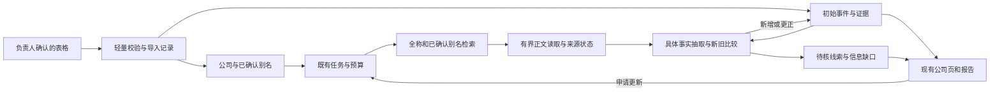

# ADR-0022：负责人确认的初始资料与按需增量研究

- 状态：产品方向已由负责人于 2026-09-13 明确；E4.1 本地实现已验收，E4.2/E4.3 未开始，生产导入与运行另验收。
- 依据：负责人确认自己提供并复核的公司资料可以作为初始数据，要求轻量校验、系统独立检索对照及后续按需更新。
- 部分取代：ADR-0018 第 1 节、ADR-0020 对所有新公司的强制公开交叉核对前置；补充 ADR-0007 的人工复核资料入库路径。
- 保留：ADR-0021 的增量交付与局部重构、内部公司 ID、Provider 独立性、租户/基金隔离、预算、证据血缘及严重负面表述边界。
- 实施范围与验收：[完整计划 E4](../15-incremental-event-delivery-plan.md#e4-负责人确认资料与按需增量研究)。当前唯一切片只见[看板](../10-implementation-plan.md)。

## 1. 问题与取舍

原 E4 已使用负责人提供的表格选样并冻结事件基准，但系统在重复身份查证时停止，尚未执行业务发现。对已由负责人确认的资料仍要求取得配对工商正文及独立政府旁证，重复了人工工作，也把网页可访问性错误地变成了资料准入条件。

代码检查还发现三个独立缺口：业务检索与正文匹配未使用已核实别名；静态 HTML 的业务摘录可能截掉关键段落；融资候选主要保存网页标题，尚未具备中标类已有的业务字段和事项归并能力。只解除身份阻塞不能宣称这些问题已经解决。

采用“人工整理可靠起点，程序按需发现变化”。收益是先有可用内容、少花重复身份核验费用，并可复用网页版研究的人工成果；代价是初始数据质量依赖整理人，需要保留整理时间、出处、口径和更正历史。系统仍须单独测量自动发现能力，不能用导入结果掩盖漏报。

## 2. 主体准入：确认来源可以是负责人

1. 负责人明确确认的工商全称、信用代码及表内已明确的别名/归属关系，使用独立依据 `curator_confirmed`。它表示“负责人已确认”，不标成“政府登记核验”或“系统已交叉核对”。本次已明确的批次确认有效，不要求逐公司再次确认或补交执照。
2. 默认离线检查必填项、信用代码格式/校验位、重复记录、主档碰撞及关系歧义。通过后可创建或关联公司并进入业务研究；政府页面、商业数据库和官网不是必经关卡。轻量在线查找只用于实际冲突、变更迹象或明确补充需求，不逐家常规重做。
3. 同码异名、同名异码和无法唯一归属的品牌只阻塞受影响记录的绑定，不中断其余有效行。不得自动覆盖旧名称、信用代码或将集团事件当作某子公司实际收款。
4. 复用 `Company`、`CompanyAlias`、导入记录和审计。必要时用新迁移增加核验依据及其确认记录关联，不伪造 `official_identity_verifications`，不重写历史迁移。来源文件哈希、工作表/行或记录 ID、确认者、确认时间、适用范围必须可追溯。
5. 本阶段平台共享身份由已有平台管理权限维护。普通用户输入不自动取得负责人权限；未来租户资料先按其授权范围保存，不因上传者勾选确认就晋升平台共享事实或泄露已有私有档案。
6. 原公开交叉核对流程继续服务未经人工确认的新申请。已确认身份不会仅因检查时间变旧或某链接打不开而撤销；新鲜度仍按真实检查时间显示，发现真实冲突时定点复核。既有失败运行及用量保留，不能改写成核验成功。

## 3. 初始业务资料：复用人工研究导入，保留原口径

1. 增加本地表格适配，复用 `ResearchImportProvider`、现有事件/证据/快照/报告及人工决定路径。先支持已提供的表格结构，不建设通用上传平台或另一套数据库。文件内容只作数据，不执行宏、公式、链接指令或附件命令。
2. 已明确复核的普通业务事实可以作为人工确认的初始事件进入公司页、快照和模板报告；不要求系统先重新读到所有网页。保留最小必要的人工整理记录作为证据，关联原出处，标明“人工整理、负责人已复核”，不把整理摘要伪装为网页原文。
3. 分别保存来源性质、人工确认状态、自动抓取检查状态和业务事实状态。表中原有“媒体报道”“品牌/集团归集”“待核”“实际日期未知”等口径照录；批次确认不把媒体报道改成公司公告，不把指控改成裁判认定。`待核事项` 仍为线索，不能批量晋升为事实。
4. 本轮链接未检查或暂不可访问，不单独撤销已有人工确认，也不阻止展示初始资料；如实显示来源定位、整理基准日及系统最近检查状态。新网络线索只有标题/摘要时不能冒充已取得原文或已经核实的新事实；实质冲突另存，不能覆盖既有版本。
5. 文件/批次/外部记录/事项分层去重；相同输入重试无新增，更正保留前后版本和依据。同一融资报道的转载可以合并来源，不合并不同轮次、不同程序节点或主体。表内交易/进程组仅辅助判断，不单凭组号覆盖事件。
6. 初始导入的资料基准日与系统导入日分开；不因今天导入就宣称今天已查全网。金额近似词、单位、币种、日期精度及未知值原样保留，不从摘要补算营收、估值或持股。

## 4. 查询体验：立即显示已有资料，并按需启动更新

用户申请更新后，立即展示初始资料或最近结果；在身份已确认、预算/冷却/权限满足时创建或复用后台研究任务，由 Worker 尽快执行。显示排队、执行、部分完成、预算延后和结束状态，重新打开页面仍可查看结果。这个流程满足“用户提出需求时开展网络更新”，不让一个同步 HTTP 请求长时间等待搜索和模型。

已配置并获授权的正常业务更新不要求负责人逐任务再次手动批准；重复打开页面、多人申请和缓存命中不得重复付费。当前验证环境的关闭开关保持原状，生产按需执行需要部署及运行验收后启用，本决策不等于已经启用。

检索与更新复用现有链路：

## 5. 获取能力：按失败环节修复

- **发现**：将唯一绑定且适用的已确认别名用于搜索和正文匹配；在既有调用上限内分配全称/别名查询，按实际缺口回退，不让一个低价值结果阻止后续有效检索。普通增量任务可使用已有来源定位，盲测不得使用保留答案。
- **读取**：先改业务正文中的目标段落定位，避免只留开头而丢掉事件。利用允许的正文、官方 RSS、已支持的 PDF 等通路；单页失败继续处理队列内其他合格候选，最后报告部分结果。验证码、robots、超时、动态页面及正文无相关内容分别记录。
- **受阻后续**：静态方式确有能力缺口且来源允许时，再评估受限浏览器渲染、正式接口或人工导出通路；不把这些预留方式写成已经接通。不得绕过验证码、登录或访问限制，不调用消费端未公开接口。已确认导入资料可继续提供价值。
- **处理**：先补当前融资样本所需的最小具体字段与事项归并，复用已有事件版本机制；不同时实现九类复杂抽取。只有离线误差证明规则不足时才提出有预算的模型抽取切片，模型仅接收必要的新证据，不能自主扩题或直接发布。
- **成本**：先修正当前调用的有效性，不先增加预算或换付费供应商。记录每层候选数、拒绝原因、有效正文、事件、缓存及费用，避免把所有失败统称为身份不足。

## 6. E4 分开验证两件事

| 验证模式 | 可见输入 | 评价与限制 |
| --- | --- | --- |
| 独立业务发现 | 已确认身份、适用别名、事先冻结的时间窗；已知业务事件正文、金额、日期、URL 不进入查询、快照、缓存或 Worker 可见上下文 | 先封存系统输出，再与原 Excel 基准对照；计算该已知集合中的命中和漏报，不宣称全网完整召回 |
| 初始导入及增量维护 | 导入已复核的历史资料，随后在同一授权范围处理新材料 | 检查初始内容可读、重复不新增、确有变化才追加、失败保留旧结果；复用或重新找到导入答案不能计入独立召回 |

首轮继续使用已选单家公司与冻结事件，不需要再选公司。历史身份失败、费用和基准哈希保留；新准入依据、新运行及其上下文另存版本，不重置累计消耗。表格含 25 家公司并不授权自动全量联网。单样本测试通过后才恢复原独立用户价值验收，不能直接关闭 E4 或进入 E5。

## 7. 决策固化时的边界（历史）

本轮只更新决策、产品/架构说明、既有计划与看板；未实现上述新路径，未将真实表格导入生产，未恢复申请、调用产品搜索/抓取/模型或修改开关。后续按切片做本地测试、交付、合并部署及受控验证，已明确的资料信任与方向不重复请求确认。
